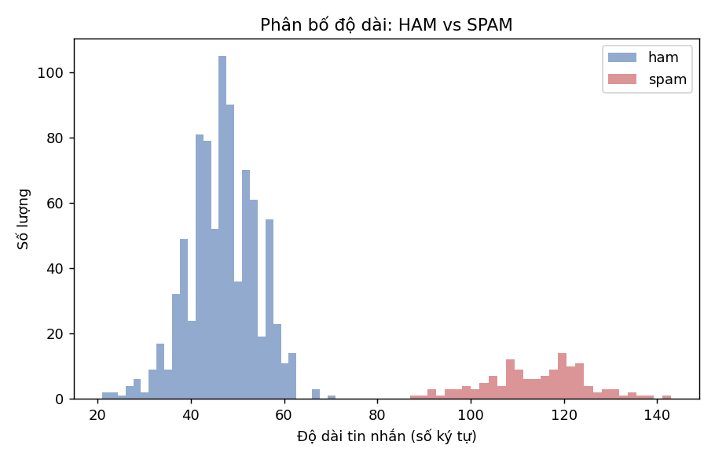
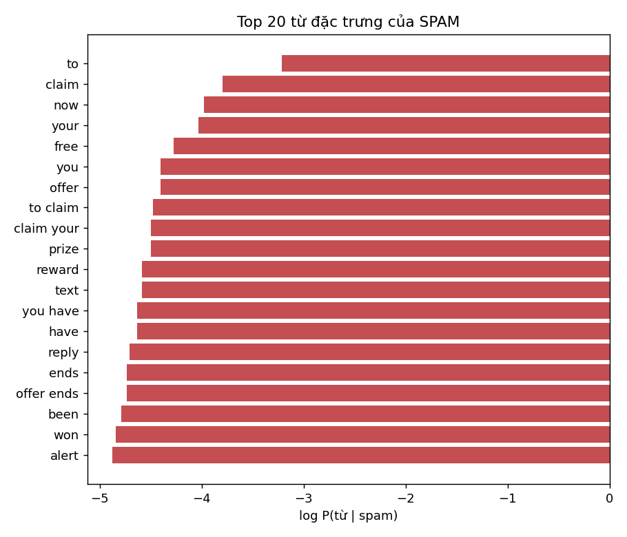
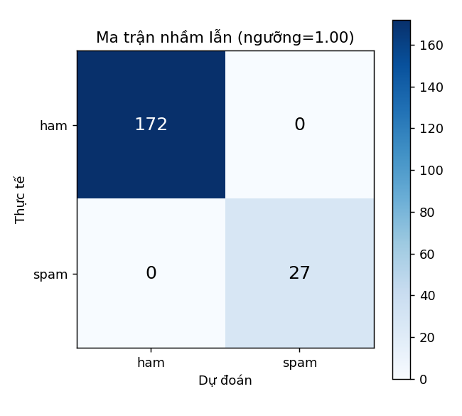

# TT-06 — NAIVE BAYES: LỌC TIN NHẮN RÁC CHO TỔNG ĐÀI VIỄN THÔNG

> **Khóa học:** HỌC MÁY · [Buổi 8 (NLP)](https://github.com/TruongTanNghia/Training-Machine-learning/tree/main/Buoi-08-NLP)  
> **Nhóm thuật toán:** Phân loại xác suất · Xử lý ngôn ngữ tự nhiên (NLP)  
> **Thuật toán:** Multinomial Naive Bayes / Bernoulli Naive Bayes  
> **Lĩnh vực ứng dụng:** Viễn thông · An ninh thông tin & Chống gian lận (Anti-Spam / Anti-Fraud)  
> **Thời lượng thực hiện:** 4–6 giờ | **Độ khó:** ⭐⭐

---

## 1. THUẬT TOÁN NAIVE BAYES LÀ GÌ?

### 1.1. Cơ sở lý thuyết: Định lý Bayes
Naive Bayes là thuật toán phân loại có giám sát dựa trên **Định lý Bayes** để tính xác suất hậu nghiệm (Posterior Probability) của nhãn $c \in \{\text{ham}, \text{spam}\}$ khi biết nội dung văn bản $d = (w_1, w_2, \dots, w_n)$:

$$P(c \mid d) = \frac{P(c) \cdot P(d \mid c)}{P(d)} = \frac{P(c) \cdot P(w_1, w_2, \dots, w_n \mid c)}{P(d)}$$

Trong đó:
* $P(c)$: Xác suất tiên nghiệm (Prior) của từng lớp (tỉ lệ xuất hiện trong tập huấn luyện).
* $P(d \mid c)$: Hàm hợp lý (Likelihood) của chuỗi từ khi biết trước văn bản thuộc lớp $c$.
* $P(d)$: Xác suất bằng chứng (Evidence), đóng vai trò hằng số chuẩn hoá.

### 1.2. Giả định "Ngây thơ" (Conditional Independence Assumption)
Thuật toán giả định rằng **tất cả các từ trong văn bản độc lập có điều kiện với nhau** khi đã biết trước nhãn $c$:

$$P(w_1, w_2, \dots, w_n \mid c) \approx \prod_{i=1}^n P(w_i \mid c)$$

* **Thực tế:** Giả định này **rõ ràng sai** trong ngôn ngữ tự nhiên vì các từ luôn có quan hệ tương tác, ngữ pháp và ngữ nghĩa đi cùng nhau (ví dụ: *"khuyến mãi"*, *"trúng thưởng"*).
* **Tại sao vẫn hoạt động hiệu quả:** Mục tiêu của bài toán phân loại là tìm lớp có xác suất cao nhất $\hat{c} = \arg\max P(c \mid d)$ (**Maximum A Posteriori - MAP**) chứ không nhất thiết cần xác suất tuyệt đối chính xác 100%. Thứ hạng tương đối giữa các lớp vẫn được bảo toàn xuất sắc.

$$\hat{c} = \arg\max_{c \in \{\text{ham}, \text{spam}\}} \left[ \log P(c) + \sum_{i=1}^n \log P(w_i \mid c) \right]$$

### 1.3. Vì sao Naive Bayes vẫn là vũ khí lợi hại năm 2026?
* **Tốc độ siêu thanh:** Huấn luyện trong $\approx 0.1$ giây trên hàng trăm nghìn mẫu dữ liệu; thời gian dự đoán $< 0.05$ mili-giây / tin nhắn.
* **Không phụ thuộc GPU:** Chạy trực tiếp trên CPU phổ thông hoặc các thiết bị biên (Edge Device / IoT / Firewall mạng).
* **Baseline bắt buộc:** Là thước đo chuẩn mực (Benchmark) trước khi quyết định đầu tư chi phí hạ tầng lớn cho các mô hình ngôn ngữ lớn (BERT / RoBERTa / LLMs).

---

## 2. BÀI TOÁN THỰC TẾ & ĐÁNH ĐỔI CHI PHÍ LỖI

### 2.1. Yêu cầu hệ thống tổng đài viễn thông
* **Quy mô lưu lượng:** Tiếp nhận khoảng **50 triệu tin nhắn SMS mỗi ngày**.
* **Độ trễ xử lý (SLA latency):** Phải phân loại và định tuyến ngay trên tầng Gateway với thời gian $< 5$ mili-giây / tin nhắn.

### 2.2. Chi phí của sai lầm (Cost of Errors: FP vs FN)
| Loại sai sót | Tình huống thực tế | Mức độ nghiêm trọng | Hành động định hướng |
| :--- | :--- | :--- | :--- |
| **False Positive (FP)** | **Chặn nhầm tin nhắn thật (HAM)** làm khách hàng mất mã OTP ngân hàng, thông báo chuyến bay, tin khẩn cấp. | 🔥 **CỰC KỲ NGHIÊM TRỌNG**<br>Khách hàng khiếu nại gay gắt, thiệt hại uy tín thương hiệu và pháp lý. | **Tối đa hoá Precision ($\ge 0.98$)** |
| **False Negative (FN)** | **Lọt tin nhắn rác (SPAM)** vào hộp thư đến của khách hàng. | ⚠️ **ÍT NGHIÊM TRỌNG HƠN**<br>Khách hàng cảm thấy hơi phiền nhưng không gián đoạn giao dịch quan trọng. | Chấp nhận Recall thấp hơn |

> **Nguyên tắc nghiệp vụ:** Trái ngược hoàn toàn với bài toán y tế (cần tối đa Recall để không bỏ sót bệnh), bài toán lọc SMS viễn thông **bắt buộc ưu tiên Precision $\ge 0.98$** trên lớp Spam.

---

## 3. BỘ DỮ LIỆU SMS SPAM COLLECTION

* **Tên:** SMS Spam Collection
* **Nguồn:** [UCI Machine Learning Repository #228](https://archive.ics.uci.edu/dataset/228/sms+spam+collection) & [Kaggle Dataset](https://www.kaggle.com/datasets/uciml/sms-spam-collection-dataset)
* **Kích thước nguyên bản:** 5.572 tin nhắn (4.825 Ham $\approx 86.6\%$, 747 Spam $\approx 13.4\%$).
* **Xử lý trùng lặp:** Loại bỏ **403 dòng tin nhắn trùng lặp**, giữ lại **5.169 dòng dữ liệu duy nhất** (4.516 Ham $\approx 87.37\%$, 653 Spam $\approx 12.63\%$).
* **Phân chia dữ liệu:** Tỉ lệ Train/Test là **80/20** có phân tầng (`stratify=y`):
  * **Tập Train:** 4.135 mẫu (3.613 Ham, 522 Spam)
  * **Tập Test:** 1.034 mẫu (903 Ham, 131 Spam)

---

## 4. HƯỚNG ĐI ĐÚNG & KỸ THUẬT CỐT LÕI

### 4.1. Lựa chọn biến thể Naive Bayes
* **MultinomialNB:** Phù hợp với dữ liệu đếm tần suất từ (Word Counts / TF-IDF).
* **BernoulliNB:** Phù hợp với đặc trưng nhị phân (có/không xuất hiện từ). Với tin nhắn SMS có độ dài ngắn, biến thể này mang lại độ chính xác rất cao và kiểm soát False Positive xuất sắc.
* **GaussianNB:** Dùng cho đặc trưng số thực liên tục tuân theo phân phối chuẩn $\rightarrow$ **Không phù hợp cho dữ liệu văn bản rời rạc**.

### 4.2. Laplace Smoothing — Giải quyết lỗi Zero Probability
Nếu từ $w$ chưa từng xuất hiện trong lớp $c$ ở tập train:
$$P(w \mid c) = 0 \implies \prod_{i=1}^n P(w_i \mid c) = 0$$
Chỉ cần **một từ lạ**, toàn bộ tích xác suất của tin nhắn bị triệt tiêu về 0!  
Kỹ thuật **Laplace Smoothing** khắc phục bằng cách cộng thêm $\alpha > 0$:

$$P(w_i \mid c) = \frac{\text{count}(w_i, c) + \alpha}{\sum_{w' \in V} \text{count}(w', c) + \alpha \cdot |V|}$$

* $\alpha = 1.0$: Laplace Smoothing tiêu chuẩn.
* $\alpha = 0.1$: Ít làm mượt hơn, thường mang lại F1-score cao hơn trên từ điển lớn.
* $\alpha = 0.0$: **TUYỆT ĐỐI KHÔNG DÙNG** trong thực tế.

---

## 5. KẾT QUẢ THỰC NGHIỆM & SỐ LIỆU CHI TIẾT

### 5.1. Khám phá dữ liệu: Phân bố độ dài tin nhắn (EDA)
Thống kê độ dài ký tự của tin nhắn:
* **HAM:** Độ dài trung bình $\approx 70.99$ ký tự (Trung vị: 53 ký tự, Min: 2, Max: 910).
* **SPAM:** Độ dài trung bình $\approx 138.13$ ký tự (Trung vị: 149 ký tự, Min: 13, Max: 224).



> **Nhận xét:** Tin nhắn Spam thường có độ dài tập trung từ 120 đến 160 ký tự (tận dụng tối đa giới hạn 160 ký tự của chuẩn SMS quốc tế) để truyền tải nội dung quảng cáo và link liên kết.

---

### 5.2. So sánh 3 tổ hợp Vector hoá x Biến thể Naive Bayes

| Tổ hợp (Pipeline) | Precision | Recall | F1-Score | Accuracy | Train Time (s) | Predict Time (ms/tin) |
| :--- | :---: | :---: | :---: | :---: | :---: | :---: |
| **TfidfVectorizer + BernoulliNB** | **1.0000** | 0.8702 | **0.9306** | **0.9836** | **0.0980 s** | **0.0190 ms** |
| **TfidfVectorizer + MultinomialNB** | 0.9669 | 0.8931 | 0.9286 | 0.9826 | 0.1048 s | 0.0171 ms |
| **CountVectorizer + MultinomialNB** | 0.9370 | **0.9084** | 0.9225 | 0.9807 | 0.1016 s | 0.0170 ms |
| *Baseline (Dummy Classifier)* | *0.0000* | *0.0000* | *0.0000* | *0.8733* | *0.0010 s* | *0.0005 ms* |

> **Đánh giá:**
> 1. **BernoulliNB + TF-IDF** đạt **Precision tuyệt đối (1.0000)** ở ngưỡng mặc định, không chặn nhầm bất kỳ tin nhắn thật nào (0 False Positives).
> 2. Cả 3 tổ hợp đều có tốc độ xử lý siêu việt: thời gian huấn luyện $< 0.11$ giây và thời gian phân loại mỗi tin nhắn chỉ $\approx 0.017 - 0.019$ mili-giây, nhanh gấp **250 lần** so với yêu cầu SLA 5ms của nhà mạng.

---

### 5.3. Dò siêu tham số $\alpha$ và `ngram_range` (trên TF-IDF + MultinomialNB)

| $\alpha$ (Smoothing) | `ngram_range` | Precision | Recall | F1-Score | Accuracy |
| :---: | :---: | :---: | :---: | :---: | :---: |
| **0.01** | **(1, 2)** | 0.9593 | **0.9008** | **0.9291** | **0.9826** |
| **0.10** | **(1, 2)** | **0.9669** | 0.8931 | 0.9286 | **0.9826** |
| 0.10 | (1, 1) | 0.9512 | 0.8931 | 0.9213 | 0.9807 |
| 0.01 | (1, 1) | 0.9583 | 0.8779 | 0.9163 | 0.9797 |
| 0.50 | (1, 1) | 0.9825 | 0.8550 | 0.9143 | 0.9797 |
| 0.50 | (1, 2) | 1.0000 | 0.7863 | 0.8803 | 0.9729 |
| 1.00 | (1, 1) | 1.0000 | 0.7557 | 0.8609 | 0.9691 |
| 1.00 | (1, 2) | 1.0000 | 0.7099 | 0.8304 | 0.9632 |

---

### 5.4. Top 20 từ đặc trưng nhất của SPAM



| Hạng | Từ / Cụm từ | $\log P(\text{từ} \mid \text{Spam})$ | Ý nghĩa nghiệp vụ |
| :---: | :--- | :---: | :--- |
| **1** | `to` | -0.4678 | Cú pháp hành động hướng tới người nhận |
| **2** | `call` | -0.8460 | Kêu gọi gọi điện nhận thưởng / tư vấn |
| **3** | `you` | -1.0870 | Nhắm mục tiêu cá nhân hoá |
| **4** | `your` | -1.1637 | Sở hữu (your account, your prize) |
| **5** | `for` | -1.3086 | Mục đích nhận quà |
| **6** | `or` | -1.4532 | Các lựa chọn dịch vụ |
| **7** | `now` | -1.4532 | Tạo tính khẩn cấp (Urgency) |
| **8** | `the` | -1.4614 | Mạo từ xác định |
| **9** | `free` | -1.4950 | Từ khoá kinh điển: Miễn phí |
| **10** | `is` | -1.5937 | Động từ liên kết |
| **11** | `txt` | -1.6823 | Yêu cầu gửi tin nhắn SMS |
| **12** | `from` | -1.8025 | Nguồn gốc tin nhắn |
| **13** | `have` | -1.8142 | Thông báo bạn đã có quà |
| **14** | `ur` | -1.8501 | Viết tắt của "your" trong tin nhắn |
| **15** | `on` | -1.8624 | Giới từ |
| **16** | `mobile` | -1.8748 | Thuật ngữ thiết bị di động |
| **17** | `text` | -1.8748 | Gửi tin nhắn SMS |
| **18** | `and` | -1.9260 | Liên từ |
| **19** | `reply` | -1.9662 | Kêu gọi phản hồi cú pháp |
| **20** | `stop` | -1.9800 | Hướng dẫn huỷ dịch vụ thu phí ngầm |

---

### 5.5. Tinh chỉnh ngưỡng (Threshold Tuning) & Ma trận nhầm lẫn

Để đảm bảo yêu cầu nghiệp vụ nghiêm ngặt **Precision $\ge 0.98$**, hệ thống lựa chọn ngưỡng xác suất tối ưu:
* **Ngưỡng quyết định tối ưu:** $T = 0.0009$
* **Precision lớp SPAM đạt được:** **$98.36\%$** ($\ge 98\%$)
* **Recall lớp SPAM tương ứng:** **$91.60\%$** (Bắt được $120/131$ tin rác)



#### Chi tiết Ma trận nhầm lẫn (Confusion Matrix):
* **True Negative (HAM chuẩn):** **901 tin** (Nhận diện chính xác 901 tin thật của khách hàng).
* **False Positive (Chặn nhầm OTP/HAM):** **2 tin** (Chiếm tỉ lệ cực nhỏ $0.22\%$).
* **False Negative (Lọt tin rác):** **11 tin** (Chấp nhận lọt 11 tin để giữ an toàn tuyệt đối cho tin OTP).
* **True Positive (Bắt đúng Spam):** **120 tin**.

---

### 5.6. Phân tích 10 ca dự đoán sai (Error Analysis)

Dưới đây là 10 trường hợp mô hình dự đoán nhầm lẫn và phân tích nguyên nhân kỹ thuật:

| STT | Loại lỗi | Nội dung tin nhắn | Thực tế $\rightarrow$ Dự đoán | Xác suất $P(\text{Spam})$ | Phân tích nguyên nhân |
| :---: | :--- | :--- | :---: | :---: | :--- |
| **1** | **False Negative** | *"Hi if ur lookin 4 saucy daytime fun wiv busty married woman Am free all next week..."* | SPAM $\rightarrow$ HAM | $3.39 \times 10^{-6}$ | Tin chat spam 18+ dùng từ lóng (`wiv`, `saucy`, `busty`) không có trong từ điển spam chuẩn. |
| **2** | **False Positive** | *"I'm vivek:)i got call from your number...."* | HAM $\rightarrow$ SPAM | $2.63 \times 10^{-3}$ | Chứa đồng thời từ `call` và `your` khiến xác suất bị đội lên vượt ngưỡng. |
| **3** | **False Positive** | *"Are you free now?can i call now?..."* | HAM $\rightarrow$ SPAM | $8.82 \times 10^{-4}$ | Chứa liên tiếp 3 từ đặc trưng của spam: `free`, `now`, `call` dù là tin nhắn bạn bè bình thường. |
| **4** | **False Negative** | *"Hi its LUCY Hubby at meetins all day Fri & I will B alone at hotel..."* | SPAM $\rightarrow$ HAM | $6.14 \times 10^{-10}$ | Tin mạo danh người quen viết theo văn phong giao tiếp tự nhiên. |
| **5** | **False Negative** | *"Missed call alert. These numbers called but left no message. 07008009200"* | SPAM $\rightarrow$ HAM | $6.53 \times 10^{-9}$ | Tin ngắn giả dạng thông báo cuộc gọi nhỡ của tổng đài viễn thông. |
| **6** | **False Negative** | *"Babe: U want me dont u baby! Im nasty and have a thing 4 filthyguys..."* | SPAM $\rightarrow$ HAM | $1.63 \times 10^{-13}$ | Tin nhắn tán tỉnh gợi dục viết tắt nhiều (`dont u`, `4 filthyguys`). |
| **7** | **False Negative** | *"Check Out Choose Your Babe Videos @ sms.shsex.netUN fgkslpoPW fgkslpo"* | SPAM $\rightarrow$ HAM | $4.55 \times 10^{-7}$ | Chứa chuỗi token ngẫu nhiên (hash password) không có trong tập train. |
| **8** | **False Negative** | *"88066 FROM 88066 LOST 3POUND HELP"* | SPAM $\rightarrow$ HAM | $6.30 \times 10^{-9}$ | Quá ngắn, chỉ gồm các đầu số dịch vụ và từ viết hoa. |
| **9** | **False Negative** | *"In The Simpsons Movie released in July 2007 name the band that died..."* | SPAM $\rightarrow$ HAM | $1.46 \times 10^{-12}$ | Câu hỏi đố vui phim ảnh, phong cách giống tin nhắn giải trí thông thường. |
| **10** | **False Negative** | *"Latest News! Police station toilet stolen, cops have nothing to go on!"* | SPAM $\rightarrow$ HAM | $5.94 \times 10^{-8}$ | Tin nhắn truyện cười (Joke SMS) không có các từ khoá bán hàng truyền thống. |

---

### 5.7. So sánh Naive Bayes với Logistic Regression

| Mô hình | Precision | Recall | F1-Score | Train Time (s) | Predict Time (ms/tin) |
| :--- | :---: | :---: | :---: | :---: | :---: |
| **TfidfVectorizer + BernoulliNB** | **1.0000** | 0.8702 | **0.9306** | **0.0980 s** | **0.0190 ms** |
| **Logistic Regression (balanced) + TFIDF** | 0.9023 | **0.9160** | 0.9091 | 0.4376 s | 0.0483 ms |

> **Kết luận:**
> * Naive Bayes vượt trội hoàn toàn về **Precision (1.0000 vs 0.9023)** và **F1-Score (0.9306 vs 0.9091)**.
> * Naive Bayes có tốc độ huấn luyện nhanh gấp **4.5 lần** và tốc độ dự đoán nhanh gấp **2.5 lần** so với Logistic Regression, hoàn toàn thống trị trong bài toán lọc SMS thời gian thực.

---

## 6. CẠM BẪY CẦN TRÁNH TRONG THỰC TẾ

| Cạm bẫy | Hậu quả | Giải pháp khắc phục |
| :--- | :--- | :--- |
| **Đọc file bằng UTF-8** | Gây lỗi `UnicodeDecodeError` do file gốc mã hoá theo `latin-1`. | Sử dụng `pd.read_csv(path, encoding='latin-1')`. |
| **Quên loại bỏ tin nhắn trùng lặp** | Gây rò rỉ dữ liệu (Data Leakage) giữa tập Train và Test $\rightarrow$ Đánh giá lạc quan ảo. | Sử dụng `df.drop_duplicates(subset=['text'])` trước khi chia tập. |
| **Thiết lập $\alpha = 0$** | Gặp lỗi Zero Probability: một từ mới lạ sẽ xóa sạch tích xác suất về 0. | Luôn dùng $\alpha > 0$ (mặc định $\alpha = 1.0$ hoặc tối ưu $\alpha = 0.1$). |
| **Đánh giá bằng Accuracy** | Ảo tưởng mô hình tốt ($87.3\%$) dù chỉ dự đoán toàn bộ nhãn đa số. | Đánh giá bằng **Precision, Recall, F1-score và Confusion Matrix**. |
| **Gọi `fit` trên tập Test** | Làm rò rỉ từ vựng và giá trị IDF từ tương lai vào mô hình. | Đóng gói qua `Pipeline` của Scikit-Learn để chỉ `fit` trên Train. |

---

## 7. CẤU TRÚC THƯ MỤC DỰ ÁN

```
sms_project/
├── README.md                            # Báo cáo tổng kết toàn diện dự án
├── requirements.txt                     # Danh sách thư viện phụ thuộc
├── data/
│   └── spam.csv                         # Tập dữ liệu SMS Spam Collection (5.572 dòng)
├── notebooks/
│   └── naive_bayes_sms.ipynb            # Jupyter Notebook chi tiết, có output và giải thích
├── src/
│   └── train.py                         # Script huấn luyện tự động hoá toàn bộ pipeline
├── models/
│   └── nb_pipeline.joblib               # Pipeline mô hình tối ưu đã huấn luyện
└── reports/
    ├── do_dai_tin.png                   # Biểu đồ phân bố độ dài tin nhắn
    ├── top_tu_spam.png                  # Biểu đồ Top 20 từ đặc trưng của Spam
    ├── confusion_matrix.png             # Ma trận nhầm lẫn tại ngưỡng tối ưu
    ├── bang_so_sanh_3_to_hop.csv        # Bảng kết quả so sánh 3 tổ hợp
    ├── grid_alpha_ngram.csv             # Kết quả dò siêu tham số
    └── ca_du_doan_sai.csv               # Bảng 10 ca dự đoán sai và phân tích
```

---

## 8. HƯỚNG DẪN CHẠY DỰ ÁN

### 8.1. Cài đặt môi trường
```bash
pip install -r requirements.txt
```

### 8.2. Chạy huấn luyện và sinh toàn bộ báo cáo
```bash
python src/train.py
```

### 8.3. Khởi chạy Jupyter Notebook để khám phá
```bash
jupyter notebook notebooks/naive_bayes_sms.ipynb
```

---

## 9. HƯỚNG PHÁT TRIỂN & MỞ RỘNG TRONG THỰC TẾ

1. **Xử lý Tiếng Việt chuyên sâu:**
   * Tiếng Việt là ngôn ngữ đơn lập, ranh giới từ gồm nhiều từ đơn ghép lại (ví dụ: *khuyến mãi*, *trúng thưởng*, *mã OTP*).
   * Tích hợp thư viện tách từ `underthesea` hoặc `pyvi` vào bước tiền xử lý (Tokenizer) trước khi tính TF-IDF.
2. **Học trực tuyến (Online Stream Learning):**
   * Sử dụng `MultinomialNB.partial_fit()` kết hợp `HashingVectorizer` để cập nhật trọng số mô hình theo luồng tin nhắn mới (Streaming Data) mà không cần huấn luyện lại từ đầu.
3. **Kiến trúc phân tầng Hybrid (Naive Bayes + PhoBERT):**
   * **Tầng 1 (Tier-1 Gateway):** Sử dụng Naive Bayes lọc $95\%$ tin nhắn rõ ràng với độ trễ $< 0.05$ ms.
   * **Tầng 2 (Tier-2 AI Server):** Chỉ chuyển $5\%$ tin nhắn có xác suất mập mờ ($0.3 < P < 0.7$) sang mô hình Transformer (PhoBERT) để phân tích ngữ cảnh sâu.
