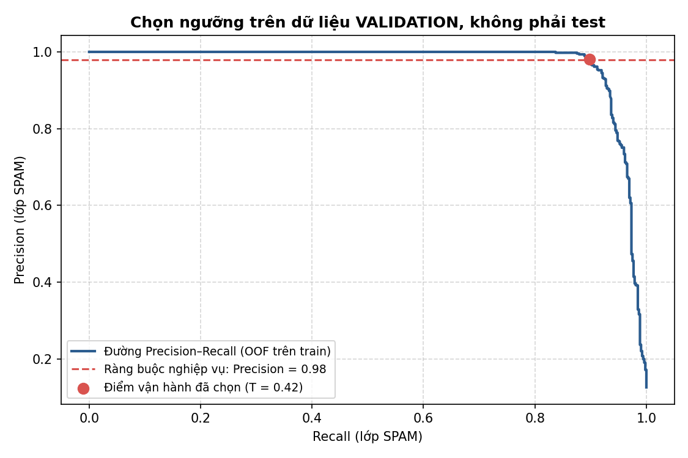
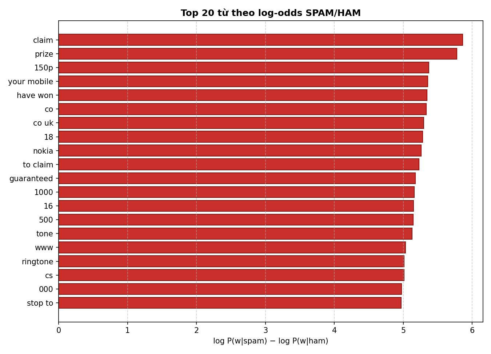

# TT-06 — NAIVE BAYES: LỌC TIN NHẮN RÁC CHO TỔNG ĐÀI VIỄN THÔNG

> **Khoá học:** HỌC MÁY · [Buổi 8 (NLP)](https://github.com/TruongTanNghia/Training-Machine-learning/tree/main/Buoi-08-NLP)
> **Nhóm thuật toán:** Phân loại xác suất · Xử lý ngôn ngữ tự nhiên (NLP)
> **Thuật toán:** Multinomial Naive Bayes / Bernoulli Naive Bayes
> **Lĩnh vực:** Viễn thông · An ninh thông tin & Chống gian lận (Anti-Spam / Anti-Fraud)
> **Độ khó:** ⭐⭐

> **Mọi con số trong tài liệu này được trích từ [`reports/ket_qua.md`](reports/ket_qua.md)** — file
> do `src/train.py` sinh tự động, không sửa tay. Chạy lại script sẽ ghi đè file đó; nếu
> README lệch khỏi nó thì README sai. Lần chạy được trích dẫn: seed 42, 5-fold CV,
> scikit-learn 1.8.0. Xem [`SUA_LOI.md`](SUA_LOI.md) để biết bản này khác bản nộp trước ở đâu.

---

## 1. THUẬT TOÁN NAIVE BAYES LÀ GÌ?

### 1.1. Cơ sở lý thuyết: Định lý Bayes

Naive Bayes là thuật toán phân loại có giám sát, dựa trên **Định lý Bayes** để tính xác suất
hậu nghiệm (Posterior) của nhãn $c \in \{\text{ham}, \text{spam}\}$ khi biết nội dung văn bản
$d = (w_1, w_2, \dots, w_n)$:

$$P(c \mid d) = \frac{P(c) \cdot P(d \mid c)}{P(d)} = \frac{P(c) \cdot P(w_1, \dots, w_n \mid c)}{P(d)}$$

* $P(c)$ — **Prior**: tỉ lệ xuất hiện của mỗi lớp trong tập huấn luyện.
* $P(d \mid c)$ — **Likelihood**: độ hợp lý của chuỗi từ khi đã biết văn bản thuộc lớp $c$.
* $P(d)$ — **Evidence**: hằng số chuẩn hoá, giống nhau cho mọi lớp nên có thể bỏ qua khi so sánh.

### 1.2. Giả định "ngây thơ" (Conditional Independence)

Thuật toán giả định **các từ độc lập có điều kiện với nhau khi đã biết nhãn**:

$$P(w_1, \dots, w_n \mid c) \approx \prod_{i=1}^n P(w_i \mid c)$$

Giả định này **sai rành rành** trong ngôn ngữ tự nhiên: "trúng" kéo theo "thưởng", "khuyến"
kéo theo "mãi". Nhưng bài toán phân loại chỉ cần **thứ hạng tương đối** giữa hai lớp, không cần
xác suất tuyệt đối đúng. Quy tắc quyết định **MAP (Maximum A Posteriori)**, tính trong không
gian log để tránh tràn số dưới:

$$\hat{c} = \arg\max_{c} \left[ \log P(c) + \sum_{i=1}^n \log P(w_i \mid c) \right]$$

Hệ quả thực tế của việc nhân dồn hàng chục thừa số phụ thuộc lẫn nhau: xác suất đầu ra **bão
hoà về ~0 hoặc ~1** và không còn là xác suất hiệu chỉnh (calibrated). Đây chính là lý do §5.5
phải chọn ngưỡng bằng thực nghiệm thay vì dùng mặc định 0.5.

### 1.3. Vì sao Naive Bayes vẫn đáng dùng?

* **Nhanh:** huấn luyện ~0.1 s trên 4.135 tin; suy luận có đo được ở §5.6.
* **Không cần GPU:** chạy trên CPU phổ thông, thiết bị biên, firewall mạng.
* **Baseline bắt buộc:** phải đo Naive Bayes trước khi bỏ tiền hạ tầng cho BERT/LLM.

---

## 2. BÀI TOÁN THỰC TẾ & ĐÁNH ĐỔI CHI PHÍ LỖI

### 2.1. Yêu cầu hệ thống

* **Lưu lượng:** ~50 triệu tin SMS/ngày.
* **SLA độ trễ:** phân loại ngay tại tầng Gateway, $< 5$ ms/tin.

### 2.2. Chi phí của sai lầm: FP vs FN

| Loại sai | Tình huống | Mức nghiêm trọng | Định hướng |
| :--- | :--- | :--- | :--- |
| **False Positive** | **Chặn nhầm tin thật (HAM)** — khách mất mã OTP ngân hàng, thông báo chuyến bay, tin khẩn cấp. | 🔥 **Cực kỳ nghiêm trọng.** Khiếu nại, tổn hại uy tín, rủi ro pháp lý. | **Tối đa hoá Precision ($\ge 0.98$)** |
| **False Negative** | **Lọt tin rác** vào hộp thư khách hàng. | ⚠️ **Nhẹ hơn.** Phiền toái, không gián đoạn giao dịch. | Chấp nhận Recall thấp hơn |

> **Nguyên tắc nghiệp vụ:** ngược hẳn bài toán y tế (ưu tiên Recall để không bỏ sót bệnh), lọc
> SMS viễn thông **ưu tiên Precision** trên lớp spam.

### 2.3. Vì sao ràng buộc này lại khó hơn vẻ ngoài

Ràng buộc "Precision ≥ 0.98" chỉ có thể được **ước lượng**, không thể được **bảo đảm**. Tập test
chỉ có 131 tin spam, nên mỗi False Positive dịch Precision khoảng 0.7 điểm phần trăm. §5.5 và
§5.7 cho thấy ngưỡng đạt 0.9812 trên validation lại rơi xuống 0.9752 trên test — không phải lỗi
lập trình, mà là sai số lấy mẫu. Cách xử lý đúng ở môi trường thật là chốt ngưỡng với **biên an
toàn** (nhắm 0.99 trên validation để đạt 0.98 khi vận hành) và giám sát liên tục, chứ không phải
chỉnh ngưỡng cho tới khi con số trên test đẹp mắt.

---

## 3. BỘ DỮ LIỆU SMS SPAM COLLECTION

* **Tên:** SMS Spam Collection
* **Nguồn:** [UCI Machine Learning Repository #228](https://archive.ics.uci.edu/dataset/228/sms+spam+collection) · [Kaggle](https://www.kaggle.com/datasets/uciml/sms-spam-collection-dataset)
* **Kích thước gốc:** 5.572 tin (4.825 ham ≈ 86.6%, 747 spam ≈ 13.4%)
* **Sau `drop_duplicates`:** loại 403 dòng trùng → **5.169 tin duy nhất** (4.516 ham ≈ 87.4%, 653 spam ≈ 12.6%)
* **Chia 80/20 có phân tầng** (`stratify`, `random_state=42`):
  * **Train:** 4.135 tin (3.613 ham, 522 spam)
  * **Test:** 1.034 tin (903 ham, 131 spam)

### 3.1. Dữ liệu KHÔNG được commit vào repo

`data/spam.csv` nằm trong `.gitignore`. Lấy dữ liệu bằng:

```bash
python data/download_data.py
```

Script tải về rồi **xác thực 3 lớp** trước khi ghi ra đĩa: SHA-256 của file gốc, số dòng thô
(5.572) kèm phân phối nhãn (4.825/747), và số dòng sau khi lọc trùng (5.169). Sai bất kỳ điều
kiện nào thì script thoát với mã lỗi và **không ghi file**.

`src/train.py` kiểm tra lại lần nữa khi nạp dữ liệu và dừng ngay nếu bộ dữ liệu không khớp. Muốn
cố ý chạy trên bộ khác thì phải nói rõ bằng cờ `--skip-data-check`, và script sẽ in cảnh báo.

> **Vì sao phải chặt chẽ đến vậy:** bản nộp trước đưa vào repo một file `spam.csv` **giả lập
> 1.144 dòng** do `data/make_demo_data.py` tự sinh, trong khi README lại mô tả bộ UCI 5.572 dòng.
> Hệ quả: `reports/` khi ấy cho Precision = Recall = F1 = 1.0 ở cả 3 tổ hợp và cả 8 cấu hình lưới
> — những con số vô nghĩa phủ định chính README, còn `ca_du_doan_sai.csv` thì rỗng trơn dù README
> trình bày bảng 10 ca sai. `make_demo_data.py` đã bị xoá khỏi dự án.

---

## 4. HƯỚNG ĐI ĐÚNG & KỸ THUẬT CỐT LÕI

### 4.1. Chọn biến thể Naive Bayes

* **MultinomialNB** — hợp với đặc trưng đếm tần suất (word counts / TF-IDF).
* **BernoulliNB** — hợp với đặc trưng nhị phân (từ có xuất hiện hay không). Tin SMS ngắn nên
  biến thể này cạnh tranh sát nút, xem §5.3.
* **GaussianNB** — dành cho đặc trưng liên tục phân phối chuẩn → **không hợp** với văn bản rời rạc.

### 4.2. Laplace Smoothing — chống lỗi Zero Probability

Nếu từ $w$ chưa từng xuất hiện ở lớp $c$ trong tập train thì $P(w \mid c) = 0$, kéo cả tích
$\prod_i P(w_i \mid c)$ về 0. Laplace Smoothing cộng thêm $\alpha > 0$:

$$P(w_i \mid c) = \frac{\text{count}(w_i, c) + \alpha}{\sum_{w' \in V} \text{count}(w', c) + \alpha \cdot |V|}$$

* $\alpha = 1.0$ — Laplace chuẩn.
* $\alpha = 0.1$ — làm mượt nhẹ, tốt hơn trên từ điển lớn (và là cấu hình được chọn ở §5.4).
* $\alpha = 0$ — **tuyệt đối không dùng**, xem thực nghiệm §5.4.1.

### 4.3. Quy trình đánh giá: tập test chỉ được chạm MỘT LẦN

Đây là điểm sửa quan trọng nhất so với bản trước.

```
5.169 tin
   │
   ├── drop_duplicates TRƯỚC khi chia  ─────► chống rò rỉ train↔test
   │
   ├── train_test_split (80/20, stratify, seed 42)
   │        │
   │        ├── TRAIN 4.135 ──► 5-fold StratifiedKFold
   │        │                     ├── so sánh 3 tổ hợp        (§5.3)
   │        │                     ├── dò alpha × ngram         (§5.4)
   │        │                     └── chọn NGƯỠNG quyết định   (§5.5)
   │        │                          ↑ mọi quyết định nằm trong khung này
   │        │
   │        └── TEST 1.034 ──► KHOÁ LẠI, mở đúng một lần ở §5.7
```

Vectorizer nằm **bên trong** `Pipeline`, nên từ vựng và giá trị IDF chỉ được `fit` trên phần
train của từng fold. Không có `fit_transform` nào chạm vào dữ liệu đánh giá.

> **Lỗi ở bản trước:** ngưỡng được chọn bằng `precision_recall_curve(y_test, ...)` rồi công bố
> Precision/Recall trên **chính tập test đó**; lưới `alpha × ngram` cũng chấm bằng `y_test`. Khi
> vừa chọn vừa chấm trên cùng một tập, con số công bố là ước lượng lạc quan có hệ thống — nó cho
> biết cấu hình khớp tập test tốt đến đâu, chứ không cho biết mô hình sẽ chạy thế nào trên tin
> nhắn ngày mai.

---

## 5. KẾT QUẢ THỰC NGHIỆM

### 5.1. EDA: phân bố độ dài tin nhắn (tính trên TRAIN)

| Nhãn | Số tin | Trung bình | Độ lệch chuẩn | Trung vị | Min | Max |
| :--- | ---: | ---: | ---: | ---: | ---: | ---: |
| ham | 3.613 | 69.90 | 54.63 | 52 | 2 | 632 |
| spam | 522 | 137.97 | 30.16 | 148 | 13 | 224 |


> **Nhận xét:** spam bám sát trần 160 ký tự của chuẩn SMS — tận dụng tối đa mỗi tin trả phí để
> nhồi nội dung quảng cáo, cú pháp và đầu số. Độ lệch chuẩn của spam (30) chỉ bằng ~55% của ham
> (55): tin rác được soạn theo khuôn mẫu, tin thật thì muôn hình vạn trạng.
>
> **Lưu ý phương pháp:** thống kê tính trên train, không phải toàn bộ dữ liệu. EDA cũng là một
> dạng nhìn vào dữ liệu; nhìn tập test rồi mới quyết định đặc trưng cũng là rò rỉ, dù nhẹ.

### 5.2. Baseline: vì sao Accuracy là chỉ số dối trá

Mô hình đoán toàn `ham` đạt **Accuracy = 0.8733** trên test nhưng Precision = Recall = F1 = **0**.
Nó chặn được đúng 0 tin rác. Mọi con số Accuracy dưới đây phải được đọc trên nền 87.33% này.

### 5.3. So sánh tổ hợp — chấm bằng 5-fold CV trên TRAIN

Đây là bảng dùng để **chọn** mô hình nên bắt buộc tính trên out-of-fold của train.

| Tổ hợp | Precision (CV) | Recall (CV) | F1 (CV) | Accuracy (CV) | Train 1 lần (s) |
| :--- | :---: | :---: | :---: | :---: | :---: |
| **TfidfVectorizer + MultinomialNB** | 0.9936 | 0.8870 | **0.9372** | 0.9850 | 0.10 |
| TfidfVectorizer + BernoulliNB | **0.9957** | 0.8812 | 0.9350 | 0.9845 | 0.12 |
| CountVectorizer + MultinomialNB | 0.9503 | **0.9157** | 0.9327 | 0.9833 | 0.10 |
| Logistic Regression (balanced) + TFIDF | 0.9156 | 0.9349 | 0.9251 | 0.9809 | 0.15 |
| *Baseline: DummyClassifier* | *0.0000* | *0.0000* | *0.0000* | *0.8738* | *0.06* |

> **Đọc bảng:**
> 1. Khoảng cách F1 giữa ba tổ hợp Naive Bayes chỉ là **0.0045** — nhỏ hơn độ lệch chuẩn giữa các
>    fold (§5.5 đo được ±0.0136 cho Precision). Nói "MultinomialNB thắng BernoulliNB" là đọc quá
>    tay vào nhiễu; đúng hơn là **cả ba đều tương đương, và ta chọn một cách nhất quán theo F1
>    out-of-fold.**
> 2. TF-IDF mua Precision bằng Recall so với CountVectorizer (+0.043 P, −0.029 R). Với hàm chi phí
>    ở §2.2, đó là hướng đánh đổi ta muốn.
> 3. Logistic Regression `class_weight="balanced"` cho Recall cao nhất trong nhóm nhưng Precision
>    thấp nhất — đúng như thiết kế, vì trọng số cân bằng đẩy mô hình về phía bắt hết lớp thiểu số.
>    Với bài toán này thì đó là hướng sai.

### 5.4. Dò $\alpha$ × `ngram_range` — chấm bằng 5-fold CV trên TRAIN

| $\alpha$ | `ngram_range` | Precision (CV) | Recall (CV) | F1 (CV) | Accuracy (CV) |
| :---: | :---: | :---: | :---: | :---: | :---: |
| **0.10** | **(1, 2)** | 0.9936 | 0.8870 | **0.9372** | 0.9850 |
| 0.01 | (1, 2) | 0.9769 | 0.8927 | 0.9329 | 0.9838 |
| 0.10 | (1, 1) | 0.9808 | 0.8793 | 0.9273 | 0.9826 |
| 0.01 | (1, 1) | 0.9726 | 0.8831 | 0.9257 | 0.9821 |
| 0.50 | (1, 1) | 0.9977 | 0.8333 | 0.9081 | 0.9787 |
| 0.50 | (1, 2) | 0.9976 | 0.7931 | 0.8837 | 0.9736 |
| 1.00 | (1, 1) | **1.0000** | 0.7510 | 0.8578 | 0.9686 |
| 1.00 | (1, 2) | **1.0000** | 0.6992 | 0.8230 | 0.9620 |

> **Quy luật rõ ràng:** $\alpha$ tăng → Precision tăng đơn điệu, Recall giảm mạnh hơn. Ở
> $\alpha = 1.0$ mô hình đạt Precision tuyệt đối nhưng để lọt 30% tin rác. Lý do: $\alpha$ lớn kéo
> mọi $P(w \mid c)$ về gần phân phối đều, làm nhoè bằng chứng của những từ đặc trưng hiếm gặp
> ("guaranteed", "150p") — mô hình chỉ còn dám kết luận spam khi bằng chứng quá hiển nhiên.
> **Cấu hình được chọn: $\alpha = 0.1$, `ngram_range = (1, 2)`.**

#### 5.4.1. Thực nghiệm: $\alpha = 0$ phá huỷ mô hình như thế nào

Kết quả chạy thật, huấn luyện `CountVectorizer + MultinomialNB` trên tập train:

| Tình huống | P(spam), $\alpha = 0$ | Nhãn | P(spam), $\alpha = 0.1$ | Nhãn |
| :--- | ---: | :---: | ---: | :---: |
| Tin HAM bình thường | 0.00e+00 | ham | 1.15e-13 | ham |
| Tin HAM + 1 từ chỉ có ở spam (`'claim'`) | **NaN** | ham | 3.02e-10 | ham |
| Tin SPAM bình thường | 1.00e+00 | spam | 1.00e+00 | spam |
| Tin SPAM + 1 từ chỉ có ở ham (`'gt'`) | **NaN** | **ham** ❌ | 1.00e+00 | spam |
| Tin SPAM + 1 từ hoàn toàn lạ (`'xyzzyqwerty7788'`) | 1.00e+00 | spam | 1.00e+00 | spam |

Ba điều đáng chú ý:

1. **Kết quả không phải "sai", mà là `NaN`.** Với $\alpha = 0$ thì $P(w \mid c) = 0$ nên
   $\log P(w \mid c) = -\infty$. Tin nhắn chứa đồng thời một từ vắng mặt ở ham và một từ vắng
   mặt ở spam khiến log-likelihood của **cả hai lớp** đều là $-\infty$; khi chuẩn hoá,
   $-\infty - (-\infty) = $ `NaN`. Bộ phân loại không đưa ra phán quyết sai — nó không đưa ra
   phán quyết nào cả, và nhãn trả về trở thành tuỳ ý. Dòng 4 là ca xấu nhất: **một tin rác lọt
   lưới chỉ vì có chữ `'gt'`.**
2. **Từ hoàn toàn lạ lại vô hại** (dòng 5). `'xyzzyqwerty7788'` không nằm trong từ vựng nên bị
   `CountVectorizer` loại bỏ ngay từ khâu vector hoá. Thủ phạm thật là từ **có** trong từ vựng
   nhưng đếm được 0 lần ở một lớp — đúng tình huống Laplace smoothing sinh ra để xử lý. Cách phát
   biểu "một từ chưa từng thấy sẽ xoá sạch tích xác suất" là mô tả sai cơ chế.
3. scikit-learn tự kẹp `alpha` về `1e-10` kèm `RuntimeWarning: divide by zero encountered in log`,
   nhưng như bảng cho thấy, về mặt số học kết quả vẫn suy biến.

### 5.5. Chọn ngưỡng quyết định — trên VALIDATION, không phải test

Xác suất từ Naive Bayes bão hoà về hai đầu (§1.2), nên ngưỡng mặc định 0.5 không có gì thiêng
liêng. Ta chọn ngưỡng **nhỏ nhất đạt Precision ≥ 0.98** trên xác suất out-of-fold của tập train —
nhỏ nhất để Recall còn cao nhất có thể trong số các ngưỡng thoả ràng buộc.



| Hạng mục | Giá trị |
| :--- | :--- |
| Ràng buộc nghiệp vụ | Precision (spam) ≥ 0.98 |
| **Ngưỡng chọn** | **T = 0.4170** |
| Precision ước lượng (OOF gộp) | 0.9812 |
| Recall ước lượng (OOF gộp) | 0.8985 |
| Precision theo từng fold | 0.9681 · 0.9894 · 0.9792 · 1.0000 · 0.9691 |
| Trung bình ± độ lệch chuẩn | **0.9811 ± 0.0136** |
| Khoảng ±1 sai số chuẩn | [0.9750 , 0.9872] |

> **Điều mà độ lệch chuẩn này nói ra:** ràng buộc 0.98 chỉ đúng **theo kỳ vọng**. **Ba trong năm
> fold đã rơi xuống dưới 0.98** (0.9681 · 0.9792 · 0.9691) — tức ngay trên chính dữ liệu dùng để
> chọn, ngưỡng này cũng chỉ thoả ràng buộc khi gộp cả 5 fold lại. Ngưỡng T = 0.4170 được **đóng
> băng ngay tại đây**, trước khi tập test được mở.

### 5.6. Độ trễ suy luận

| Chế độ đo | p50 | p95 | p99 | Trung bình |
| :--- | ---: | ---: | ---: | ---: |
| **Từng tin một (giống gateway thật)** | 0.517 ms | **0.629 ms** | 0.739 ms | 0.528 ms |
| Theo lô 1.034 tin (vector hoá một lần) | — | — | — | 0.018 ms |

> Con số cần đối chiếu với SLA là **p95 = 0.629 ms**, tức còn dư khoảng **8 lần** so với ngưỡng
> 5 ms — dư địa thoải mái cho §7.
>
> **Đính chính so với bản trước:** bản trước chỉ đo chế độ theo lô rồi gọi kết quả là "ms/tin" và
> kết luận "nhanh gấp 250 lần SLA". Chia đều chi phí vector hoá cho cả lô làm con số đẹp lên
> khoảng 29 lần so với thực tế. Gateway xử lý từng tin một khi nó đến, nên chế độ đầu mới là chế
> độ đúng. Kết luận cuối vẫn giữ nguyên — Naive Bayes thừa nhanh — chỉ là biên an toàn thật là
> 8 lần chứ không phải 250 lần. (Số đo phụ thuộc phần cứng; chạy lại trên máy khác sẽ khác.)

### 5.7. KẾT QUẢ CUỐI CÙNG TRÊN TEST — lần chạm duy nhất

Mọi lựa chọn đã chốt xong. Bảng dưới là lần đầu tiên và duy nhất tập test được mở.

| Mô hình | Precision | Recall | F1 | Accuracy |
| :--- | :---: | :---: | :---: | :---: |
| **TF-IDF + MultinomialNB @ T = 0.4170** *(cấu hình đã chốt)* | **0.9752** | 0.9008 | 0.9365 | 0.9845 |
| TF-IDF + MultinomialNB @ T = 0.5 (mặc định) | 0.9833 | 0.9008 | 0.9402 | 0.9855 |
| Logistic Regression (balanced) + TF-IDF | 0.9516 | 0.9008 | 0.9255 | 0.9816 |
| *Baseline: đoán toàn `ham`* | *0.0000* | *0.0000* | *0.0000* | *0.8733* |


| | Dự đoán HAM | Dự đoán SPAM |
| :--- | ---: | ---: |
| **Thực tế HAM** | 900 (TN) | **3 (FP)** |
| **Thực tế SPAM** | 13 (FN) | 118 (TP) |

> **Ràng buộc nghiệp vụ KHÔNG đạt trên test: 0.9752 < 0.98.** Ghi nhận thẳng thắn thay vì chỉnh
> ngưỡng cho tới khi con số đẹp.
>
> * **Vì sao lệch:** ngưỡng đạt 0.9812 trên validation nhưng chỉ đạt 0.9752 trên test. Với 121 tin
>   bị gắn nhãn spam, **chỉ cần bớt một False Positive là Precision lên 0.9835 và ràng buộc đạt.**
>   Độ lệch nằm gọn trong khoảng ±1 s.e. đã đo ở §5.5 ([0.9750, 0.9872]) — đây là sai số lấy mẫu,
>   không phải mô hình hỏng.
> * **Chi tiết trớ trêu:** ngưỡng mặc định T = 0.5 lại đạt 0.9833 trên test. Điều này **không**
>   có nghĩa nên chọn T = 0.5 — biết được điều đó đòi hỏi phải nhìn vào test, đúng cái sai mà
>   bản này sửa. T = 0.5 tốt hơn ở đây là may mắn, và ghi nhận nó ra chính là để không bị cám dỗ
>   quay lại chọn ngưỡng trên test.
> * **Việc cần làm ở môi trường thật:** nhắm Precision ≈ 0.99 trên validation để có biên an toàn,
>   hoặc mở rộng tập đánh giá. Với 131 tin spam trong test, độ phân giải của phép đo đơn giản là
>   không đủ để xác nhận một ràng buộc ở mức 0.98.
> * **So với Logistic Regression:** cùng Recall 0.9008, Naive Bayes hơn 2.4 điểm Precision và
>   huấn luyện nhanh hơn. Với hàm chi phí ở §2.2 thì Naive Bayes là lựa chọn đúng — nhưng lưu ý
>   LogReg được để nguyên `class_weight="balanced"`, cấu hình vốn đẩy về phía Recall; một so sánh
>   công bằng hoàn toàn thì phải dò ngưỡng cho cả hai.

### 5.8. Top 20 từ đặc trưng của SPAM


Xếp theo $\log P(\text{từ} \mid \text{spam})$ — đúng như đề bài yêu cầu:

| Hạng | Từ | $\log P$ | | Hạng | Từ | $\log P$ |
| :---: | :--- | :---: | :---: | :---: | :--- | :---: |
| 1 | `to` | −5.0681 | | 11 | `mobile` | −5.8935 |
| 2 | `call` | −5.1412 | | 12 | `reply` | −5.9092 |
| 3 | `your` | −5.4771 | | 13 | `stop` | −5.9095 |
| 4 | `free` | −5.4927 | | 14 | `from` | −5.9308 |
| 5 | `for` | −5.6416 | | 15 | `the` | −5.9322 |
| 6 | `you` | −5.7036 | | 16 | `claim` | −5.9957 |
| 7 | `or` | −5.7501 | | 17 | `ur` | −5.9977 |
| 8 | `txt` | −5.7890 | | 18 | `is` | −6.0166 |
| 9 | `now` | −5.8088 | | 19 | `www` | −6.0393 |
| 10 | `text` | −5.8301 | | 20 | `have` | −6.0569 |

> **Bảng này gây hiểu lầm, và đó là bài học.** `to`, `for`, `the`, `is`, `you` đứng đầu chỉ vì
> chúng là hư từ xuất hiện dày đặc **ở mọi văn bản tiếng Anh** — kể cả ham. $\log P(w \mid \text{spam})$
> đo tần suất trong lớp spam, chứ không đo **khả năng phân biệt**. Diễn giải "`the` là mạo từ xác
> định đặc trưng của spam" là đọc sai đại lượng.

#### 5.8.1. Xếp theo log-odds — chữ ký thật của spam

Đại lượng đúng để trả lời "từ nào tố cáo spam" là log tỉ số:
$\log P(w \mid \text{spam}) - \log P(w \mid \text{ham})$.



| Hạng | Từ / cụm từ | log-odds | Diễn giải nghiệp vụ |
| :---: | :--- | :---: | :--- |
| 1 | `claim` | 5.8611 | Cú pháp nhận thưởng — từ khoá lõi của spam trúng thưởng |
| 2 | `prize` | 5.7755 | Mồi nhử giải thưởng |
| 3 | `150p` | 5.3700 | **Cước phí đầu số trả phí** — dấu vết thương mại rõ nhất |
| 4 | `your mobile` | 5.3561 | Bigram nhắm mục tiêu vào thiết bị người nhận |
| 5 | `have won` | 5.3423 | Bigram thông báo trúng thưởng |
| 6 | `co` | 5.3327 | Mảnh của tên miền `.co.uk` |
| 7 | `co uk` | 5.2951 | Tên miền dịch vụ nội dung Anh quốc |
| 8 | `18` | 5.2787 | Giới hạn độ tuổi trong điều khoản dịch vụ |
| 9 | `nokia` | 5.2579 | Mồi nhử điện thoại miễn phí (bối cảnh 2002–2005) |
| 10 | `to claim` | 5.2298 | Cụm kêu gọi hành động |
| 11 | `guaranteed` | 5.1728 | Ngôn ngữ cam kết tuyệt đối |
| 12 | `1000` | 5.1600 | Số tiền thưởng |
| 13 | `16` | 5.1511 | Giới hạn độ tuổi |
| 14 | `500` | 5.1463 | Số tiền / số phút thưởng |
| 15 | `tone` | 5.1261 | Dịch vụ nhạc chuông thu phí ngầm |
| 16 | `www` | 5.0353 | Địa chỉ web — hiếm gặp trong tin nhắn cá nhân |
| 17 | `ringtone` | 5.0125 | Dịch vụ nhạc chuông |
| 18 | `cs` | 5.0107 | Viết tắt "customer service" trong phần điều khoản |
| 19 | `000` | 4.9751 | Mảnh của số tiền lớn |
| 20 | `stop to` | 4.9719 | Cú pháp huỷ dịch vụ bắt buộc theo quy định |

> Danh sách này đọc như bản mô tả nghiệp vụ của ngành SMS thu phí đầu số: mồi nhử (`prize`,
> `guaranteed`), cú pháp hành động (`to claim`, `stop to`), và **dấu vết pháp lý bắt buộc**
> (`150p`, `18`, `cs`) mà spam thương mại hợp pháp buộc phải kèm theo. Chính nhóm cuối mới là
> đặc trưng bền vững nhất: kẻ gửi spam có thể đổi từ ngữ mồi nhử, nhưng khó bỏ phần công bố cước.
>
> **Điểm yếu cần biết:** những đặc trưng này gắn chặt vào bối cảnh Anh quốc đầu những năm 2000.
> `nokia`, `ringtone` đã lỗi thời; áp mô hình này lên lưu lượng Việt Nam 2026 sẽ hỏng ngay — xem §7.

### 5.9. Phân tích ca dự đoán sai

Tổng **16 ca sai** trên 1.034 tin test: **3 False Positive** và **13 False Negative**. Danh sách
đầy đủ ở [`reports/ca_du_doan_sai.csv`](reports/ca_du_doan_sai.csv). Dưới đây sắp theo mức độ
sát ngưỡng (T = 0.4170), FP trước vì tốn kém hơn.

| # | Loại | Nội dung | P(spam) | Nguyên nhân |
| :---: | :--- | :--- | :---: | :--- |
| 1 | **FP** | *"Waiting for your call."* | 0.4672 | Bốn từ, hai trong đó là `your` và `call` — hạng 2 và 3 ở bảng §5.8. Tin quá ngắn nên không có từ nào khác kéo lại. **Đây là dạng FP đáng sợ nhất trong thực tế: tin nhắn thật, ngắn, khẩn.** |
| 2 | **FP** | *"K:)eng rocking in ashes:)"* | 0.5473 | Tiếng lóng Ấn Độ trộn emoticon. Gần như mọi token đều hiếm, mô hình không có bằng chứng nào thuộc lớp ham để dựa vào. |
| 3 | **FP** | *"Nokia phone is lovly.."* | 0.9082 | `nokia` là hạng 9 của log-odds (5.26) vì spam nhử điện thoại miễn phí. Nhưng đây là người thật khen điện thoại thật. **Minh hoạ kinh điển: mô hình học được mối tương quan, không phải ý định.** |
| 4 | FN | *"Burger King - Wanna play footy at a top stadium? Get 2 Burger King before 1st Sept..."* | 0.3405 | Spam thương hiệu lớn, văn phong chiến dịch marketing sạch, không có cú pháp đầu số hay công bố cước. |
| 5 | FN | *"ASKED 3MOBILE IF 0870 CHATLINES INCLU IN FREE MINS... BAILIFF DUE IN DAYS"* | 0.3260 | Viết hoa toàn bộ + viết tắt kiểu SMS (`SED`, `L8ER`, `GIV`). Sau khi `lowercase=True` và cắt theo `min_df=2`, phần lớn token bị loại khỏi từ vựng. |
| 6 | FN | *"88066 FROM 88066 LOST 3POUND HELP"* | 0.1865 | Sáu token, hai trong đó là cùng một đầu số. Không đủ bằng chứng để tích xác suất nghiêng về đâu. |
| 7 | FN | *"Check Out Choose Your Babe Videos @ sms.shsex.netUN fgkslpoPW fgkslpo"* | 0.1763 | Chứa **token băm ngẫu nhiên** (`fgkslpo`) — cố ý sinh ra để không trùng với bất kỳ từ điển nào. Bị `min_df=2` loại thẳng. |
| 8 | FN | *"Xmas & New Years Eve tickets are now on sale from the club..."* | 0.1435 | Quảng cáo sự kiện viết như thông báo bình thường, không mồi nhử, không cú pháp thu phí. |
| 9 | FN | *"ringtoneking 84484"* | 0.1262 | Chỉ hai token. `ringtoneking` viết liền nên **không khớp** với `ringtone` (hạng 17). Tách từ theo khoảng trắng thất bại ở đây. |
| 10 | FN | *"Would you like to see my XXX pics they are so hot..."* | 0.0888 | Spam người lớn viết bằng ngôn ngữ hội thoại tự nhiên, không dấu vết thương mại. |
| 11 | FN | *"Latest News! Police station toilet stolen, cops have nothing to go on!"* | 0.0860 | Tin nhắn truyện cười phát tán hàng loạt. Về ngôn ngữ, không thể phân biệt với tin bạn bè chuyển tiếp. |
| 12 | FN | *"Hi if ur lookin 4 saucy daytime fun wiv busty married woman..."* | 0.0747 | Từ lóng (`wiv`, `saucy`, `lookin`) và số thay chữ (`4` = "for"). Từ vựng của mô hình không chứa nhóm này. |

> **Ba nhóm nguyên nhân, ba hướng khắc phục khác nhau:**
>
> | Nhóm | Ca | Bản chất | Hướng xử lý |
> | :--- | :--- | :--- | :--- |
> | **Tin quá ngắn** | 1, 2, 6, 9 | Ít hơn ~6 token, tích xác suất không đủ bằng chứng | Quy tắc riêng cho tin ngắn; bổ sung đặc trưng ký tự (`char_wb` n-gram) |
> | **Vượt qua bộ tách từ** | 5, 7, 9, 12 | Từ lóng, viết tắt, token băm, từ dính liền | `char_wb` n-gram 3–5 ký tự; chuẩn hoá từ lóng; đặc trưng "tỉ lệ token lạ" |
> | **Thật sự mơ hồ về ngữ nghĩa** | 3, 4, 8, 10, 11 | Ngôn ngữ giống hệt tin thật, chỉ khác **ý định** | Không mô hình túi-từ nào giải được. Cần ngữ cảnh — chính là lý do có tầng 2 ở §7 |
>
> Đáng chú ý: **cả 3 False Positive đều rơi vào nhóm "tin quá ngắn"**, và cũng chính là nhóm rẻ
> nhất để sửa. Một luật đơn giản "tin dưới 6 token thì không tự động chặn, đẩy sang tầng 2" sẽ
> loại bỏ cả 3 FP mà không đụng tới FN nào.

---

## 6. CẠM BẪY CẦN TRÁNH

| Cạm bẫy | Hậu quả | Cách tránh |
| :--- | :--- | :--- |
| **Commit dữ liệu giả lập** | Báo cáo cho Precision = Recall = F1 = 1.0, phủ định chính README; người khác clone về không tái tạo được gì. | Không commit dữ liệu. Dùng script tải có xác thực SHA-256 + số dòng, và cho script huấn luyện dừng hẳn khi dữ liệu sai. |
| **Chọn ngưỡng / siêu tham số trên tập test** | Con số công bố là ước lượng lạc quan có hệ thống; đo được độ khớp với tập test chứ không đo được năng lực tổng quát hoá. | Mọi lựa chọn chấm bằng K-fold CV trên train. Test mở đúng một lần. |
| **Đọc file bằng UTF-8** | `UnicodeDecodeError` vì file gốc mã hoá `latin-1` (chứa `£`, `€`). | `pd.read_csv(path, encoding="latin-1")`. |
| **Quên `drop_duplicates` trước khi chia tập** | 403 tin trùng rơi vào cả train lẫn test → đánh giá lạc quan ảo. | Lọc trùng **trước** `train_test_split`. |
| **Đặt $\alpha = 0$** | Không phải "sai" mà là `NaN`: $\log 0 = -\infty$ ở cả hai lớp làm phép chuẩn hoá sinh `NaN`, nhãn trả về tuỳ ý (§5.4.1). | Luôn $\alpha > 0$. |
| **Đánh giá bằng Accuracy** | Đoán toàn `ham` đã được 87.33%. | Precision / Recall / F1 trên lớp thiểu số + ma trận nhầm lẫn. |
| **Gọi `fit` trên tập test** | Rò rỉ từ vựng và IDF từ dữ liệu tương lai. | Bọc vectorizer trong `Pipeline`, `fit` chỉ chạy trên phần train của mỗi fold. |
| **Đo độ trễ theo lô rồi gọi là "ms/tin"** | Chi phí vector hoá bị chia đều, con số đẹp lên ~27 lần so với thực tế vận hành. | Đo từng tin một, báo cáo p95/p99 chứ không chỉ trung bình. |
| **Đọc bảng $\log P(w \mid \text{spam})$ như bảng "từ đặc trưng"** | Hư từ (`the`, `to`, `is`) chiếm đầu bảng; diễn giải nghiệp vụ trở nên vô nghĩa. | Xếp hạng bằng log-odds giữa hai lớp (§5.8.1). |
| **Kết luận mô hình A thắng B khi chênh lệch nhỏ hơn nhiễu** | Chọn nhầm dựa trên ngẫu nhiên. | Báo cáo độ lệch chuẩn giữa các fold; chênh lệch nhỏ hơn 1 s.e. thì kết luận "tương đương". |

---

## 7. HƯỚNG PHÁT TRIỂN

### 7.1. Xử lý tiếng Việt

Toàn bộ đặc trưng ở §5.8.1 gắn với bối cảnh Anh quốc đầu 2000 (`nokia`, `ringtone`, `150p`). Áp
thẳng lên lưu lượng Việt Nam sẽ hỏng. Cần:

* **Tách từ:** tiếng Việt là ngôn ngữ đơn lập, ranh giới từ không trùng khoảng trắng
  (`khuyến_mãi`, `trúng_thưởng`, `mã_xác_thực`). Dùng `underthesea` hoặc `pyvi` trước khi TF-IDF.
* **Chuẩn hoá dấu:** spam tiếng Việt cố tình bỏ dấu hoặc chèn ký tự ("kh.uyến m@i") để né bộ lọc.
  Bổ sung `char_wb` n-gram 3–5 ký tự — kỹ thuật này cũng xử lý luôn nhóm "vượt qua bộ tách từ" ở
  §5.9 (các ca 5, 7, 9, 12).
* **Gán nhãn lại từ đầu.** Không có đường tắt: mô hình phải học trên tin nhắn tiếng Việt thật.

### 7.2. Học trực tuyến chống Spam Drift

Cú pháp spam thay đổi hàng tuần. Thay vì huấn luyện lại trên 50 triệu tin mỗi ngày, dùng
`MultinomialNB.partial_fit(X_batch, y_batch, classes=["ham", "spam"])` kết hợp `HashingVectorizer`
(từ vựng cố định, không cần fit lại) để cập nhật theo luồng.

**Cảnh báo vận hành:** học trực tuyến trên nhãn do người dùng báo cáo mở ra hướng tấn công đầu độc
dữ liệu — kẻ tấn công báo cáo hàng loạt tin ham để đẩy từ khoá vào lớp spam, gây chặn nhầm diện
rộng. Cần giới hạn tỉ lệ, đánh trọng số theo uy tín người báo cáo, và giữ một tập test cố định
sạch để phát hiện suy giảm.

### 7.3. Kiến trúc phân tầng: Naive Bayes → PhoBERT

Từ số đo p95 = 0.629 ms ở §5.6 và SLA 5 ms, ngân sách độ trễ như sau:

| Tầng | Xử lý | Độ trễ | Vai trò |
| :--- | :--- | :--- | :--- |
| **Tầng 1 — Gateway (Naive Bayes)** | ~95% lưu lượng | p95 ≈ 0.6 ms | Quyết định dứt điểm khi $P < 0.1$ hoặc $P > 0.9$ |
| **Tầng 2 — AI Server (PhoBERT)** | ~5% lưu lượng mập mờ | 20–50 ms/tin, cần GPU | Phân tích ngữ cảnh cho vùng $0.1 \le P \le 0.9$ |
| **Độ trễ trung bình toàn hệ thống** | | $0.95 \times 0.6 + 0.05 \times 35 \approx$ **2.3 ms** | Vẫn dưới SLA 5 ms |

Nhưng **p95 toàn hệ thống lại là ~35 ms, vượt SLA**. Vì thế tầng 2 phải chạy **bất đồng bộ**: tầng
1 phát hành quyết định tạm thời ngay, tầng 2 xét lại trong nền và thu hồi nếu cần. Với hàm chi phí
ở §2.2, quyết định tạm thời nên nghiêng về **cho qua** — thà chuyển tin rác rồi thu hồi, còn hơn
giữ lại mã OTP trong 35 ms.

Vùng mập mờ $[0.1, 0.9]$ nên được hiệu chỉnh lại bằng dữ liệu vận hành, vì như §1.2 đã nêu, xác
suất của Naive Bayes bão hoà về hai đầu — tỉ lệ rơi vào vùng này trên thực tế có thể thấp hơn 5%
nhiều. Ngoài ra, **cả 3 False Positive ở §5.9 đều là tin cực ngắn**, nên một luật bổ sung "dưới 6
token thì luôn đẩy lên tầng 2" là cách rẻ nhất để bảo vệ tin OTP.

---

## 8. CẤU TRÚC THƯ MỤC

```
sms_project/
├── README.md                       # Báo cáo này
├── SUA_LOI.md                      # Nhật ký sửa lỗi so với bản nộp trước
├── requirements.txt
├── .gitignore
├── data/
│   ├── .gitignore                  # Loại spam.csv khỏi git
│   └── download_data.py            # Tải + xác thực SHA-256 và số dòng
├── notebooks/
│   └── naive_bayes_sms.ipynb       # Bản notebook, cùng phương pháp với train.py
├── src/
│   └── train.py                    # Toàn bộ pipeline, sinh mọi thứ trong reports/
├── models/
│   └── nb_pipeline.joblib          # Pipeline + ngưỡng + siêu dữ liệu lần chạy
└── reports/                        # SINH TỰ ĐỘNG — không sửa tay
    ├── ket_qua.md                  # ★ Báo cáo số liệu, nguồn của mọi bảng trong README
    ├── run_metadata.json           # Seed, phiên bản thư viện, dấu vân tay dữ liệu
    ├── do_dai_tin.png
    ├── top_tu_spam.png             # Theo log P(w|spam)
    ├── top_tu_spam_logodds.png     # Theo log-odds
    ├── chon_nguong_pr_curve.png    # Đường PR trên validation + điểm vận hành
    ├── confusion_matrix.png
    ├── bang_so_sanh_3_to_hop.csv
    ├── grid_alpha_ngram.csv
    ├── ket_qua_cuoi_cung.csv
    ├── do_tre_suy_luan.csv
    ├── top_tu_spam.csv
    ├── top_tu_spam_logodds.csv
    └── ca_du_doan_sai.csv          # Toàn bộ 16 ca sai, không cắt bớt
```

---

## 9. HƯỚNG DẪN CHẠY

```bash
# 1. Cài môi trường
pip install -r requirements.txt

# 2. Tải dữ liệu (bắt buộc — repo không chứa dữ liệu)
python data/download_data.py

# 3. Huấn luyện và sinh toàn bộ báo cáo
python src/train.py

# 4. (tuỳ chọn) Khám phá bằng notebook
jupyter notebook notebooks/naive_bayes_sms.ipynb
```

`src/train.py` neo mọi đường dẫn theo vị trí của chính file, nên chạy được từ bất kỳ thư mục nào,
và tự tạo `reports/` cùng `models/` nếu chưa có. Các tuỳ chọn:

```bash
python src/train.py --help
python src/train.py --seed 7 --folds 10 --target-precision 0.99
```

### 9.1. Kiểm tra tính tái tạo

Sau khi chạy, đối chiếu `reports/ket_qua.md` với các bảng ở §5. Với `--seed 42`, mọi con số phải
trùng khớp trừ thời gian chạy (§5.3, §5.6) vốn phụ thuộc phần cứng. Nếu bảng nào lệch, README đã
lỗi thời và cần cập nhật lại từ `ket_qua.md` — chứ không phải ngược lại.
