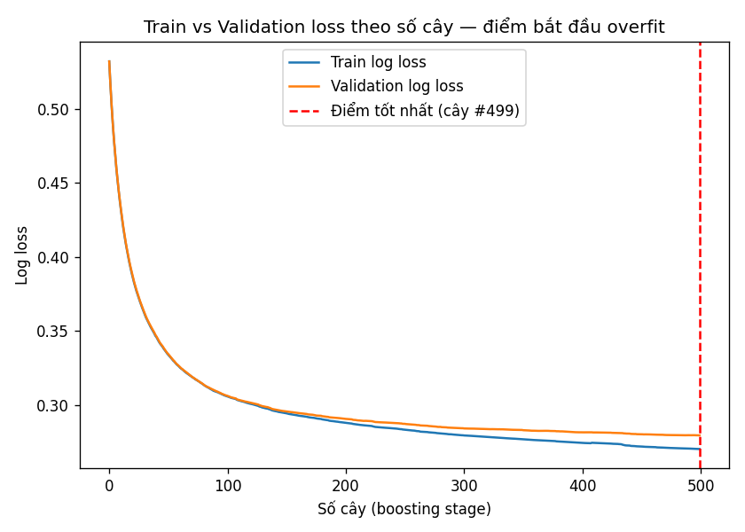
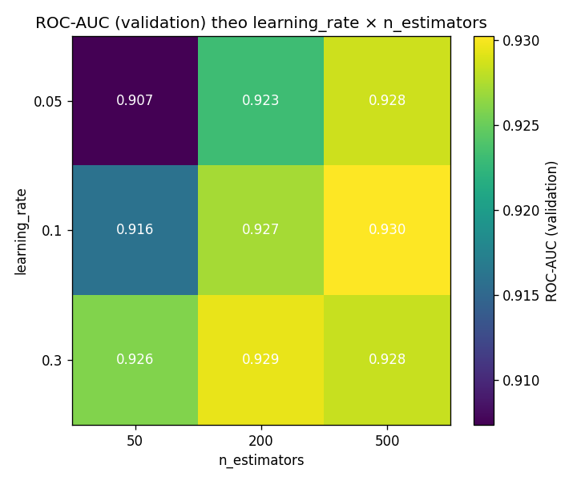
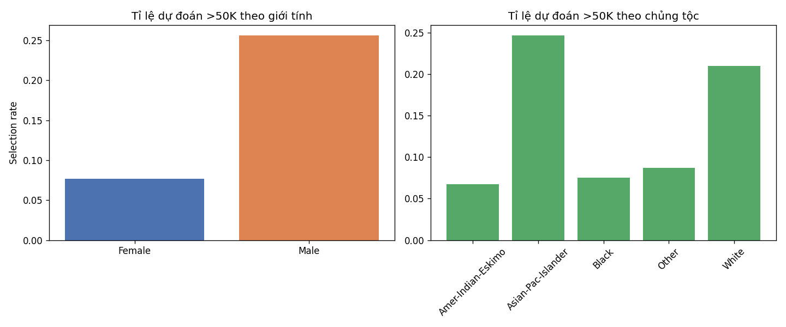

# TT-07 — GRADIENT BOOSTING
## Dự đoán mức thu nhập để hỗ trợ chấm điểm hồ sơ vay tiêu dùng

| | |
|---|---|
| 🎓 **Khoá** | HỌC MÁY · [Buổi 6](https://github.com/TruongTanNghia/Training-Machine-learning/tree/main/Buoi-06-Ensemble-EndToEnd) |
| 🧠 **Nhóm** | Phân loại · Ensemble (Boosting) |
| 🔧 **Thuật toán** | Gradient Boosting Classifier |
| 🏭 **Lĩnh vực** | Tài chính · Tín dụng tiêu dùng |
| 📈 **Độ khó** | ⭐⭐⭐ |

> **Mọi con số trong tài liệu này được trích từ `reports/`** — sinh tự động bởi
> `src/train.py`, không sửa tay. Chạy lại `python src/train.py` sẽ ghi đè các
> file đó; nếu README lệch khỏi `reports/` thì README sai. Lần chạy được trích
> dẫn: seed 42, scikit-learn 1.8.0, pandas 3.0.1.

---

## 1. BÀI TOÁN THỰC TẾ

Một công ty tài chính tiêu dùng cần ước lượng **khả năng tài chính** của khách
trước khi duyệt khoản vay trả góp, nhưng khách thường không khai thu nhập
hoặc khai không chính xác. Ta dùng thông tin dễ kiểm chứng hơn (nghề nghiệp,
học vấn, giờ làm/tuần, tình trạng hôn nhân...) để dự đoán khách có thu nhập
**> 50.000 $/năm** hay không — kết quả này là **một trong các đầu vào** của
mô hình chấm điểm tín dụng, không phải quyết định cuối cùng.

```
   BAGGING (Random Forest — TT-03)     BOOSTING (bài này)
     Cây 1 ─┐                            Cây 1 → sai ─→ Cây 2 → sai ─→ Cây 3
     Cây 2 ─┼─▶ BỎ PHIẾU                   ↓        ↓        ↓
     Cây 3 ─┘                            Kết quả = Cây1 + Cây2 + Cây3
     (học SONG SONG, độc lập)            (học TUẦN TỰ, cây sau sửa lỗi cây trước)
     Giảm VARIANCE                        Giảm BIAS
```

**Cơ chế:** mỗi cây mới học để dự đoán **phần dư (residual)** mà các cây
trước đó còn để sót lại — dự đoán mới = dự đoán cũ + `learning_rate` × cây mới.

---

## 2. BỘ DỮ LIỆU

| | |
|---|---|
| **Tên** | Adult Census Income (điều tra dân số Mỹ 1994) |
| **Nguồn** | [UCI ML Repository #2](https://archive.ics.uci.edu/dataset/2/adult), tải qua mirror công khai — xem [`data/DATA_SOURCE.md`](data/DATA_SOURCE.md) |
| **Kích thước** | 48.842 dòng × 14 cột đặc trưng + nhãn `income` |
| **Phân phối nhãn** | 23,93% `>50K` — mất cân bằng vừa phải |

### 2.1. Bốn bẫy trong dữ liệu

| Bẫy | Cách xử lý |
|---|---|
| Giá trị thiếu ghi bằng `' ?'` (khoảng trắng + dấu hỏi) | `.str.strip()` **trước**, rồi mới `replace("?", NaN)` — bắt được cả `'?'` và `' ?'` |
| Chuỗi có khoảng trắng thừa đầu/cuối | `.str.strip()` cho mọi cột object |
| `education` và `education-num` trùng thông tin | Bỏ `education`, giữ bản số đã có thứ tự |
| `fnlwgt` là trọng số điều tra dân số, không phải đặc trưng cá nhân | Bỏ cột |

**Bẫy ẩn thứ năm — nhãn có thể kèm dấu chấm cuối:** bản phân phối chính thức
`adult.test` của UCI ghi nhãn là `">50K."` (có dấu chấm, vì đây vốn là dòng
comment cuối file gốc). `data/adult.csv` dùng ở đây không có dấu chấm này,
nhưng `load_and_clean()` vẫn `.str.rstrip(".")` trước khi so khớp `">50K"` —
thiếu bước này, nếu ai đó đổi nguồn dữ liệu sang `adult.test` hoặc UCI gốc,
**toàn bộ nhãn sẽ bị đọc thành 0 một cách âm thầm**, không lỗi, không cảnh
báo, và mọi kết quả phía sau đều sai mà không ai nhận ra. Chi tiết ở
[`data/DATA_SOURCE.md`](data/DATA_SOURCE.md).

---

## 3. QUY TRÌNH ĐÁNH GIÁ — TEST CHỈ ĐƯỢC CHẠM MỘT LẦN

```
48.842 dòng
   │
   ├── train_test_split (80/20, stratify, seed 42)
   │        │
   │        ├── TRAIN_FULL  39.073 dòng
   │        │        │
   │        │        ├── train_test_split lần 2 (80/20, stratify)
   │        │        │        ├── train  31.258 ──┐
   │        │        │        └── val     7.815 ──┼─► MỌI lựa chọn nằm trong khung này:
   │        │        │                             │   staged loss (§5.2), lưới learning_rate
   │        │        │                             │   × n_estimators (§5.3)
   │        │        │
   │        │        └── Model CUỐI CÙNG huấn luyện lại trên TOÀN BỘ train_full
   │        │             (train_full = train + val gộp lại, không lãng phí dữ liệu)
   │        │
   │        └── TEST  9.769 dòng ──► KHOÁ LẠI, mở đúng một lần ở §5.1, §5.4–§5.6
```

**Vì sao tách thêm một lớp validation:** `learning_rate × n_estimators` (§5.3)
và điểm dừng sớm `best_iter` (§5.2) là những **lựa chọn**, không phải kết quả
cuối. Chấm chúng bằng chính tập test rồi công bố số đó là ước lượng lạc quan
có hệ thống — nó cho biết cấu hình khớp tập test tốt đến đâu, chứ không cho
biết mô hình sẽ chạy thế nào với hồ sơ vay ngày mai. Sau khi các lựa chọn đã
chốt (dựa trên validation), model cuối được huấn luyện lại trên toàn bộ dữ
liệu train sẵn có (`train_full`) để không lãng phí 7.815 dòng validation, và
test chỉ được mở **đúng một lần** để báo cáo kết quả cuối.

---

## 4. HAI SIÊU THAM SỐ THEN CHỐT

```
   learning_rate (η) — mỗi cây đóng góp bao nhiêu
        η nhỏ + n_estimators LỚN  = ổn định, ít overfit hơn
        η lớn + n_estimators nhỏ  = nhanh nhưng dễ overfit

   max_depth = 3 — cây phải NÔNG (weak learner)
        ⚠️ Khác hoàn toàn Random Forest (cây sâu, mạnh)
        Boosting cần cây YẾU để cộng dồn từ từ; cây sâu → overfit ngay
```

```python
gb = GradientBoostingClassifier(
    n_estimators=500, learning_rate=0.05, max_depth=3,
    subsample=0.8,              # Stochastic GB — chống overfit
    validation_fraction=0.1, n_iter_no_change=20,   # dừng sớm nội bộ
    random_state=42,
)
```

---

## 5. KẾT QUẢ THỰC NGHIỆM

### 5.1. PR-AUC so với baseline — trên TEST

| Mô hình | PR-AUC (Average Precision) |
|---|---:|
| Dummy (most_frequent) | 0.2393 |
| Decision Tree (depth=6) | 0.7270 |
| **Gradient Boosting** | **0.8283** |

Nền tham chiếu là 0.2393 (≈ tỉ lệ nhãn dương thật) — Decision Tree nông đã
vượt xa nền đó, và Gradient Boosting còn vượt tiếp thêm ~0.10 điểm, cho thấy
model học được tín hiệu thật chứ không chỉ "ăn may" nhờ nhãn mất cân bằng.
ROC-AUC = **0,9277**, Accuracy = **0,8741** (test).

### 5.2. Train vs Validation loss theo số cây



Hai đường bám sát nhau xuyên suốt 500 cây, log loss validation chỉ nhỉnh hơn
train một chút ở cuối (~0,28 so với ~0,27) — **chưa thấy dấu hiệu overfit rõ
rệt** trong phạm vi 500 cây, nhờ tổ hợp `learning_rate=0,05` nhỏ + `subsample
=0,8` + cây nông (`max_depth=3`). `best_iter` (điểm log loss validation thấp
nhất) rơi đúng vào cây cuối cùng (#499) — nói cách khác, ở cấu hình này,
càng nhiều cây (trong phạm vi đã thử) vẫn còn đang giúp ích, chưa tới điểm
quay đầu.

### 5.3. Lưới `learning_rate × n_estimators` — chấm bằng VALIDATION



| learning_rate \ n_estimators | 50 | 200 | 500 |
|---:|---:|---:|---:|
| 0.05 | 0.9073 | 0.9231 | 0.9285 |
| 0.10 | 0.9160 | 0.9271 | **0.9303** |
| 0.30 | 0.9259 | 0.9295 | 0.9283 |

**Đọc bảng trung thực, không tô hồng:** quan hệ nghịch giữa `learning_rate`
và số cây cần thiết thể hiện rõ ở cột `n_estimators=50` (η lớn hơn → ROC-AUC
cao hơn hẳn khi chưa có nhiều cây để bù). Nhưng ở lưới 3×3 cụ thể này, ô cao
nhất là **η=0,10 · 500 cây (0,9303)**, không phải η=0,05 như "quy tắc vàng"
vẫn nêu — η=0,05 · 500 cây (0,9285) đứng thứ nhì, cách nhau 0,0018, nhỏ hơn
mức dao động ngẫu nhiên thường thấy giữa các lần chạy. Kết luận đúng mực:
**η nhỏ + nhiều cây vẫn là lựa chọn an toàn và ổn định** (ít nhạy với việc
chọn sai `n_estimators`, xem cột 50 vs 500 của hàng 0,05 chênh tới 0,021,
trong khi hàng 0,30 chỉ chênh 0,002) — nhưng "tốt nhất" và "an toàn nhất"
không phải lúc nào cũng là cùng một cấu hình, và ta giữ η=0,05 cho model
cuối vì tính ổn định, không phải vì nó thắng tuyệt đối trên lưới này.

### 5.4. So sánh Bagging vs Boosting vs AdaBoost — trên TEST

| Mô hình | PR-AUC | ROC-AUC | Thời gian train (s) | Số cây |
|---|---:|---:|---:|---:|
| Random Forest (Bagging) | 0.7569 | 0.8946 | ~5 | 300 |
| **Gradient Boosting** | **0.8304** | **0.9285** | ~90 | 500 |
| AdaBoost | 0.7948 | 0.9149 | ~34 | 300 |

*(Thời gian train phụ thuộc phần cứng và tải hệ thống tại thời điểm chạy —
chạy lại `src/train.py` trên máy khác sẽ ra số khác; PR-AUC/ROC-AUC thì tái
lập được nhờ `random_state=42`.)*

Gradient Boosting thắng cả hai đối thủ về PR-AUC/ROC-AUC, đổi lại thời gian
train chậm hơn Random Forest hơn 20 lần — cây học tuần tự nên không song
song hoá được giữa các cây như Bagging.

### 5.5. Tốc độ: `GradientBoostingClassifier` vs `HistGradientBoostingClassifier`

| | GB cổ điển | HistGB |
|---|---:|---:|
| Thời gian train | 62,38 s | 11,67 s |
| ROC-AUC (test) | 0,9277 | 0,9304 |

**HistGB nhanh hơn ~5,3×** với ROC-AUC tương đương (thậm chí nhỉnh hơn một
chút) — nhờ thuật toán histogram-based, khuyến nghị dùng cho dữ liệu lớn hơn
hoặc khi cần lặp thử nghiệm nhanh.

### 5.6. ⚖️ Kiểm tra thiên lệch theo `sex` và `race` — trên TEST



| sex | n | Selection rate | TPR | FPR |
|---|---:|---:|---:|---:|
| Female | 3.289 | 7,66% | 0,5477 | 0,0175 |
| Male | 6.480 | 25,62% | 0,6641 | 0,0778 |

| race | n | Selection rate | TPR | FPR |
|---|---:|---:|---:|---:|
| Amer-Indian-Eskimo | 104 | 6,73% | 0,5556 | 0,0211 |
| Asian-Pac-Islander | 304 | 24,67% | 0,6667 | 0,1018 |
| Black | 944 | 7,52% | 0,5041 | 0,0122 |
| Other | 69 | 8,70% | 0,4545 | 0,0172 |
| White | 8.348 | 21,00% | 0,6546 | 0,0588 |

Model dự đoán nam giới thuộc nhóm `>50K` với tỉ lệ cao gấp **~3,3 lần** nữ
giới, và White/Asian-Pac-Islander có selection rate cao hơn nhiều so với
Black/Amer-Indian-Eskimo. Đây **không phải lỗi kỹ thuật** — nó phản ánh
trung thực chênh lệch thu nhập thực tế trong dữ liệu điều tra dân số Mỹ
1994. Nhưng dùng thẳng đầu ra này để duyệt vay sẽ **khuếch đại** đúng bất
bình đẳng lịch sử đó lên các quyết định tài chính hiện tại.

#### 5.6.1. Thử bỏ hẳn `sex`/`race` — bias có biến mất không?

| sex (KHÔNG dùng sex/race làm đặc trưng) | n | Selection rate | TPR | FPR |
|---|---:|---:|---:|---:|
| Female | 3.289 | 7,94% | 0,5586 | 0,0192 |
| Male | 6.480 | 25,54% | 0,6596 | 0,0787 |

ROC-AUC gần như không đổi (0,9277 → 0,9278) và chênh lệch selection rate
nam/nữ **vẫn còn gần như nguyên vẹn** (7,66%→7,94% và 25,62%→25,54%) sau khi
bỏ hẳn `sex` và `race` khỏi đặc trưng đầu vào. Lý do: các cột còn lại như
`occupation`, `relationship`, `marital-status` đóng vai trò **biến thay thế
(proxy)** mang thông tin tương quan chặt với giới tính/chủng tộc trong dữ
liệu này (`relationship=Wife`/`Husband` gần như xác định `sex`).

> **Bài học:** xoá cột nhạy cảm **không đủ** để loại bỏ thiên lệch nếu các
> cột còn lại vẫn "rò rỉ" cùng thông tin đó qua tương quan. Đo bias, xoá
> `sex`/`race`, rồi đo lại là bước bắt buộc để phát hiện đúng điều này —
> nếu chỉ đo một lần trước khi xoá, sẽ dễ kết luận sai rằng "đã sửa xong".

### 5.7. Khuyến nghị giảm thiểu thiên lệch

Đo được thiên lệch (§5.6) và chứng minh xoá cột nhạy cảm không đủ (§5.6.1)
mới là bước phát hiện — dưới đây là các hướng xử lý cụ thể, xếp theo độ khả
thi triển khai:

| Hướng | Cơ chế | Đánh đổi |
|---|---|---|
| **Ngưỡng riêng theo nhóm (post-processing)** | Thay vì một ngưỡng 0,5 chung, chọn ngưỡng khác nhau cho từng nhóm `sex`/`race` sao cho selection rate hoặc TPR cân bằng giữa các nhóm (equalized odds / demographic parity). | Không cần train lại; nhưng dùng `sex`/`race` *tường minh* ở bước quyết định — cần minh bạch với người bị ảnh hưởng và có thể vướng quy định chống phân biệt đối xử tuỳ pháp lý địa phương. |
| **Reweighing khi train** | Gán trọng số mẫu cao hơn cho các tổ hợp (nhóm, nhãn) bị thiểu số trong dữ liệu train (vd. nữ có thu nhập cao) để model bớt lệch về đa số. | Cần đánh giá lại toàn bộ pipeline; có thể đánh đổi một phần độ chính xác tổng thể để lấy công bằng hơn. |
| **Fairness-constrained learning** | Dùng thư viện chuyên biệt (vd. `fairlearn.reductions`) tối ưu đồng thời độ chính xác và một ràng buộc công bằng (demographic parity / equalized odds) ngay trong lúc train. | Phức tạp hơn để tích hợp và giải thích; cần chọn đúng định nghĩa công bằng phù hợp bài toán (không có định nghĩa nào đúng cho mọi trường hợp). |
| **Giám sát vận hành liên tục** | Theo dõi selection rate / TPR / FPR theo nhóm trên dữ liệu thật theo thời gian (không chỉ đo một lần lúc train), cảnh báo khi lệch vượt ngưỡng. | Cần hạ tầng logging + có nhãn thật (label) đến sau (thực tế người vay có trả nợ hay không) để đánh giá đúng. |
| **Con người xét duyệt cho vùng biên** | Với hồ sơ có xác suất gần ngưỡng quyết định, chuyển cho nhân viên tín dụng xem xét thay vì tự động hoá hoàn toàn. | Chậm hơn, tốn nhân lực; nhưng là lớp bảo vệ cuối cùng trước khi một quyết định tài chính thật được đưa ra. |

> ⚖️ **Khuyến nghị chốt lại:** với dữ liệu và mô hình trong bài tập này,
> **không dùng trực tiếp xác suất đầu ra để tự động duyệt/từ chối vay**. Ở
> mức tối thiểu cần (1) chọn một định nghĩa công bằng phù hợp bài toán và áp
> dụng post-processing hoặc reweighing tương ứng, (2) giám sát các chỉ số ở
> bảng §5.6 trên dữ liệu vận hành thật, và (3) giữ con người trong vòng lặp
> quyết định cho các trường hợp biên. Đây là hướng mở rộng thực nghiệm ở §9.

---

## 6. CẠM BẪY CẦN TRÁNH

| Cạm bẫy | Hậu quả | Cách tránh |
|---|---|---|
| `replace("?")` không strip trước | Không bắt được `' ?'` có khoảng trắng | `.str.strip()` mọi cột chuỗi **trước** khi so khớp `"?"` |
| So khớp nhãn `== ">50K"` không phòng thủ dấu chấm cuối | Nếu gặp `adult.test` (`">50K."`) thì **toàn bộ nhãn về 0** một cách âm thầm | `.str.rstrip(".")` trước khi so khớp — xem §2.1 |
| `max_depth` lớn (8–10) | Overfit ngay — sai bản chất boosting | Giữ cây nông (`max_depth=3`), Boosting cần *weak learner* |
| Giữ cả `education` và `education-num` | Trùng lặp thông tin | Bỏ một trong hai |
| Giữ `fnlwgt` | Nhiễu, không liên quan tới cá nhân | Bỏ cột |
| **Dò `learning_rate × n_estimators` hoặc chọn điểm dừng sớm bằng chính tập test** | Con số công bố là ước lượng lạc quan có hệ thống, không phản ánh khả năng tổng quát hoá thật | Tách thêm validation từ train; test chỉ mở đúng một lần ở bước đánh giá cuối (§3) |
| Xoá `sex`/`race` rồi coi như đã hết thiên lệch | Các cột còn lại rò rỉ cùng thông tin qua proxy (§5.6.1) — bias gần như không đổi | Đo lại bias sau khi xoá, đừng chỉ tin lý thuyết |
| Chỉ đo thiên lệch mà không có khuyến nghị xử lý | Số liệu công bằng nằm im trong báo cáo, không ai hành động | Gắn mỗi phát hiện với một hướng xử lý cụ thể (§5.7) |

---

## 7. CẤU TRÚC THƯ MỤC

```
TT-07-GradientBoosting/
├── README.md                       # Báo cáo này
├── requirements.txt
├── data/
│   ├── adult.csv
│   └── DATA_SOURCE.md               # Nguồn dữ liệu + lý do làm sạch phòng thủ
├── notebooks/
│   └── gradient_boosting_income.ipynb   # Cùng phương pháp với train.py, có giải thích từng bước
├── src/
│   └── train.py                     # Toàn bộ pipeline, sinh mọi thứ trong reports/
├── models/
│   └── gb_pipeline.joblib           # Model cuối cùng (huấn luyện trên train_full)
└── reports/                         # SINH TỰ ĐỘNG bởi train.py — không sửa tay
    ├── loss_theo_so_cay.png         # Train vs Validation log loss
    ├── lr_vs_nestimators.png/.csv   # Lưới learning_rate × n_estimators (validation)
    ├── bagging_vs_boosting_vs_adaboost.csv
    ├── speed_comparison.json
    ├── bias_by_sex.csv / bias_by_race.csv / bias_by_group.png
    └── bias_by_sex_no_sensitive.csv # Bias sau khi bỏ sex/race khỏi đặc trưng (§5.6.1)
```

---

## 8. HƯỚNG DẪN CHẠY

```bash
pip install -r requirements.txt
python src/train.py                 # huấn luyện + sinh toàn bộ reports/
jupyter notebook notebooks/gradient_boosting_income.ipynb   # bản giải thích từng bước
```

`src/train.py` neo mọi đường dẫn theo vị trí của chính file, chạy được từ
bất kỳ thư mục nào, và tự tạo `reports/`, `models/` nếu chưa có.

---

## 9. MỞ RỘNG

```
1. LightGBM & SHAP: notebook có thêm phần so sánh với LightGBM (nhanh hơn
   GradientBoostingClassifier cổ điển với ROC-AUC tương đương) và dùng SHAP
   để giải thích từng hồ sơ cụ thể — cần cài thêm `lightgbm`, `shap`.
2. Áp dụng thực tế một trong các hướng ở §5.7 (vd. fairlearn.reductions với
   ràng buộc demographic parity) và đo lại bảng §5.6 để xem selection rate
   giữa các nhóm co lại bao nhiêu, đánh đổi bao nhiêu điểm ROC-AUC.
3. Kiểm định thống kê chênh lệch giữa các cấu hình ở lưới §5.3 (vd. lặp lại
   với nhiều seed) thay vì chỉ nhìn một lần chạy — chênh 0,0018 giữa hai ô
   tốt nhất có thể chỉ là nhiễu.
```

> ⚖️ **Cảnh báo đạo đức bắt buộc:** bộ dữ liệu này từ điều tra dân số Mỹ 1994,
> chứa **định kiến lịch sử** rõ rệt về giới tính và chủng tộc. Model học tốt
> trên dữ liệu này sẽ **học và khuếch đại** đúng những định kiến đó (§5.6).
> **Tuyệt đối không dùng model này cho quyết định thật về con người** nếu
> chưa áp dụng ít nhất một hướng giảm thiểu ở §5.7.

**Tham khảo:** [Buổi 6 — Ensemble & Boosting](https://github.com/TruongTanNghia/Training-Machine-learning/tree/main/Buoi-06-Ensemble-EndToEnd/Tai-Lieu/ly_thuyet_chi_tiet_buoi_06.md)
