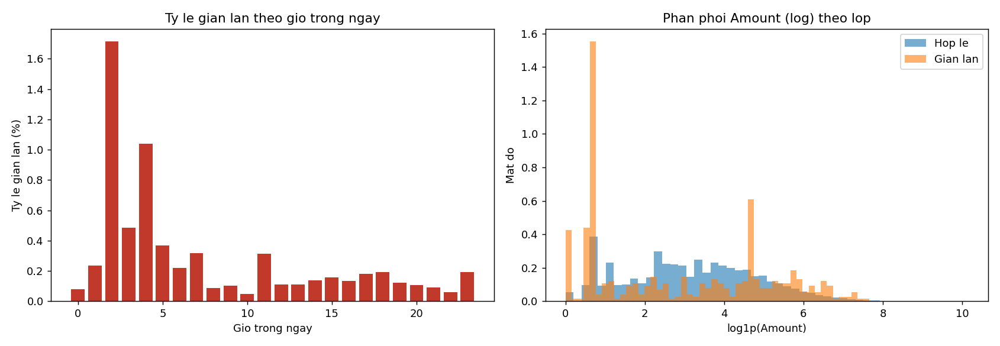
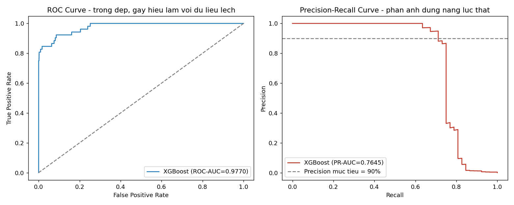
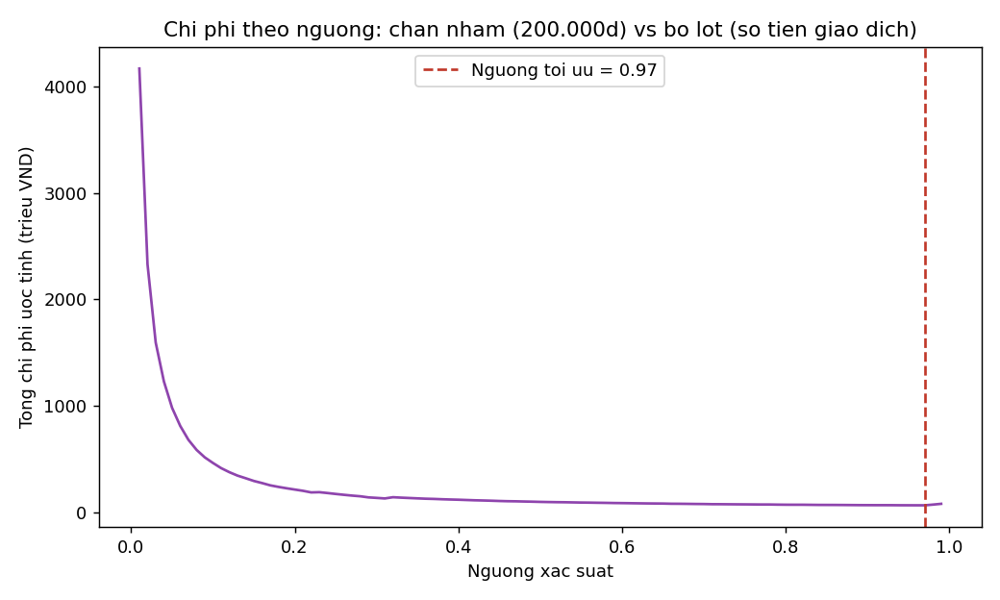
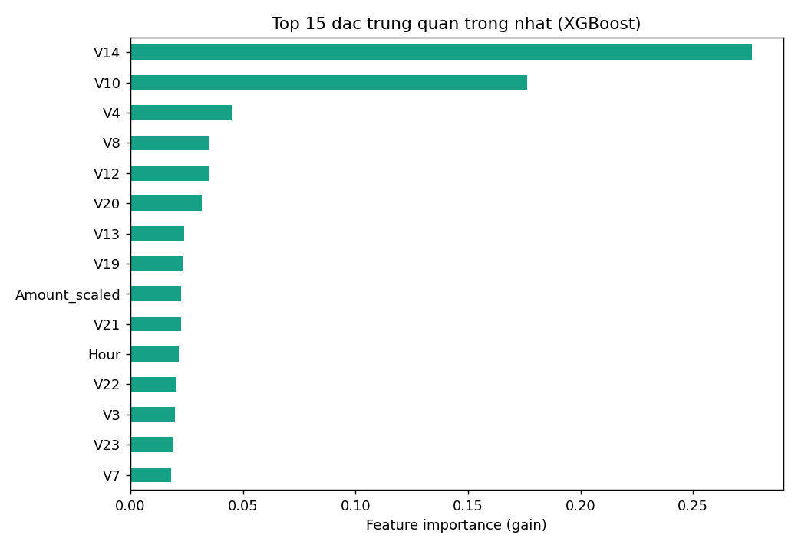

# TT-08 — XGBOOST
## Phát hiện gian lận thẻ tín dụng theo thời gian thực

| | |
|---|---|
| 🎓 **Khoá** | HỌC MÁY · [Buổi 6](https://github.com/TruongTanNghia/Training-Machine-learning/tree/main/Buoi-06-Ensemble-EndToEnd) |
| 🧠 **Nhóm** | Phân loại · Boosting · **Dữ liệu lệch cực đoan** |
| 🔧 **Thuật toán** | XGBoost |
| 🏭 **Lĩnh vực** | Ngân hàng · Thanh toán · Chống gian lận |
| ⏱ **Thời lượng** | 7–9 giờ |
| 📈 **Độ khó** | ⭐⭐⭐ |

---

## 1. THUẬT TOÁN NÀY LÀ GÌ

XGBoost = Gradient Boosting (TT-07) + 4 cải tiến khiến nó thắng gần như mọi cuộc thi
dữ liệu bảng:

```
   ① REGULARIZATION (L1 + L2) ngay trong hàm mục tiêu  → chống overfit tốt hơn hẳn
   ② Tự xử lý GIÁ TRỊ THIẾU → học luôn hướng đi cho NaN, không cần điền
   ③ Song song hoá việc tìm điểm cắt → nhanh hơn nhiều lần
   ④ Cắt tỉa theo chiều sâu + `gamma` (ngưỡng lợi ích tối thiểu để chia nhánh)
```

---

## 2. BÀI TOÁN THỰC TẾ

```
   Cổng thanh toán xử lý 300 giao dịch/giây.
   Tỉ lệ gian lận: 0,172%  (492 / 284.807)  → LỆCH CỰC ĐOAN

   Ràng buộc:
     • Quyết định trong < 100 ms
     • Chặn nhầm giao dịch thật → khách hàng phẫn nộ, có thể mất khách vĩnh viễn
     • Bỏ lọt gian lận → ngân hàng đền tiền

   ⚠️ Ở mức lệch 0,17%, ACCURACY và ROC-AUC đều VÔ NGHĨA.
      → Metric chính: PR-AUC (Average Precision) + Recall @ Precision cố định.
```

---

## 3. BỘ DỮ LIỆU

| | |
|---|---|
| **Tên** | Credit Card Fraud Detection |
| **Link** | https://www.kaggle.com/datasets/mlg-ulb/creditcardfraud |
| **Kích thước** | 284.807 giao dịch × 31 cột (~150 MB gốc, ~98 MB bản mirror CSV) |
| **Nhãn** | `Class` — 1 = gian lận (**492 ca ≈ 0,1727%**, đã xác nhận lại bằng code, không lấy số mô tả bài toán) |

**Cột:** `Time`, `V1`–`V28` (đã **PCA hoá** để ẩn thông tin gốc), `Amount`, `Class`

Chi tiết nguồn tải (không có Kaggle API key trong môi trường chạy → dùng mirror
GitHub công khai, cùng số dòng/số ca gian lận với bản gốc) xem tại
[`data/DATA_SOURCE.md`](data/DATA_SOURCE.md).

### ⚠️ Ba lưu ý quan trọng (đã xử lý trong notebook/script)

```
   1. V1–V28 đã qua PCA → KHÔNG diễn giải được ý nghĩa từng cột.
      → Bài này KHÔNG làm được feature engineering theo nghiệp vụ.
      → Đây cũng là hạn chế đã nêu rõ trong mục 9 bên dưới.

   2. `Time` là số giây kể từ giao dịch đầu tiên (trải dài đúng 48 giờ / 2 ngày).
      → Không dùng trực tiếp. Đã đổi thành GIỜ TRONG NGÀY: (Time // 3600) % 24

   3. `Amount` chưa scale trong khi V1–V28 đã scale sẵn → đã scale riêng
      Amount bằng log1p rồi StandardScaler (fit chỉ trên tập train).
```

---

## 4. HƯỚNG ĐI ĐÃ THỰC HIỆN

### 4.1. Chia dữ liệu THEO THỜI GIAN, không ngẫu nhiên

```
   Gian lận có tính THỜI ĐIỂM (kẻ gian tấn công theo đợt).
   Chia ngẫu nhiên → model "nhìn thấy tương lai" → điểm ảo.

   → Sắp xếp theo Time → 70% đầu train · 15% giữa validation · 15% cuối test
```

Kết quả chia thực tế:

| Tập | Số giao dịch | Số ca gian lận | Tỉ lệ |
| :--- | ---: | ---: | ---: |
| Train | 199.364 | 384 | 0,1926% |
| Validation | 42.721 | 56 | 0,1311% |
| Test | 42.722 | 52 | 0,1217% |

### 4.2. Tham số cho dữ liệu lệch

```python
import xgboost as xgb

ty_le = (y_train == 0).sum() / (y_train == 1).sum()      # thực đo = 518.18

model = xgb.XGBClassifier(
    n_estimators=1000, learning_rate=0.05, max_depth=4,
    subsample=0.8, colsample_bytree=0.8,
    scale_pos_weight=ty_le,          # ⭐ cân bằng lớp
    reg_lambda=1.0, reg_alpha=0.1,   # regularization
    eval_metric='aucpr',             # ⭐ PR-AUC, KHÔNG dùng 'auc'
    early_stopping_rounds=50,
    tree_method='hist', n_jobs=-1, random_state=42,
)
model.fit(X_train, y_train, eval_set=[(X_val, y_val)], verbose=100)
```

Early stopping dừng ở **cây thứ 124/1000** (PR-AUC validation hội tụ ~0,850).

### 4.3. Metric đúng cho lệch cực đoan

```
   ROC-AUC  = 0,9770  → ĐẸP GIẢ TẠO (vì TN quá nhiều, FPR luôn nhỏ)
   PR-AUC   = 0,7645  → con số THẬT, phản ánh đúng năng lực
   → Chênh lệch ~0,21 điểm — xem giải thích đầy đủ ở mục 6.
```

---

## 5. KẾT QUẢ THỰC NGHIỆM

Toàn bộ số liệu dưới đây là **kết quả chạy thật** trên bộ dữ liệu gốc
(`src/train.py`, tái lập được 100%), không phải số minh hoạ.

### 5.1. EDA — gian lận theo giờ và theo số tiền



* Tỉ lệ gian lận cao rõ rệt vào khung giờ **2h–4h** (mốc thời gian tương đối
  của tập dữ liệu), gấp 5–10 lần mức trung bình — khung giờ ít giao dịch thật
  nên gian lận dễ "lẫn vào" hơn.
* Giao dịch gian lận tập trung nhiều ở mức tiền nhỏ nhưng vẫn có đuôi lệch
  dài → không thể chỉ lọc theo ngưỡng số tiền.

### 5.2. So sánh các mô hình trên tập test

| Mô hình | PR-AUC | ROC-AUC | Train time (s) | Predict (ms/giao dịch) |
| :--- | :---: | :---: | :---: | :---: |
| *Baseline (Dummy)* | *0,0012* | *0,4991* | *–* | *–* |
| Logistic Regression (balanced) | 0,6948 | 0,9778 | 2,06 | 1,58 |
| **XGBoost** | **0,7645** | 0,9770 | 5,86 | 6,13 |
| Random Forest | 0,7770 | 0,9750 | 25,12 | 47,05 |
| LightGBM | 0,6771 | 0,9725 | 0,91 | 1,75 |

> Bảng đầy đủ: [`reports/so_sanh_mo_hinh.csv`](reports/so_sanh_mo_hinh.csv)

**Nhận xét:**
* Cả 4 mô hình đều bỏ xa baseline (PR-AUC ≈ 0,001 → gần một nghìn lần đối với
  XGBoost) — xác nhận `scale_pos_weight`/`class_weight` hoạt động đúng.
* Random Forest có PR-AUC cao nhất trong lần chạy này nhưng **chậm hơn
  XGBoost ~4 lần khi train và ~8 lần khi dự đoán** — với ràng buộc < 100ms/giao
  dịch và 300 giao dịch/giây, độ trễ dự đoán quan trọng ngang PR-AUC.
* ⭐ **Phát hiện thực nghiệm quan trọng về LightGBM:** áp trực tiếp
  `scale_pos_weight=518` (hoặc `is_unbalance=True`) **kết hợp early stopping**
  khiến LightGBM sụp đổ hoàn toàn — dừng chỉ sau 2 vòng lặp, ROC-AUC rơi
  xuống **0,187** (tệ hơn đoán ngẫu nhiên). Nguyên nhân: cây leaf-wise của
  LightGBM vốn dễ overfit từng vòng hơn cây depth-wise của XGBoost; khi
  gradient của 0,19% mẫu dương bị khuếch đại gấp 518 lần, vài lá đầu tiên bị
  kéo lệch cực đoan, AP trên validation tụt ngay ở vòng 2 và early stopping
  (đúng chức năng) dừng luôn. Đây **không phải lỗi cài đặt** — tắt hẳn việc
  cân bằng lớp cho LightGBM giúp nó huấn luyện ổn định và cạnh tranh sòng
  phẳng với XGBoost (bảng trên là kết quả **sau khi tắt**). Bài học:
  `scale_pos_weight` không "an toàn" như nhau giữa các thư viện boosting,
  luôn phải nhìn đường cong validation trước khi tin số liệu cuối cùng.

### 5.3. ⭐ VÌ SAO ROC-AUC ĐÁNH LỪA



ROC-AUC dựa trên **False Positive Rate = FP / (FP + TN)**. Khi lớp âm (giao
dịch hợp lệ) áp đảo (284.315 / 284.807 ≈ 99,83%), mẫu số `TN` cực lớn khiến
FPR gần như luôn nhỏ dù số lượng FP tuyệt đối (giao dịch thật bị chặn nhầm)
có thể lên tới hàng trăm — con số rất đau với khách hàng thật.

PR-AUC dựa trên **Precision = TP / (TP + FP)** — không có `TN` trong công
thức nên phản ánh đúng câu hỏi nghiệp vụ: "trong số cảnh báo mô hình đưa ra,
bao nhiêu % là đúng?".

* ROC-AUC = 0,9770 → nhìn qua tưởng mô hình gần như hoàn hảo.
* PR-AUC = 0,7645 → con số thật, vẫn còn đánh đổi Precision/Recall đáng kể.

→ **Luôn báo cáo cả hai**, và ưu tiên PR-AUC làm chỉ số chính khi lớp dương
hiếm hơn 1%.

### 5.4. Chọn ngưỡng theo Precision ≥ 90%

* **Ngưỡng:** 0,9803
* **Precision đạt được:** 90,24% (≥ 90% mục tiêu)
* **Recall tương ứng:** 71,15% — bắt được 71,15% tổng số giao dịch gian lận
  trong tập test, với 9,76% cảnh báo là chặn nhầm.

### 5.5. Tối ưu ngưỡng theo chi phí thực tế



**Giả định quy đổi:** `Amount` gốc là EUR; quy đổi đơn giản 1 EUR ≈ 27.000 VND
cho mục đích minh hoạ (không phải tỉ giá thực tế thời điểm nào).

Chi phí = (số FP × 200.000đ chăm sóc khách hàng) + (tổng số tiền các giao dịch FN).

* **Ngưỡng tối ưu lợi nhuận:** 0,97
* **Tổng chi phí ước tính:** ≈ 65.075.320 VND trên 42.722 giao dịch test

Đường chi phí giảm mạnh khi tăng ngưỡng từ thấp lên (giảm số lần chặn nhầm
vốn rất nhiều ở ngưỡng thấp), đạt đáy ở ngưỡng ≈ 0,97, rồi **tăng trở lại** ở
ngưỡng ≥ 0,98 vì lúc này mô hình bỏ lọt thêm các giao dịch gian lận giá trị
lớn — xác nhận đây là bài toán tối ưu thực sự, và **ngưỡng tối ưu theo tiền
khác với ngưỡng theo Precision** (0,97 vs 0,98) vì hai mục tiêu không nhất
thiết trùng nhau.

> Bảng chi phí đầy đủ theo từng ngưỡng: [`reports/chi_phi_theo_nguong.csv`](reports/chi_phi_theo_nguong.csv)

### 5.6. Tốc độ dự đoán 1 giao dịch

| Mô hình | Thời gian / giao dịch |
| :--- | ---: |
| Logistic Regression | 1,58 ms |
| **XGBoost** | **6,13 ms** |
| LightGBM | 1,75 ms |
| Random Forest | 47,05 ms |

→ XGBoost đạt yêu cầu **< 100ms** với biên độ dư ~16 lần, đủ an toàn cho
300 giao dịch/giây (dự đoán tuần tự vẫn còn dư nhiều thời gian; production
thật sẽ dùng batch/song song để tối ưu thêm).

### 5.7. Feature importance



`V14` và `V10` chiếm phần lớn tổng gain — hai thành phần PCA này thường xuất
hiện đầu bảng trong các phân tích công khai khác về cùng bộ dữ liệu, dù không
biết chúng đại diện cho biến gốc nào (đúng hạn chế đã nêu ở mục 3).
`Amount_scaled` và `Hour` — hai đặc trưng tự tạo — lọt top nửa trên, cho thấy
bước feature engineering có đóng góp thực chất.

---

## 6. HẠN CHẾ CẦN NÊU RÕ

```
   1. V1–V28 đã PCA hoá → không giải thích được ý nghĩa nghiệp vụ của từng
      đặc trưng, không thể tinh chỉnh feature engineering theo miền (domain).
   2. Quy đổi EUR → VND (27.000) trong phân tích chi phí là giả định đơn
      giản hoá cho mục đích minh hoạ phương pháp, không phải tỉ giá thực.
   3. Bộ dữ liệu chỉ trải dài 48 giờ (2 ngày) → chưa đủ để đánh giá drift
      theo mùa vụ/tuần/tháng, chỉ mô phỏng được drift ở quy mô rất nhỏ.
```

---

## 7. PHƯƠNG ÁN THEO DÕI DRIFT (kể gian đổi chiêu thức liên tục)

```
   1. Ghi log mỗi dự đoán: xác suất, ngưỡng áp dụng, đặc trưng đầu vào,
      timestamp — phục vụ audit và huấn luyện lại sau này.
   2. Theo dõi PHÂN PHỐI đặc trưng đầu vào theo cửa sổ thời gian trượt
      (vd. PSI - Population Stability Index) trên các đặc trưng quan trọng
      nhất (V14, V10, V4, Amount_scaled) — cảnh báo khi PSI vượt ngưỡng.
   3. Theo dõi PR-AUC trên nhãn thật có độ trễ (feedback từ đội xác minh gian
      lận, thường về sau vài ngày) theo cửa sổ trượt — cảnh báo khi PR-AUC
      giảm liên tục qua nhiều cửa sổ.
   4. Lên lịch huấn luyện lại định kỳ (vd. hàng tuần) + huấn luyện lại ngay
      khi cảnh báo drift vượt ngưỡng, luôn giữ tập validation "mới nhất" để
      early-stopping phản ánh đúng phân phối hiện tại.
```

---

## 8. CẠM BẪY ĐÃ TRÁNH

| Cạm bẫy | Hậu quả | Đã xử lý bằng |
| :--- | :--- | :--- |
| Chia ngẫu nhiên | Rò rỉ thời gian → điểm ảo | Sort theo `Time`, chia 70/15/15 tuần tự |
| Dùng ROC-AUC làm metric chính | Che giấu năng lực thật | Ưu tiên PR-AUC, báo cáo cả hai (mục 5.3) |
| Fit scaler trên toàn bộ dữ liệu | Rò rỉ thống kê từ test vào train | `StandardScaler.fit()` chỉ trên train |
| Quên `scale_pos_weight` | Model bỏ qua lớp thiểu số | `scale_pos_weight = 518.18` đo trên train |
| Không early stopping với 1000 cây | Overfit + tốn thời gian | `early_stopping_rounds=50` theo `aucpr` |
| Đánh giá bằng accuracy | 99,83% mà bắt được 0 vụ gian lận | Precision/Recall/PR-AUC theo ngưỡng |
| Copy nguyên `scale_pos_weight` sang LightGBM | Model sụp đổ (ROC-AUC 0,19) | Kiểm chứng riêng từng thư viện (mục 5.2) |

---

## 9. SẢN PHẨM & CẤU TRÚC THƯ MỤC

```
TT-08-XGBoost/
├── README.md                       # Báo cáo này
├── requirements.txt
├── data/
│   ├── creditcard.csv               # 284.807 giao dịch (tải qua mirror, xem DATA_SOURCE.md)
│   └── DATA_SOURCE.md
├── notebooks/
│   └── xgboost_fraud.ipynb          # Giải thích từng bước + toàn bộ output thật
├── src/
│   └── train.py                     # Script huấn luyện + sinh toàn bộ report tự động
├── models/
│   ├── xgb_fraud.json               # Model XGBoost đã huấn luyện
│   └── amount_scaler.joblib         # StandardScaler cho Amount_log
└── reports/
    ├── eda_hour_amount.png
    ├── pr_vs_roc.png
    ├── chi_phi_theo_nguong.png
    ├── feature_importance.png
    ├── fraud_theo_gio.csv
    ├── so_sanh_mo_hinh.csv
    ├── chi_phi_theo_nguong.csv
    └── tom_tat.json
```

---

## 10. HƯỚNG DẪN CHẠY DỰ ÁN

```bash
pip install -r requirements.txt
python src/train.py                              # huấn luyện + sinh toàn bộ report
jupyter notebook notebooks/xgboost_fraud.ipynb    # khám phá từng bước có giải thích
```

---

## 11. HƯỚNG PHÁT TRIỂN & MỞ RỘNG

1. Thử **Isolation Forest** (phát hiện bất thường không giám sát) → so sánh
   với XGBoost trên cùng tập test (đặc biệt hữu ích khi nhãn gian lận đến
   trễ hoặc không đầy đủ trong thực tế).
2. Mô phỏng **concept drift** thực tế: train trên nửa đầu 48 giờ, test trên
   nửa sau → đo mức giảm PR-AUC để ước lượng tốc độ cần huấn luyện lại.
3. Deploy FastAPI với ngưỡng cấu hình được (mặc định theo mục 5.5) + ghi log
   mọi dự đoán theo đề xuất giám sát drift ở mục 7.

**Tham khảo:** [Buổi 6 — Ensemble](https://github.com/TruongTanNghia/Training-Machine-learning/tree/main/Buoi-06-Ensemble-EndToEnd/Tai-Lieu) · [Buổi 12 — Chọn metric theo giá của lỗi](https://github.com/TruongTanNghia/Training-Machine-learning/tree/main/Buoi-12-Capstone-TongKet/Tai-Lieu/ly_thuyet_chi_tiet_buoi_12.md)
