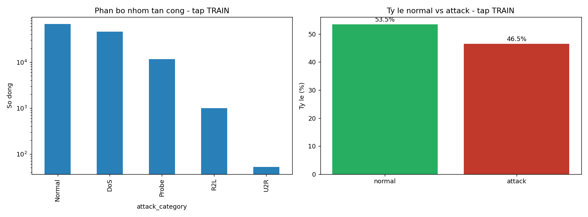
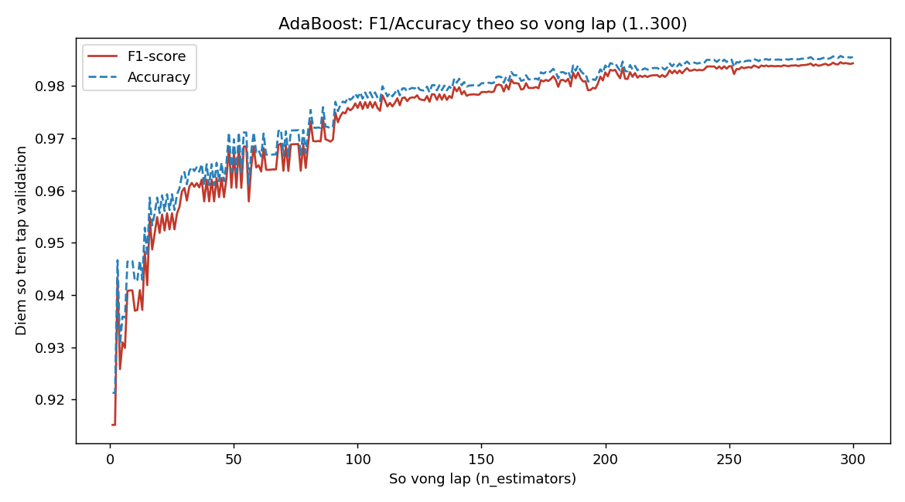
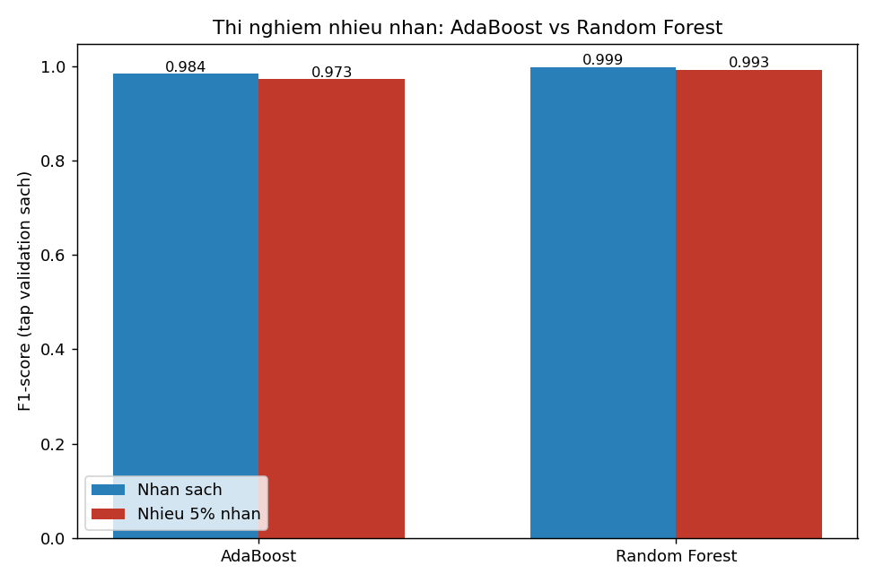
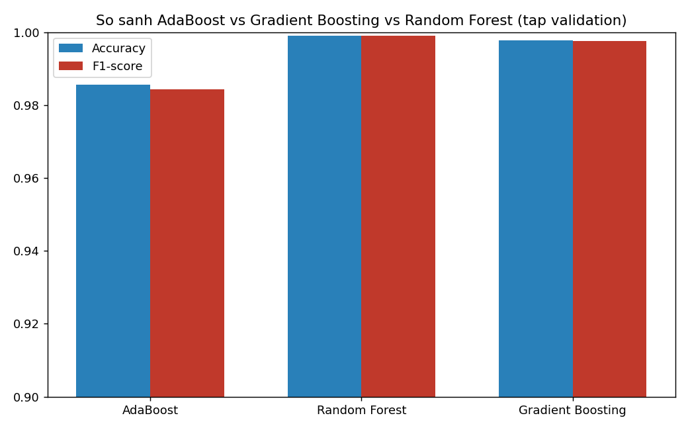
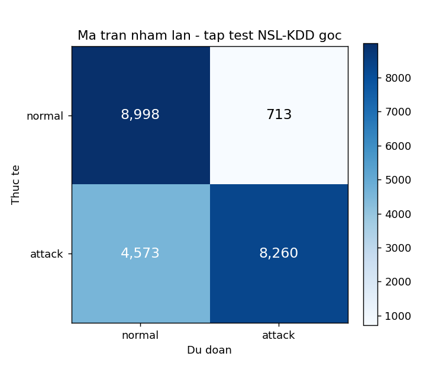

# TT-09 — ADABOOST
## Phát hiện xâm nhập mạng trong hệ thống giám sát an ninh

| | |
|---|---|
| 🎓 **Khoá** | HỌC MÁY · [Buổi 6](https://github.com/TruongTanNghia/Training-Machine-learning/tree/main/Buoi-06-Ensemble-EndToEnd) |
| 🧠 **Nhóm** | Phân loại · Boosting (thế hệ đầu) |
| 🔧 **Thuật toán** | AdaBoost (Adaptive Boosting) |
| 🏭 **Lĩnh vực** | An ninh mạng · SOC |
| ⏱ **Thời lượng** | 5–7 giờ |
| 📈 **Độ khó** | ⭐⭐⭐ |

---

## 1. THUẬT TOÁN NÀY LÀ GÌ

AdaBoost (1995) là thuật toán boosting **đầu tiên**. Khác Gradient Boosting ở chỗ:
thay vì học phần dư, nó **đánh trọng số lại các MẪU**.

```
   Vòng 1: mọi mẫu trọng số bằng nhau → train cây cụt (stump, depth=1)
           → những mẫu bị phân SAI được TĂNG trọng số
   Vòng 2: cây mới buộc phải chú ý vào các mẫu khó đó
           → lại tăng trọng số mẫu vẫn sai
   ...
   Kết quả cuối = tổng có trọng số của tất cả cây
                  (cây nào chính xác hơn được tiếng nói lớn hơn)

        α_m = ½·ln((1 − err_m) / err_m)      ← trọng số của cây thứ m
```

| | AdaBoost | Gradient Boosting |
|---|---|---|
| Cơ chế | Đánh trọng số **MẪU** | Học **PHẦN DƯ** |
| Weak learner | Stump (depth = 1) | Cây nông (depth = 3) |
| Nhạy với nhiễu/outlier | ⚠️ **RẤT nhạy** | Ít nhạy hơn |
| Còn dùng nhiều? | Ít — chủ yếu để hiểu nền tảng | ✅ Phổ biến |

---

## 2. BÀI TOÁN THỰC TẾ

```
   Trung tâm điều hành an ninh (SOC) nhận hàng triệu gói tin/phút.
   Cần phân loại: kết nối BÌNH THƯỜNG hay TẤN CÔNG.

   ⚠️ Đặc thù an ninh mạng:
      • Bỏ sót 1 cuộc tấn công → có thể mất toàn bộ dữ liệu công ty  → RECALL quan trọng
      • Báo động giả quá nhiều → nhân viên SOC "mệt mỏi cảnh báo"
        (alert fatigue) rồi bỏ qua cả cảnh báo thật → PRECISION cũng quan trọng
   → Cân bằng bằng F1 / F2-score.
```

---

## 3. BỘ DỮ LIỆU

| | |
|---|---|
| **Tên** | NSL-KDD (bản cải tiến của KDD Cup 99) |
| **Link** | https://www.unb.ca/cic/datasets/nsl.html |
| **Kích thước** | ~125.973 dòng train × 43 cột |
| **Nhãn** | `normal` vs 4 nhóm tấn công (DoS, Probe, R2L, U2R) |

**Nguồn thay thế nhẹ hơn:** `sklearn.datasets.fetch_kddcup99(subset='SA')` —
tải trực tiếp, không cần đăng ký.

### ⚠️ Bẫy dữ liệu

```
   1. Bộ NSL-KDD có tập TEST chứa các LOẠI TẤN CÔNG KHÔNG có trong train
      → đây là CỐ Ý (mô phỏng tấn công zero-day)
      → điểm trên tập test sẽ THẤP hơn CV rất nhiều — đó là điều ĐÚNG, không phải lỗi

   2. Lớp U2R cực hiếm (~0,04%) → gần như không học được
      → nên gộp thành bài toán NHỊ PHÂN (normal vs attack) trước

   3. 3 cột phân loại: protocol_type, service (70 mức!), flag
      → one-hot làm số chiều tăng mạnh
```

---

## 4. HƯỚNG ĐI ĐÃ THỰC HIỆN

```python
from sklearn.ensemble import AdaBoostClassifier
from sklearn.tree import DecisionTreeClassifier

ada = AdaBoostClassifier(
    estimator=DecisionTreeClassifier(max_depth=1),   # ⭐ STUMP — đúng bản chất AdaBoost
    n_estimators=300,
    learning_rate=0.5,
    random_state=42,
)
```

Tiền xử lý: `ColumnTransformer` gồm `OneHotEncoder(handle_unknown="ignore")` cho
3 cột phân loại (`protocol_type`, `service`, `flag` — service có tới 70 mức,
và tập test có vài mức không xuất hiện trong train nên bắt buộc phải
`handle_unknown="ignore"`) + `StandardScaler` cho 38 cột số còn lại, luôn đặt
trong `Pipeline`/`ColumnTransformer` và **fit chỉ trên train** (kể cả bên
trong từng fold của cross-validation) để không rò rỉ thống kê. Sau one-hot,
số chiều tăng từ 41 → **122**.

> ⚠️ **Điểm yếu chí mạng đã được chứng minh bằng thí nghiệm:** AdaBoost rất
> nhạy với **NHÃN SAI** — xem số liệu thực đo tại mục 5.3.

---

## 5. KẾT QUẢ THỰC NGHIỆM

Toàn bộ số liệu dưới đây là **kết quả chạy thật** trên bộ dữ liệu NSL-KDD gốc
(`src/train.py`, tái lập được 100%), không phải số minh hoạ.

### 5.1. EDA — phân bố nhóm tấn công, dịch chuyển phân phối train → test



| Nhóm | Train | Train % | Test | Test % |
| :--- | ---: | ---: | ---: | ---: |
| Normal | 67.343 | 53,46% | 9.711 | 43,08% |
| DoS | 45.927 | 36,46% | 7.460 | 33,09% |
| Probe | 11.656 | 9,25% | 2.421 | 10,74% |
| R2L | 995 | 0,79% | 2.885 | 12,80% |
| U2R | 52 | 0,04% | 67 | 0,30% |

* Tỉ lệ `attack` thực đo: **46,54%** (train) vs **56,92%** (test) — tập test
  KHÔNG cùng phân phối với train, một phần vì tỉ trọng R2L tăng gấp ~16 lần
  (0,79% → 12,80%) và U2R tăng gấp ~7 lần theo tỉ lệ.
* **17 loại tấn công chỉ xuất hiện trong tập test** (đếm bằng code, không
  phải tra cứu tài liệu): `apache2, httptunnel, mailbomb, mscan, named,
  processtable, ps, saint, sendmail, snmpgetattack, snmpguess, sqlattack,
  udpstorm, worm, xlock, xsnoop, xterm` — mô phỏng đúng kịch bản zero-day mà
  README đề bài đã cảnh báo trước ở mục 3.
* Lớp U2R train chỉ 52/125.973 ≈ **0,0413%** — xác nhận đúng cảnh báo "cực
  hiếm" của đề bài, nhị phân hoá là lựa chọn bắt buộc cho model chính.

### 5.2. So sánh 1 stump vs 300 stump (5-fold Stratified CV trên train)

| Mô hình | CV Accuracy | CV F1 | Thời gian CV |
| :--- | :---: | :---: | ---: |
| *Baseline (Dummy)* | *0,5029 ± 0,0026* | *0,4667 ± 0,0028* | *6,8 s* |
| 1 Stump (depth=1) | 0,9221 ± 0,0020 | 0,9161 ± 0,0022 | 7,6 s |
| **AdaBoost (300 stump)** | **0,9849 ± 0,0005** | **0,9836 ± 0,0006** | 218,0 s |

> Bảng đầy đủ: [`reports/so_sanh_baseline_cv.csv`](reports/so_sanh_baseline_cv.csv)

Một stump chỉ hỏi đúng 1 câu (1 feature, 1 ngưỡng) mà đã đạt F1 = 0,916 —
NSL-KDD có vài đặc trưng cực kỳ phân tách tốt (`same_srv_rate`,
`dst_host_srv_count`...). Nhưng 300 stump kết hợp có trọng số vẫn nâng F1
thêm **+0,068** và (quan trọng hơn) giảm độ lệch chuẩn giữa các fold từ
0,0022 xuống 0,0006 — mô hình ổn định hơn hẳn, không chỉ chính xác hơn.

### 5.3. Đường Accuracy/F1 theo số vòng lặp (1..300)



F1 trên tập validation: **0,9151** tại n=1 → **0,9843** tại n=300. Đường cong
tăng nhanh trong ~30–50 vòng đầu rồi chậm dần (lợi ích biên giảm dần của mỗi
stump mới) — đúng hành vi lý thuyết của boosting.

### 5.4. ⭐ THÍ NGHIỆM NHIỄU NHÃN — điểm yếu chí mạng, đã chứng minh bằng số liệu



Đảo ngẫu nhiên 5% nhãn (5.038 / 100.778 dòng) trong tập train_sub, huấn luyện
lại cả hai mô hình, đánh giá trên **cùng tập validation sạch**:

| Mô hình | F1 (nhãn sạch) | F1 (nhiễu 5%) | Sụt giảm F1 |
| :--- | :---: | :---: | :---: |
| **AdaBoost** | 0,9843 | 0,9730 | **0,0113** |
| Random Forest | 0,9990 | 0,9927 | 0,0062 |

> Bảng đầy đủ: [`reports/thi_nghiem_nhieu.csv`](reports/thi_nghiem_nhieu.csv)

**Kết luận:** AdaBoost sụt giảm F1 gấp **~1,8 lần** so với Random Forest khi
cùng chịu 5% nhiễu nhãn — khớp đúng dự đoán lý thuyết ở mục 4. Nguyên nhân cơ
chế: AdaBoost tăng trọng số các mẫu bị phân sai sau mỗi vòng; một mẫu **bị
gán nhãn sai** thì luôn bị phân "sai" theo nhãn nhầm đó, nên trọng số của nó
tăng liên tục và không bao giờ "được tha" — model dần dồn sức học đúng những
điểm rác này. Random Forest không có cơ chế đánh trọng số lại theo lỗi (mỗi
cây học độc lập trên 1 bootstrap sample) nên chịu nhiễu tốt hơn nhiều.
→ Bài học triển khai: pipeline gán nhãn dữ liệu huấn luyện IDS bằng AdaBoost
phải được kiểm soát chất lượng chặt chẽ hơn nhiều so với khi dùng RF.

### 5.5. So sánh AdaBoost vs Gradient Boosting vs Random Forest



| Mô hình | Accuracy | F1 | Train time |
| :--- | :---: | :---: | ---: |
| AdaBoost | 0,9856 | 0,9843 | — (tái sử dụng từ mục 5.3) |
| **Random Forest** | **0,9990** | **0,9990** | — (tái sử dụng từ mục 5.4) |
| Gradient Boosting | 0,9977 | 0,9975 | 173,4 s |

> Bảng đầy đủ: [`reports/so_sanh_ensemble.csv`](reports/so_sanh_ensemble.csv)

Trên cùng tập validation (dữ liệu sạch, không nhiễu), cả 3 đều vượt xa
baseline, nhưng **Random Forest tốt nhất** ở bài toán cụ thể này — hợp lý vì
NSL-KDD có nhiều đặc trưng tương tác phi tuyến mạnh (các cột `*_rate`, số
lượng kết nối theo cửa sổ thời gian) mà cây sâu độc lập của RF khai thác tốt
hơn stump nông của AdaBoost. AdaBoost vẫn có giá trị nhờ **tốc độ dự đoán
nhanh và dễ diễn giải** (300 quy tắc 1-điều-kiện có trọng số), còn Gradient
Boosting nằm giữa hai thái cực.

### 5.6. ⭐ Đánh giá trên tập test NSL-KDD gốc — nơi có tấn công chưa từng thấy

```
   F1 trên CV (train)          = 0,9836
   F1 trên test NSL-KDD gốc    = 0,7576
   Chênh lệch                  = 0,2260   ← ĐÚNG NHƯ MỨC THAM CHIẾU ĐỀ BÀI (0,75-0,80)
   Accuracy trên test gốc      = 0,7655
```

Chênh lệch 22,6 điểm F1 **không phải lỗi huấn luyện** — 17 loại tấn công lạ ở
mục 5.1 (mô phỏng zero-day) không có bất kỳ mẫu nào trong train, nên model
giám sát (supervised) về bản chất không thể học được pattern của chúng.
Ngoài ra, phân phối R2L/U2R trong test cũng dịch chuyển mạnh so với train
(mục 5.1), càng làm giảm khả năng tổng quát hoá của các stump đã học.

### 5.7. Ma trận nhầm lẫn + ước tính báo động giả/ngày



| | Dự đoán normal | Dự đoán attack |
| :--- | ---: | ---: |
| **Thực tế normal** | TN = 8.998 | FP = 713 |
| **Thực tế attack** | FN = 4.573 | TP = 8.260 |

* **False Positive Rate = 7,34%** (713 / 9.711 kết nối normal bị chặn nhầm)
* **False Negative Rate = 35,63%** (4.573 / 12.833 kết nối attack bị bỏ lọt —
  phần lớn thuộc 17 loại tấn công lạ ở mục 5.1)

> **Giả định quy đổi** (nêu rõ để không nhầm là số liệu thực tế của một SOC
> cụ thể): SOC xử lý **2.000.000 kết nối/ngày**, tỉ lệ normal giữ theo phân
> phối tập test (43,08%).

```
   assumed_daily_normal = 2.000.000 × 43,08% ≈ 861.600 kết noi normal/ngay
   false_alarms_per_day = 861.600 × FPR (7,34%) ≈ 63.254 báo động giả/ngày
```

63.254 báo động giả/ngày (~44 báo động/phút) là con số **không thể vận hành
thủ công** — minh chứng trực tiếp cho việc chỉ dùng ngưỡng mặc định
(`predict()`, 0,5) không đủ cho SOC thực tế; cần điều chỉnh ngưỡng theo
`decision_function`/`predict_proba` (AdaBoost hỗ trợ cả hai) để đánh đổi
Precision/Recall phù hợp với năng lực xử lý của đội vận hành.

---

## 6. HẠN CHẾ CẦN NÊU RÕ

```
   1. FNR 35,63% chủ yếu đến từ 17 loại tấn công KHÔNG có trong train (mục
      5.1) — bất kỳ mô hình supervised nào cũng gặp giới hạn này; cần bổ
      sung phát hiện bất thường không giám sát (Isolation Forest) cho các
      dạng tấn công chưa từng thấy (xem mục 10).
   2. Giả định 2.000.000 kết nối/ngày ở mục 5.7 chỉ để minh hoạ PHƯƠNG PHÁP
      tính báo động giả, không phải số liệu thực tế của một SOC cụ thể.
   3. Bài toán nhị phân bỏ qua khác biệt mức độ nghiêm trọng giữa các nhóm
      tấn công (DoS ồn ào, dễ phát hiện >< U2R âm thầm nhưng nguy hiểm hơn
      nhiều nếu lọt) — xem hướng mở rộng đa lớp ở mục 10.
   4. NSL-KDD thu thập từ môi trường mô phỏng cũ (KDD Cup 99, cải tiến 2009)
      — các kỹ thuật tấn công mạng hiện đại (fileless, living-off-the-land)
      không được phản ánh trong đặc trưng dữ liệu.
```

---

## 7. CẠM BẪY ĐÃ TRÁNH

| Cạm bẫy | Hậu quả | Đã xử lý bằng |
|---------|---------|---------------|
| Dùng cây sâu làm weak learner | Mất bản chất AdaBoost, overfit | `DecisionTreeClassifier(max_depth=1)` — đúng stump |
| Bỏ qua nhiễu nhãn | Model dồn sức học điểm rác | Thí nghiệm đảo 5% nhãn + bảng so sánh định lượng (mục 5.4) |
| Chỉ đánh giá bằng CV | Không thấy được điểm yếu với tấn công lạ | Đánh giá riêng trên test NSL-KDD gốc (mục 5.6) |
| Giữ nguyên đa lớp với U2R | Lớp 0,04% không học nổi | Gộp nhị phân `normal`/`attack` trước khi huấn luyện chính |
| Không tính số báo động giả | Hệ thống không dùng được thực tế | Ước tính báo động giả/ngày từ FPR thực đo (mục 5.7) |
| Fit `OneHotEncoder`/`StandardScaler` ngoài CV | Rò rỉ thống kê giữa các fold | Đặt trong `Pipeline`, fit lại mỗi fold qua `cross_validate` |
| `service` có mức lạ ở test | `OneHotEncoder` lỗi khi transform | `handle_unknown="ignore"` |

---

## 8. SẢN PHẨM & CẤU TRÚC THƯ MỤC

```
TT-09-AdaBoost/
├── README.md                        # Báo cáo này
├── requirements.txt
├── data/
│   ├── KDDTrain+.txt                 # 125.973 dòng (tải qua mirror, xem DATA_SOURCE.md)
│   ├── KDDTest+.txt                  # 22.544 dòng (chứa 17 loại tấn công lạ)
│   └── DATA_SOURCE.md
├── notebooks/
│   └── adaboost_ids.ipynb            # Giải thích từng bước + toàn bộ output thật
├── src/
│   └── train.py                      # Script huấn luyện + sinh toàn bộ report tự động
├── models/
│   └── adaboost.joblib               # Pipeline (tiền xử lý + AdaBoost 300 stump) đã huấn luyện
└── reports/
    ├── eda_phan_bo_tan_cong.png
    ├── phan_bo_loai_tan_cong.csv
    ├── so_sanh_baseline_cv.csv
    ├── f1_theo_vong_lap.png
    ├── f1_theo_vong_lap.csv
    ├── thi_nghiem_nhieu.png
    ├── thi_nghiem_nhieu.csv
    ├── so_sanh_ensemble.png
    ├── so_sanh_ensemble.csv
    ├── confusion_matrix_test.png
    └── tom_tat.json
```

---

## 9. HƯỚNG DẪN CHẠY DỰ ÁN

```bash
pip install -r requirements.txt
python src/train.py                          # huấn luyện + sinh toàn bộ report (~7-8 phút)
jupyter notebook notebooks/adaboost_ids.ipynb # khám phá từng bước có giải thích
```

---

## 10. HƯỚNG PHÁT TRIỂN & MỞ RỘNG

1. Bài toán ĐA LỚP: phân loại đúng 5 nhóm (Normal/DoS/Probe/R2L/U2R) bằng
   `AdaBoostClassifier(algorithm="SAMME")` — cột `attack_category` đã có sẵn
   trong `src/train.py` để phục vụ hướng này.
2. Phát hiện bất thường không giám sát (Isolation Forest) chạy song song với
   AdaBoost để bắt các tấn công zero-day mà mục 5.6 cho thấy AdaBoost đang
   bỏ lọt nhiều nhất (FNR 35,63%).
3. Học trực tuyến: cập nhật trọng số mẫu khi có báo cáo tấn công mới từ đội
   phân tích, không cần huấn luyện lại từ đầu trên toàn bộ 126 nghìn dòng.

**Tham khảo:** [Buổi 6 — Ensemble & Boosting](https://github.com/TruongTanNghia/Training-Machine-learning/tree/main/Buoi-06-Ensemble-EndToEnd/Tai-Lieu/ly_thuyet_chi_tiet_buoi_06.md)
