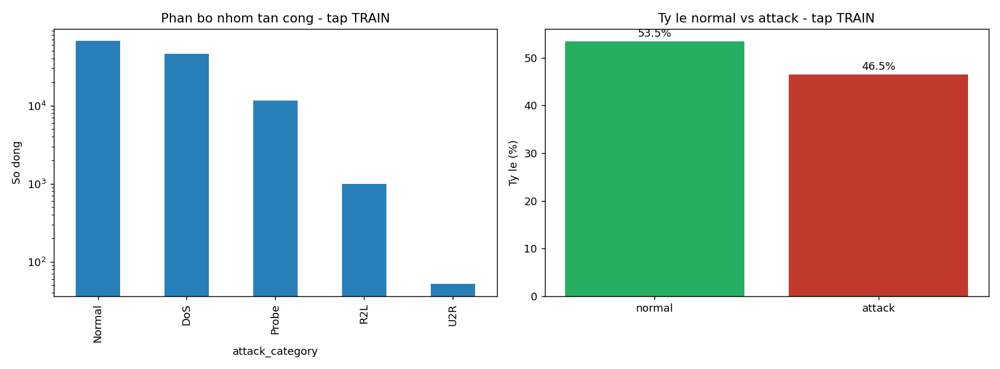
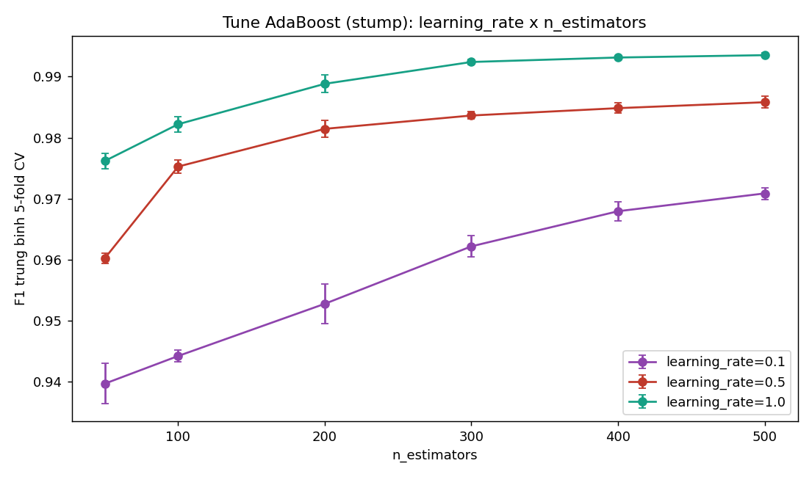
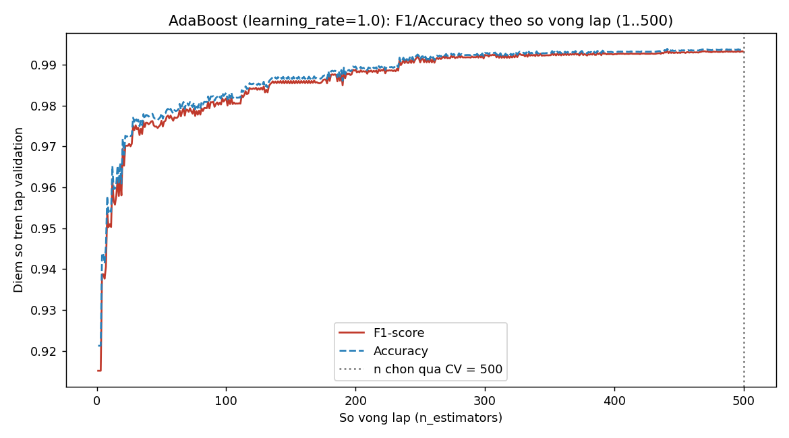
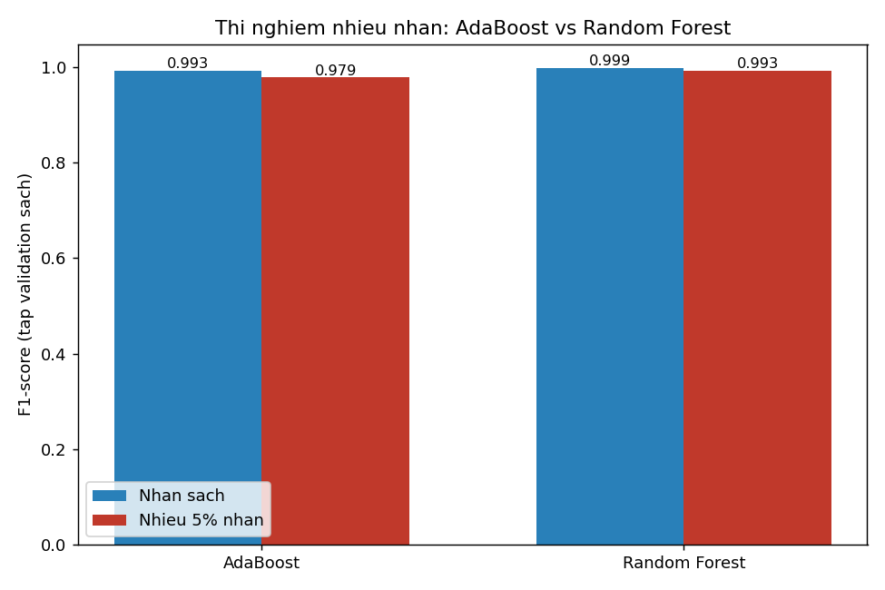
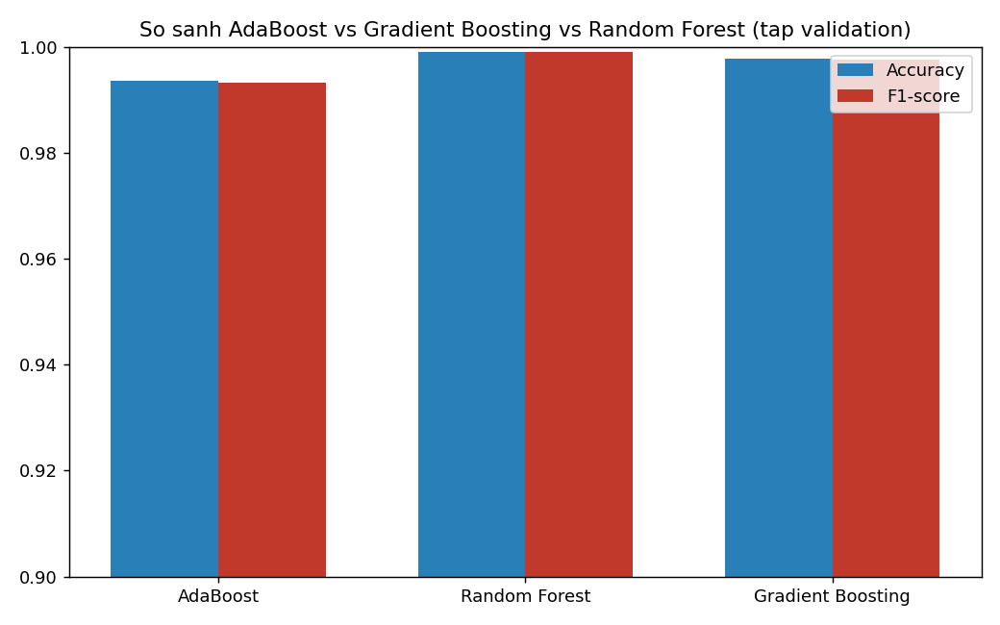
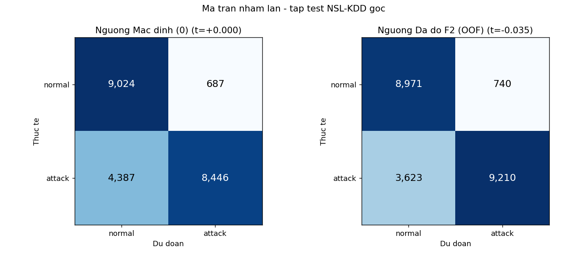
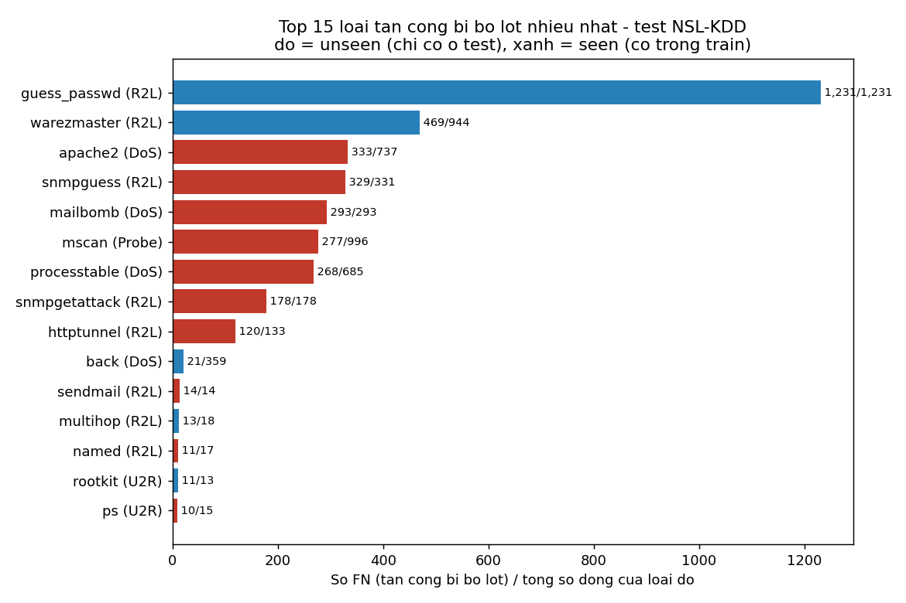

# TT-09 — ADABOOST
## Phát hiện xâm nhập mạng trong hệ thống giám sát an ninh

| | |
|---|---|
| 🎓 **Khoá** | HỌC MÁY · [Buổi 6](https://github.com/TruongTanNghia/Training-Machine-learning/tree/main/Buoi-06-Ensemble-EndToEnd) |
| 🧠 **Nhóm** | Phân loại · Boosting (thế hệ đầu) |
| 🔧 **Thuật toán** | AdaBoost (Adaptive Boosting) |
| 🏭 **Lĩnh vực** | An ninh mạng · SOC |
| ⏱ **Thời lượng** | 5–7 giờ |
| 📈 **Độ khó** | ⭐⭐⭐ |

---

## 1. THUẬT TOÁN NÀY LÀ GÌ

AdaBoost (1995) là thuật toán boosting **đầu tiên**. Khác Gradient Boosting ở chỗ:
thay vì học phần dư, nó **đánh trọng số lại các MẪU**.

```
   Vòng 1: mọi mẫu trọng số bằng nhau → train cây cụt (stump, depth=1)
           → những mẫu bị phân SAI được TĂNG trọng số
   Vòng 2: cây mới buộc phải chú ý vào các mẫu khó đó
           → lại tăng trọng số mẫu vẫn sai
   ...
   Kết quả cuối = tổng có trọng số của tất cả cây
                  (cây nào chính xác hơn được tiếng nói lớn hơn)

        α_m = ½·ln((1 − err_m) / err_m)      ← trọng số của cây thứ m
```

| | AdaBoost | Gradient Boosting |
|---|---|---|
| Cơ chế | Đánh trọng số **MẪU** | Học **PHẦN DƯ** |
| Weak learner | Stump (depth = 1) | Cây nông (depth = 3) |
| Nhạy với nhiễu/outlier | ⚠️ **RẤT nhạy** | Ít nhạy hơn |
| Còn dùng nhiều? | Ít — chủ yếu để hiểu nền tảng | ✅ Phổ biến |

---

## 2. BÀI TOÁN THỰC TẾ

```
   Trung tâm điều hành an ninh (SOC) nhận hàng triệu gói tin/phút.
   Cần phân loại: kết nối BÌNH THƯỜNG hay TẤN CÔNG.

   ⚠️ Đặc thù an ninh mạng:
      • Bỏ sót 1 cuộc tấn công → có thể mất toàn bộ dữ liệu công ty  → RECALL quan trọng
      • Báo động giả quá nhiều → nhân viên SOC "mệt mỏi cảnh báo"
        (alert fatigue) rồi bỏ qua cả cảnh báo thật → PRECISION cũng quan trọng
   → Cân bằng bằng F1 / F2-score.
```

---

## 3. BỘ DỮ LIỆU

| | |
|---|---|
| **Tên** | NSL-KDD (bản cải tiến của KDD Cup 99) |
| **Link** | https://www.unb.ca/cic/datasets/nsl.html |
| **Kích thước** | ~125.973 dòng train × 43 cột |
| **Nhãn** | `normal` vs 4 nhóm tấn công (DoS, Probe, R2L, U2R) |

**Nguồn thay thế nhẹ hơn:** `sklearn.datasets.fetch_kddcup99(subset='SA')` —
tải trực tiếp, không cần đăng ký.

### ⚠️ Bẫy dữ liệu

```
   1. Bộ NSL-KDD có tập TEST chứa các LOẠI TẤN CÔNG KHÔNG có trong train
      → đây là CỐ Ý (mô phỏng tấn công zero-day)
      → điểm trên tập test sẽ THẤP hơn CV rất nhiều — đó là điều ĐÚNG, không phải lỗi

   2. Lớp U2R cực hiếm (~0,04%) → gần như không học được
      → nên gộp thành bài toán NHỊ PHÂN (normal vs attack) trước

   3. 3 cột phân loại: protocol_type, service (70 mức!), flag
      → one-hot làm số chiều tăng mạnh
```

---

## 4. HƯỚNG ĐI ĐÃ THỰC HIỆN

```python
from sklearn.ensemble import AdaBoostClassifier
from sklearn.tree import DecisionTreeClassifier

ada = AdaBoostClassifier(
    estimator=DecisionTreeClassifier(max_depth=1),   # ⭐ STUMP — đúng bản chất AdaBoost
    n_estimators=500,        # ← chọn bằng 5-fold CV (mục 5.3), không cố định tay
    learning_rate=1.0,       # ← chọn bằng 5-fold CV (mục 5.3)
    random_state=42,
)
# Dự đoán = decision_function(X) >= -0,0348   ← ngưỡng chọn trên điểm out-of-fold của train (mục 5.4)
```

**Tiền xử lý:** `ColumnTransformer` gồm `OneHotEncoder(handle_unknown="ignore")`
cho `protocol_type`, `service` (70 mức, test có mức lạ), `flag` +
`StandardScaler` cho 38 cột số. Sau one-hot: 41 → **122** chiều (fit trên
toàn train) / 121 chiều (fit trên `train_sub`, thiếu 1 mức `service` hiếm).

**Nguyên tắc chống rò rỉ** — preprocessor luôn fit **chỉ trên phần dữ liệu
dùng để học**:
* CV (mục 5.2–5.4): nằm trong `Pipeline`, fit lại ở từng fold.
* Thí nghiệm trên validation (mục 5.5–5.7): tách `train_sub`/`val` từ
  DataFrame **thô** trước, rồi mới `fit_transform(train_sub)` → `transform(val)`.
* Test NSL-KDD gốc: chỉ dùng **1 lần** ở cuối, sau khi siêu tham số và ngưỡng
  đã cố định.

> ⚠️ **Điểm yếu chí mạng đã được chứng minh bằng thí nghiệm:** AdaBoost rất
> nhạy với **NHÃN SAI** — xem số liệu thực đo tại mục 5.6.

---

## 5. KẾT QUẢ THỰC NGHIỆM

Toàn bộ số liệu dưới đây là **kết quả chạy thật** trên NSL-KDD gốc
(`src/train.py`, `random_state=42`, tái lập được), không phải số minh hoạ.

### 5.1. EDA — phân bố nhóm tấn công, dịch chuyển phân phối train → test



| Nhóm | Train | Train % | Test | Test % |
| :--- | ---: | ---: | ---: | ---: |
| Normal | 67.343 | 53,46% | 9.711 | 43,08% |
| DoS | 45.927 | 36,46% | 7.460 | 33,09% |
| Probe | 11.656 | 9,25% | 2.421 | 10,74% |
| R2L | 995 | 0,79% | 2.885 | 12,80% |
| U2R | 52 | 0,04% | 67 | 0,30% |

* Tỉ lệ `attack`: **46,54%** (train) vs **56,92%** (test) — test KHÔNG cùng
  phân phối với train; tỉ trọng R2L tăng ~16 lần (0,79% → 12,80%).
* **17 loại tấn công chỉ có trong test** (đếm bằng code): `apache2,
  httptunnel, mailbomb, mscan, named, processtable, ps, saint, sendmail,
  snmpgetattack, snmpguess, sqlattack, udpstorm, worm, xlock, xsnoop, xterm`
  — tổng **3.750 / 22.544** dòng test (29% số dòng attack).
* U2R train chỉ 52/125.973 ≈ **0,0413%** → nhị phân hoá cho model chính.

### 5.2. Baseline: 1 stump vs AdaBoost (5-fold Stratified CV trên train)

| Mô hình | CV Accuracy | CV F1 |
| :--- | :---: | :---: |
| *Baseline (Dummy)* | *0,5029 ± 0,0026* | *0,4667 ± 0,0028* |
| 1 Stump (depth=1) | 0,9221 ± 0,0020 | 0,9161 ± 0,0022 |
| AdaBoost cũ (lr=0,5, n=300 — cố định tay) | 0,9849 ± 0,0005 | 0,9836 ± 0,0006 |
| **AdaBoost tuned (lr=1,0, n=500)** | **0,9940 ± 0,0003** | **0,9935 ± 0,0003** |

> [`reports/so_sanh_baseline_cv.csv`](reports/so_sanh_baseline_cv.csv)

Một stump (1 đặc trưng, 1 ngưỡng) đã đạt F1 = 0,916 — NSL-KDD có vài đặc
trưng phân tách rất mạnh. 500 stump có trọng số nâng thêm **+0,077** và giảm
độ lệch chuẩn giữa các fold từ 0,0022 xuống 0,0003.

### 5.3. ⭐ Tune `learning_rate` × `n_estimators` (5-fold CV)



| CV F1 | n=50 | 100 | 200 | 300 | 400 | 500 |
| :--- | :---: | :---: | :---: | :---: | :---: | :---: |
| lr=0,1 | 0,9397 | 0,9442 | 0,9528 | 0,9622 | 0,9679 | 0,9709 |
| lr=0,5 | 0,9602 | 0,9753 | 0,9814 | 0,9836 *(cũ)* | 0,9848 | 0,9858 |
| lr=1,0 | 0,9762 | 0,9822 | 0,9888 | 0,9924 | 0,9931 | **0,9935** |

> [`reports/tune_adaboost_cv.csv`](reports/tune_adaboost_cv.csv)

**Cách làm tiết kiệm:** mỗi (fold, learning_rate) chỉ fit **1 lần** 500 stump,
rồi đọc điểm tại từng mốc bằng `staged_decision_function` (AdaBoost n cây
đầu = mô hình `n_estimators=n`) → 15 lần fit thay vì 90.

**Nhận xét:** với stump, `learning_rate` nhỏ học quá chậm — lr=0,1 sau 500
vòng vẫn thua lr=1,0 sau 50 vòng. Cấu hình cũ (0,5/300) thấp hơn cấu hình
tốt nhất 0,0099 F1. Điểm tốt nhất nằm ở **biên lưới** (lr=1,0, n=500), nhưng
bước 400 → 500 chỉ thêm +0,0004 (nhỏ hơn 2 lần độ lệch chuẩn) — đường cong đã
gần bão hoà; chưa mở rộng lưới vì mỗi lần tune tốn ~16 phút.

### 5.4. ⭐ Dò ngưỡng quyết định — trên điểm out-of-fold, không đụng test

`predict()` = ngưỡng 0 trên `decision_function`. Với SOC, bỏ lọt tấn công đắt
hơn báo động giả → chọn ngưỡng **tối đa F2** trên điểm **out-of-fold** (mỗi
dòng train được chấm bởi mô hình của fold không thấy nó) của cấu hình tốt nhất:

| Ngưỡng (OOF trên train) | t | Precision | Recall | F1 | F2 | FPR |
| :--- | :---: | :---: | :---: | :---: | :---: | :---: |
| Mặc định | 0 | 0,9950 | 0,9921 | 0,9935 | 0,9926 | 0,44% |
| **Tối đa F2** | **−0,0348** | 0,9847 | **0,9955** | 0,9901 | **0,9933** | 1,35% |

> [`reports/nguong_oof.csv`](reports/nguong_oof.csv) — ngưỡng được lưu kèm
> model trong `models/adaboost.joblib` (`{"pipeline", "threshold"}`).

### 5.5. Đường Accuracy/F1 theo số vòng lặp (train_sub → val, không rò rỉ)



| n | 1 | 50 | 100 | 200 | 300 | 400 | 500 |
| :--- | :---: | :---: | :---: | :---: | :---: | :---: | :---: |
| F1 (val) | 0,9151 | 0,9763 | 0,9818 | 0,9888 | 0,9924 | 0,9926 | 0,9932 |

Tăng nhanh ~50 vòng đầu rồi chậm dần — lợi ích biên giảm dần, khớp kết quả
CV ở 5.3.

### 5.6. ⭐ THÍ NGHIỆM NHIỄU NHÃN — điểm yếu chí mạng, đã chứng minh bằng số liệu



Đảo ngẫu nhiên 5% nhãn (5.038 / 100.778 dòng) trong `train_sub`, huấn luyện
lại cả hai mô hình, đánh giá trên **cùng tập val sạch**:

| Mô hình | F1 (nhãn sạch) | F1 (nhiễu 5%) | Sụt giảm F1 |
| :--- | :---: | :---: | :---: |
| **AdaBoost** (lr=1,0, n=500) | 0,9932 | 0,9790 | **0,0142** |
| Random Forest (300 cây) | 0,9990 | 0,9929 | 0,0062 |

> [`reports/thi_nghiem_nhieu.csv`](reports/thi_nghiem_nhieu.csv)

AdaBoost sụt F1 gấp **~2,3 lần** Random Forest. Cơ chế: AdaBoost tăng trọng
số mẫu bị phân sai sau mỗi vòng; mẫu **gán nhãn sai** luôn "sai" theo nhãn
nhầm nên trọng số tăng mãi — model dồn sức học điểm rác. Random Forest không
đánh trọng số lại theo lỗi (mỗi cây học độc lập trên 1 bootstrap) nên chịu
nhiễu tốt hơn. (lr=1,0 khuếch đại trọng số mạnh hơn lr=0,5 nên mức sụt cũng
lớn hơn bản trước: 0,0142 vs 0,0113.)

### 5.7. So sánh AdaBoost vs Gradient Boosting vs Random Forest (cùng val)



| Mô hình | Accuracy | F1 | Train time |
| :--- | :---: | :---: | ---: |
| AdaBoost (lr=1,0, n=500) | 0,9936 | 0,9932 | 242 s |
| **Random Forest** (300 cây) | **0,9991** | **0,9990** | 41 s |
| Gradient Boosting (300, depth 3) | 0,9977 | 0,9976 | 359 s |

> [`reports/so_sanh_ensemble.csv`](reports/so_sanh_ensemble.csv)

Random Forest tốt nhất và nhanh nhất (song song hoá được) — NSL-KDD có nhiều
tương tác phi tuyến mà cây sâu của RF khai thác tốt hơn stump. AdaBoost tuần
tự nên chậm, nhưng dễ diễn giải (500 quy tắc 1-điều-kiện có trọng số).

### 5.8. ⭐ Đánh giá trên test NSL-KDD gốc (dùng 1 lần)

Model cuối fit trên **toàn bộ** train với siêu tham số (5.3) và ngưỡng (5.4)
đã cố định trước.



| Ngưỡng | Accuracy | Precision | Recall | F1 | FPR | FNR | TN / FP / FN / TP |
| :--- | :---: | :---: | :---: | :---: | :---: | :---: | :--- |
| Mặc định 0 | 0,7749 | 0,9248 | 0,6581 | 0,7690 | 7,07% | 34,19% | 9.024 / 687 / 4.387 / 8.446 |
| **OOF tối đa F2 (−0,0348)** | **0,8065** | 0,9256 | **0,7177** | **0,8085** | 7,62% | **28,23%** | 8.971 / 740 / 3.623 / 9.210 |

> [`reports/danh_gia_test.csv`](reports/danh_gia_test.csv)

* So với bản cũ (lr=0,5/300, ngưỡng 0: F1 0,7576, FNR 35,63%): tune + dò
  ngưỡng nâng F1 test lên **0,8085** và cứu thêm **950 tấn công** bị bỏ lọt
  (FN 4.573 → 3.623), đổi lại FP tăng 713 → 740 (+27).
* Chênh lệch CV (0,9935) vs test (0,7690 ở ngưỡng 0) vẫn lớn (~0,22) —
  nguyên nhân được đo cụ thể ở mục 5.10.

**Phân tích sau (post-hoc, không dùng để chọn ngưỡng):**
[`reports/nhay_nguong_test_posthoc.png`](reports/nhay_nguong_test_posthoc.png)
cho thấy nếu SOC chấp nhận hạ ngưỡng về −0,20 thì FNR test giảm còn 3,5%
nhưng FPR vọt lên 18,8% — ngưỡng chỉ dịch được điểm đánh đổi, không xoá được
khoảng cách phân phối.

### 5.9. Ước tính báo động giả/ngày

> **Giả định** (không phải số liệu SOC thật): **2.000.000 kết nối/ngày**, tỉ
> lệ normal theo tập test (43,08%) → ~861.600 kết nối normal/ngày.

| Ngưỡng | FPR | Báo động giả/ngày | ≈ /phút |
| :--- | :---: | ---: | ---: |
| Mặc định 0 | 7,07% | ~60.947 | ~42 |
| OOF tối đa F2 | 7,62% | ~65.649 | ~46 |

Cả hai đều **không thể vận hành thủ công** — FPR 7% trên test (so với 0,4–1,3%
trên OOF) chủ yếu do dịch chuyển phân phối normal giữa train và test. Cần
thêm tầng lọc/ưu tiên cảnh báo, hoặc chọn ngưỡng theo năng lực xử lý thực tế
của đội SOC.

### 5.10. ⭐ FN theo từng loại tấn công — seen vs unseen (đo, không giả định)

Bản trước khẳng định "FNR phần lớn do 17 loại tấn công lạ" mà chưa đo. Kết
quả đo thực tế:



| Nhóm (ngưỡng OOF) | Số dòng attack | FN | Recall | Tỉ trọng trong tổng FN |
| :--- | ---: | ---: | :---: | :---: |
| Seen (loại có trong train) | 9.083 | 1.765 | 80,57% | **48,7%** |
| Unseen (17 loại chỉ có ở test) | 3.750 | 1.858 | 50,45% | **51,3%** |

*(Ở ngưỡng 0: seen 1.951 FN — 44,5%; unseen 2.436 FN — 55,5%.)*

| Nhóm × seen/unseen | Số dòng | FN | Recall | % tổng FN |
| :--- | ---: | ---: | :---: | :---: |
| **R2L seen** | 2.199 | 1.719 | **21,8%** | **47,4%** |
| DoS unseen | 1.719 | 896 | 47,9% | 24,7% |
| R2L unseen | 686 | 662 | 3,5% | 18,3% |
| Probe unseen | 1.315 | 282 | 78,6% | 7,8% |
| DoS seen | 5.741 | 27 | 99,5% | 0,7% |
| U2R (seen + unseen) | 67 | 36 | 46,3% | 1,0% |
| Probe seen | 1.106 | 1 | 99,9% | 0,0% |

> [`reports/fn_seen_vs_unseen.csv`](reports/fn_seen_vs_unseen.csv),
> [`reports/fn_theo_nhom_tan_cong.csv`](reports/fn_theo_nhom_tan_cong.csv),
> [`reports/fn_theo_loai_tan_cong.csv`](reports/fn_theo_loai_tan_cong.csv)

**Kết luận đã sửa:**
* Tấn công lạ **có** khó hơn rõ rệt (recall 50% so với 81%) nhưng chỉ chiếm
  **khoảng một nửa** tổng FN — không phải "phần lớn" như bản trước viết.
* Nguồn FN lớn nhất là **`guess_passwd`** (R2L) — loại **có trong train**
  (53 dòng) nhưng bị lọt **1.231 / 1.231** dòng test (34% tổng FN).
  `warezmaster` (20 dòng train) lọt 469 / 944. Đây là **dịch chuyển phân phối
  trong cùng một loại tấn công** + quá ít mẫu R2L ở train (0,79%), không phải
  zero-day.
* DoS/Probe đã thấy gần như được bắt hết (recall ≥ 99,5%).

---

## 6. HẠN CHẾ CẦN NÊU RÕ

```
   1. FNR 28,23% (ngưỡng OOF) đến từ HAI nguồn gần ngang nhau (mục 5.10):
      tấn công lạ (51%) và R2L đã thấy nhưng quá ít mẫu/dịch phân phối (47%).
      Isolation Forest chỉ giải quyết được phần thứ nhất.
   2. Cấu hình tốt nhất nằm ở biên lưới (lr=1,0, n=500); lợi ích biên đã rất
      nhỏ nhưng chưa kiểm tra lr > 1 hoặc n > 500.
   3. Ngưỡng chọn trên OOF (cùng phân phối train) nên dịch ít (−0,035); trên
      test phân phối khác, ngưỡng tối ưu thực tế sẽ khác — cần tập hiệu chỉnh
      gần với lưu lượng thật hơn.
   4. Giả định 2.000.000 kết nối/ngày (mục 5.9) chỉ minh hoạ PHƯƠNG PHÁP.
   5. Nhị phân bỏ qua khác biệt mức độ nghiêm trọng (DoS ồn ào >< U2R âm thầm).
   6. NSL-KDD là dữ liệu mô phỏng cũ (1998–1999, cải tiến 2009).
```

---

## 7. CẠM BẪY ĐÃ TRÁNH

| Cạm bẫy | Hậu quả | Đã xử lý bằng |
|---------|---------|---------------|
| Dùng cây sâu làm weak learner | Mất bản chất AdaBoost, overfit | `DecisionTreeClassifier(max_depth=1)` — đúng stump |
| Fit scaler trên toàn train rồi mới tách val | Val rò rỉ vào thống kê scaler | Tách DataFrame thô trước, fit chỉ trên `train_sub` (mục 4) |
| Fit tiền xử lý ngoài CV | Rò rỉ thống kê giữa các fold | Đặt trong `Pipeline`, fit lại mỗi fold |
| Siêu tham số cố định tay | Bỏ lỡ cấu hình tốt hơn (−0,0099 F1) | Tune lr × n bằng 5-fold CV (mục 5.3) |
| Dùng ngưỡng mặc định 0 | FNR cao dù đã biết Recall quan trọng | Chọn ngưỡng tối đa F2 trên OOF (mục 5.4) |
| Chọn ngưỡng/tham số bằng test | Điểm test lạc quan giả | Test chỉ dùng 1 lần; phân tích ngưỡng trên test ghi rõ là post-hoc |
| Giải thích FN bằng giả định | Kết luận sai hướng khắc phục | Đo FN theo từng loại tấn công (mục 5.10) |
| Bỏ qua nhiễu nhãn | Model dồn sức học điểm rác | Thí nghiệm đảo 5% nhãn (mục 5.6) |
| Giữ đa lớp với U2R | Lớp 0,04% không học nổi | Gộp nhị phân `normal`/`attack` |
| `service` có mức lạ ở test | `OneHotEncoder` lỗi khi transform | `handle_unknown="ignore"` |
| Commit dữ liệu 22MB vào git | Repo phình to | `.gitignore` + `data/download_data.py` (kiểm tra SHA-256) |

---

## 8. SẢN PHẨM & CẤU TRÚC THƯ MỤC

```
TT-09-AdaBoost/
├── README.md                        # Báo cáo này
├── requirements.txt
├── .gitignore                       # bỏ data/*.txt khỏi git
├── data/
│   ├── download_data.py              # tải KDDTrain+/KDDTest+ + kiểm tra SHA-256, số dòng
│   └── DATA_SOURCE.md
├── notebooks/
│   └── adaboost_ids.ipynb            # Gọi hàm từ src/train.py, giải thích từng bước, chạy lại từ đầu
├── src/
│   └── train.py                      # Nguồn duy nhất của mọi hàm tính toán + sinh report
├── models/
│   └── adaboost.joblib               # {"pipeline": tiền xử lý + AdaBoost, "threshold": -0,0348}
└── reports/
    ├── eda_phan_bo_tan_cong.png, phan_bo_loai_tan_cong.csv
    ├── so_sanh_baseline_cv.csv
    ├── tune_adaboost_cv.png/.csv, nguong_oof.csv
    ├── f1_theo_vong_lap.png/.csv
    ├── thi_nghiem_nhieu.png/.csv
    ├── so_sanh_ensemble.png/.csv
    ├── confusion_matrix_test.png, danh_gia_test.csv
    ├── nhay_nguong_test_posthoc.png/.csv
    ├── fn_theo_loai_tan_cong.png/.csv, fn_seen_vs_unseen.csv, fn_theo_nhom_tan_cong.csv
    └── tom_tat.json
```

---

## 9. HƯỚNG DẪN CHẠY DỰ ÁN

```bash
pip install -r requirements.txt
python data/download_data.py                  # tải dữ liệu (~22MB) + kiểm tra SHA-256
python src/train.py                           # huấn luyện + sinh toàn bộ report (~30 phút, 20 lõi)
jupyter notebook notebooks/adaboost_ids.ipynb # khám phá từng bước có giải thích
```

Dùng model đã lưu:

```python
import joblib
bundle = joblib.load("models/adaboost.joblib")
is_attack = bundle["pipeline"].decision_function(X_new) >= bundle["threshold"]
```

---

## 10. HƯỚNG PHÁT TRIỂN & MỞ RỘNG

1. **Bổ sung/cân bằng mẫu R2L** (đặc biệt `guess_passwd`, `warezmaster`) —
   mục 5.10 cho thấy đây là nguồn FN lớn nhất (47%), lớn hơn cả từng nhóm
   tấn công lạ.
2. Phát hiện bất thường không giám sát (Isolation Forest) chạy song song để
   bắt phần FN còn lại đến từ 17 loại tấn công lạ (51% FN).
3. Bài toán ĐA LỚP (Normal/DoS/Probe/R2L/U2R) bằng `AdaBoostClassifier` (SAMME)
   — cột `attack_category` đã có sẵn trong `src/train.py`.
4. Mở rộng lưới tune (lr > 1, n > 500) và thử stump sâu hơn (depth 2) để kiểm
   tra điểm tối ưu nằm ở biên lưới.

**Tham khảo:** [Buổi 6 — Ensemble & Boosting](https://github.com/TruongTanNghia/Training-Machine-learning/tree/main/Buoi-06-Ensemble-EndToEnd/Tai-Lieu/ly_thuyet_chi_tiet_buoi_06.md)
