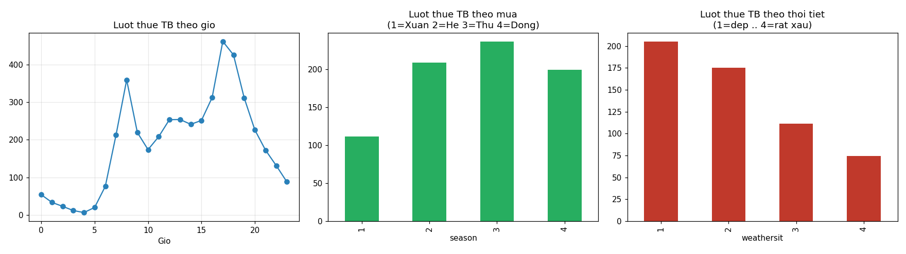
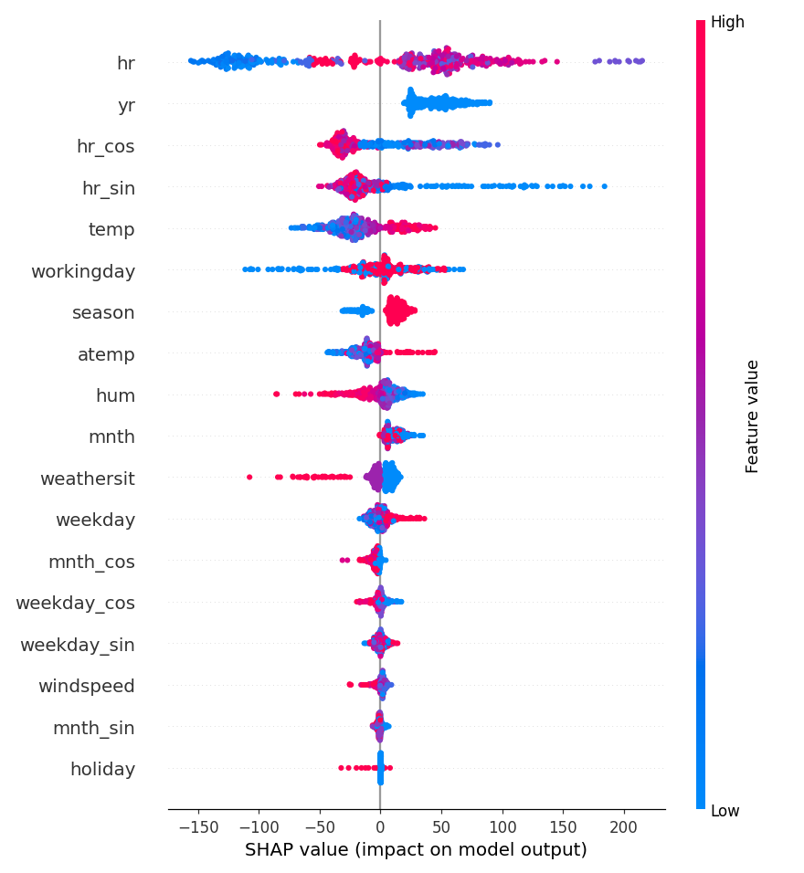
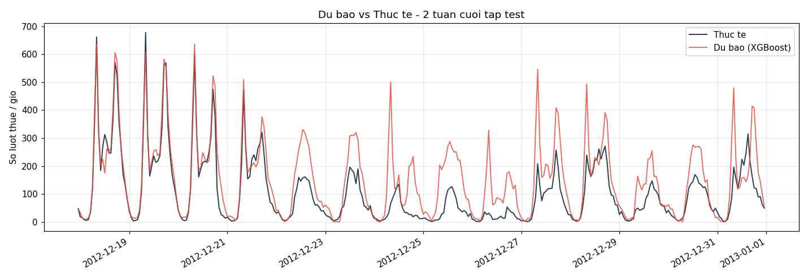
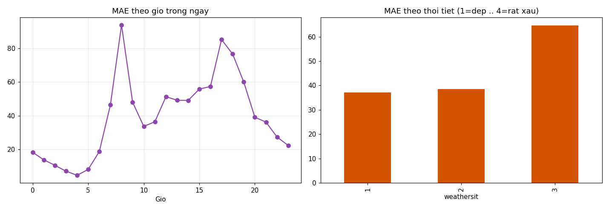

# TT-19 — XGBOOST REGRESSOR
## Dự báo nhu cầu thuê xe đạp công cộng theo giờ — kết quả thực nghiệm

| | |
|---|---|
| 🎓 **Khoá** | HỌC MÁY · [Buổi 13](https://github.com/TruongTanNghia/Training-Machine-learning/tree/main/Buoi-13-Math-Regression-NangCao) |
| 🧠 **Nhóm** | Hồi quy · Boosting · Dữ liệu có yếu tố thời gian |
| 🔧 **Thuật toán** | XGBoost Regressor (+ so sánh naive "cùng giờ tuần trước", Random Forest, Gradient Boosting) |
| 🏭 **Lĩnh vực** | Vận tải công cộng · Chia sẻ phương tiện |
| 📊 **Dữ liệu** | [Bike Sharing (UCI)](https://archive.ics.uci.edu/dataset/275/bike+sharing+dataset) `hour.csv`: 17.379 giờ × 17 cột, 2011–2012 |

> **Kết quả chính:**
> * **Mô hình cuối: XGBoost RMSE 63,5 lượt/giờ, R² 0,901, MAE 39,6** trên test (3 tháng cuối 2012). Naive "cùng giờ tuần
>   trước" có RMSE 117,3, nên XGBoost **giảm 46% sai số**. XGBoost cũng thắng Random Forest (73,6) và Gradient Boosting (80,7).
> * **Rò rỉ đã được chứng minh rồi loại bỏ:** giữ `casual` + `registered` thì R² test = **0,999** (RMSE 5,5), vì
>   `registered` chiếm 94% importance và model chỉ học phép cộng.
> * **Bước quyết định không phải tune mà là refit:** XGBoost chỉ train trên năm 2011 (RMSE 118,7) **không thắng nổi
>   naive**. Refit trên train + val đưa RMSE xuống 64,5. RandomizedSearchCV chỉ thêm 1 lượt/giờ.
> * **Thấp hơn mức tham chiếu** của đề (RMSE 40–55, R² 0,93–0,95). Lý do: cầu năm 2 cao hơn năm 1 **63%** và cây không
>   ngoại suy được. Số liệu được báo cáo đúng như đo, không chỉnh cho khớp.
> * Sai số lớn nhất ở **giờ cao điểm 8h, 17h, 18h** (MAE 77–94) và khi **thời tiết xấu** (MAE 65, gần gấp đôi trời đẹp).

---

## 1. Bài toán & cách đánh giá

Hệ thống 500 trạm cần dự báo số lượt thuê từng giờ để điều xe tải chở xe từ trạm thừa sang trạm thiếu. Dự báo thiếu
làm mất khách, dự báo thừa làm tốn chi phí vận hành.

| | |
|---|---|
| Chia dữ liệu | **Theo thời gian**, không shuffle (`features.time_based_split`): train = 2011 (8.645 giờ) · val = T1–T9/2012 (6.566 giờ) · test = T10–T12/2012 (2.168 giờ) |
| Đặc trưng | 18 cột: bỏ `instant`, `dteday`, `casual`, `registered`; thêm sin/cos cho `hr` (chu kỳ 24), `mnth` (12), `weekday` (7) |
| Tune | `RandomizedSearchCV(n_iter=25)` với `TimeSeriesSplit(3)` trên **train+val**: mỗi fold chỉ kiểm tra trên đoạn sau đoạn train |
| Số cây | Early stopping trên **15% cuối (theo thời gian) của train+val**, rồi refit toàn bộ train+val với số cây đó. **Test không được dùng** cho bất kỳ lựa chọn nào |
| Dự đoán | `np.clip(pred, 0, None)`: số lượt thuê không thể âm |
| Metric | RMSE (chính), R², MAE trên test |

Mức cầu trung bình tăng mạnh theo thời gian: **143,8** lượt/giờ (train 2011), **239,8** (val), **219,2** (test). Đây
là khó khăn chính của bài.

## 2. ⭐ Chứng minh rò rỉ `casual` + `registered`

`cnt = casual + registered` đúng tuyệt đối. Chạy XGBoost **cố tình giữ** hai cột này (cùng cấu hình refit train+val):

| | R² | RMSE |
|---|---:|---:|
| Train + val | 0,99997 | 0,90 |
| **Test** | **0,9993** | **5,49** |

Importance: `registered` **93,9%**, `casual` 5,9%, mọi cột khác < 0,1%. Model không học quy luật thuê xe nào, chỉ học
phép cộng. Hai cột này không có sẵn tại thời điểm dự báo, nên **đã bỏ** khỏi mọi model phía sau.

## 3. EDA và đặc trưng chu kỳ



* **Hai đỉnh mỗi ngày:** ~8h (đi làm/học) và 17–18h (tan ca). Hè/thu thuê nhiều hơn đông. Thời tiết càng xấu thì thuê
  càng ít.
* **sin/cos:** khoảng cách (sin, cos) giữa giờ 23 và giờ 0 là **0,26**, giữa giờ 23 và giờ 12 là **1,98**. Dạng số
  thường thì 23 và 0 cách nhau 23 đơn vị.

## 4. Kết quả thực đo

| Bước (đánh giá trên test) | Số cây | RMSE | R² |
|---|---:|---:|---:|
| Baseline naive "cùng giờ tuần trước" (39/2.168 giờ thiếu dữ liệu tuần trước, thay bằng TB theo giờ) | — | 117,30 | 0,661 |
| XGBoost + early stopping, **chỉ train năm 2011** | 1.097 | 118,67 | 0,653 ⚠️ thua naive |
| XGBoost refit train+val (cùng số cây) | 1.097 | 64,51 | 0,898 |
| Như trên, train trên `log1p(cnt)` | 558 | 65,45 | 0,895 (không tốt hơn → giữ thang gốc) |
| **XGBoost cuối: RandomizedSearchCV + early stopping + refit + clip ≥ 0** | **1.176** | **63,53** | **0,901** |

Tham số tốt nhất (CV RMSE 75,2 trên các fold `TimeSeriesSplit`): `max_depth=6, learning_rate=0,03, subsample=0,7,
colsample_bytree=0,8, min_child_weight=5, reg_lambda=2,0, reg_alpha=0,1`. Train mất 7,4 s. MAE 39,6.

**Vì sao XGBoost chỉ train năm 1 thua naive dù early stopping đúng kỹ thuật:** cầu năm 2 cao hơn năm 1 ~63%. Cây quyết
định dự đoán bằng **trung bình các lá đã thấy**, nên không thể ra giá trị vượt quá mức của năm 2011. Kết quả là dự báo
thấp có hệ thống. Naive "tuần trước" thì tự động theo mức cầu hiện tại. Refit trên train+val (đã thấy 9/12 tháng năm
2012) giảm RMSE **46%**. Đây là bước quan trọng nhất, hơn hẳn tune tham số (64,5 → 63,5).

### So sánh với Random Forest (TT-17) và Gradient Boosting (TT-18)

Cùng 18 đặc trưng, cùng chiến lược refit train+val, chỉ đổi thuật toán:

| | RMSE | R² | Thời gian train |
|---|---:|---:|---:|
| **XGBoost** | **63,53** | **0,901** | 7,4 s |
| Random Forest | 73,58 | 0,867 | 5,7 s |
| Gradient Boosting | 80,71 | 0,840 | 16,0 s |

### Vì sao thấp hơn mức tham chiếu (RMSE 40–55, R² 0,93–0,95)

Kết quả thấp hơn mức đề gợi ý, và đây là con số đo thật. Mức tham chiếu nhiều khả năng ứng với cách chia dễ hơn
(ngẫu nhiên, hoặc test nằm trong cùng mức cầu với train): khi đó model không phải ngoại suy. Khi chia đúng theo thời gian, test (Q4/2012)
nằm ở mức cầu mà model chưa thấy đủ, cộng thêm kỳ nghỉ cuối năm (mục 5). Model vẫn thắng rõ naive và hai thuật toán cây
còn lại trong cùng điều kiện.

## 5. Feature importance, SHAP, dự báo vs thực tế



* **Gain:** `hr` 19,8%, `workingday` 18,2%, `yr` 13,7%, `hr_sin` 13,0%, `hr_cos` 8,3%, `temp` 5,1%, `atemp` 5,0%,
  `weathersit` 3,0% (`reports/feature_importance.png`).
* **SHAP:** `hr` có tác động lớn nhất (−150 đến +200 lượt). `yr` đứng thứ hai, đúng với xu hướng tăng trưởng. Nhiệt độ
  cao làm tăng dự báo, độ ẩm và thời tiết xấu (`weathersit` cao) làm giảm.



**2 tuần cuối của test:** tuần 18–21/12 (ngày làm việc bình thường) model bám sát thực tế. Từ 22/12 đến 01/01, model
**dự báo cao hơn thực tế** nhiều ngày liền. Nguyên nhân: dữ liệu chỉ gắn `holiday=1` cho đúng 25/12, còn 24, 26 và
31/12 vẫn là `workingday=1`, trong khi thực tế cả tuần đó là nghỉ lễ. Muốn cải thiện thì cần đặc trưng kiểu "tuần
Giáng Sinh", không chỉ cờ `holiday` đơn lẻ.

## 6. Phân tích lỗi theo giờ và thời tiết



| Nhóm | MAE (lượt/giờ) |
|---|---:|
| 8h | **94,0** |
| 17h | 85,3 |
| 18h | 76,7 |
| Toàn bộ test | 39,6 |
| Thời tiết 1 (đẹp) / 2 (mây, sương) | 37,0 / 38,6 |
| Thời tiết 3 (mưa nhỏ, tuyết nhẹ) | **64,7** |

* Sai số tập trung ở **giờ cao điểm**: cầu lớn nhất và biến động mạnh nhất theo ngày lễ/ngày thường và thời tiết.
  Đây cũng là lúc điều phối xe quan trọng nhất.
* **Thời tiết xấu** sai gần gấp đôi: vừa hiếm trong dữ liệu train, vừa làm cầu dao động mạnh.
* Với vận hành thực tế (thiếu xe tệ hơn thừa xe), nên xem xét dự báo phân vị 70% hoặc loss bất đối xứng cho các giờ này.

## 7. Cạm bẫy đã gặp

| Cạm bẫy | Thực tế trong bài |
|---|---|
| Giữ `casual` + `registered` | R² test 0,999: rò rỉ tuyệt đối |
| Chia ngẫu nhiên | Không làm. Chia theo thời gian, tune bằng `TimeSeriesSplit` |
| Early stopping trên val rồi dùng luôn model đó | Thua naive (118,7 so với 117,3) vì model chưa thấy mức cầu năm 2 |
| Chọn số cây hoặc tham số bằng test | Không làm. Số cây chọn trên 15% cuối của train+val |
| `log1p` theo thói quen (như TT-18) | Không giúp (65,5 so với 64,5): vấn đề là xu hướng, không phải lệch phân phối |
| Không clip | Đã `clip` dự đoán về ≥ 0 |

---

## Cấu trúc & cách chạy

```
TT-19-XGBoost-Regressor/
├── README.md                               ← báo cáo này
├── requirements.txt
├── data/{hour.csv, Readme.txt}             ← Bike Sharing Dataset (UCI)
├── notebooks/xgboost_bike_demand.ipynb     ← toàn bộ pipeline, giải thích từng bước + đọc kết quả
├── src/
│   ├── features.py   ← build_features (bỏ cột rò rỉ, sin/cos), time_based_split
│   └── train.py      ← RandomizedSearchCV + early stopping + refit → models/ + reports/train_metrics.json
├── models/xgb_bike.json                    ← XGBoost cuối (định dạng native)
└── reports/  cnt_theo_gio.png · feature_importance.png · shap_summary.png · du_bao_vs_thuc_te.png
              phan_tich_loi.png · so_sanh_models.csv · tom_tat.json · train_metrics.json
```

```bash
pip install -r requirements.txt
python src/train.py          # chạy lại model cuối, không cần Jupyter
```

**Mở rộng chưa làm:** loss bất đối xứng (phạt dự báo thiếu gấp 2 lần), dự báo nhiều bước (1h / 6h / 24h tới), dùng
thời tiết *dự báo* thay vì thời tiết đã xảy ra.
