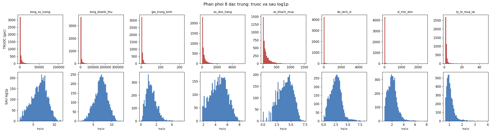
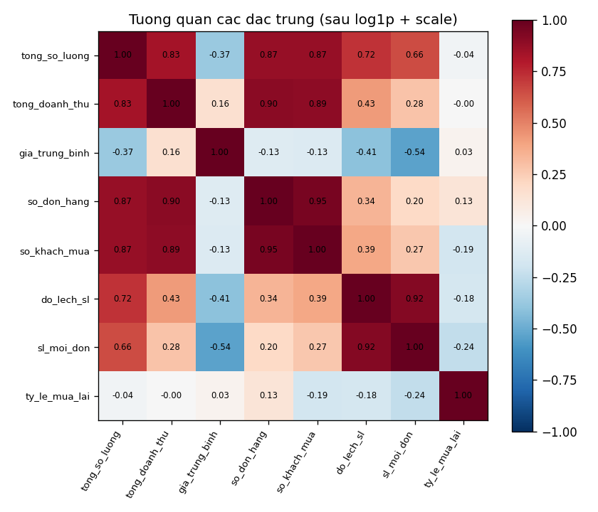
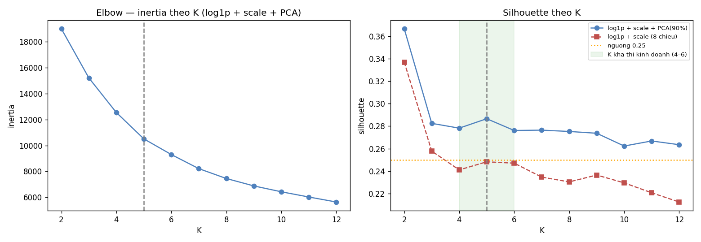
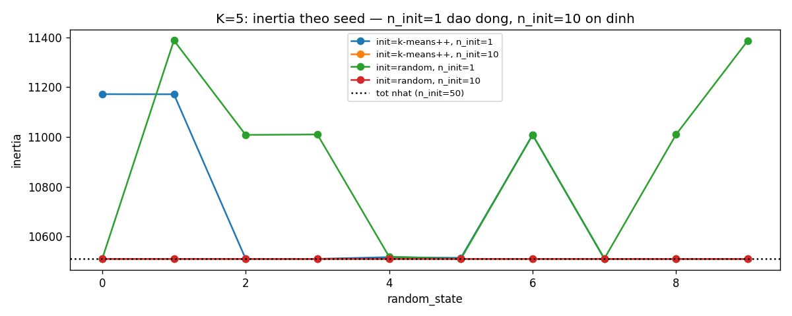
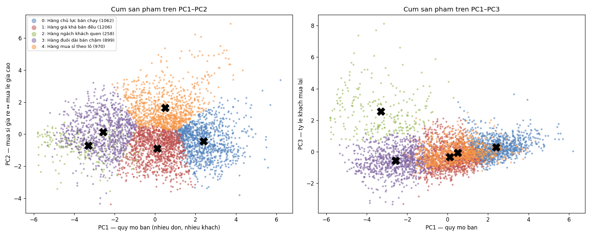
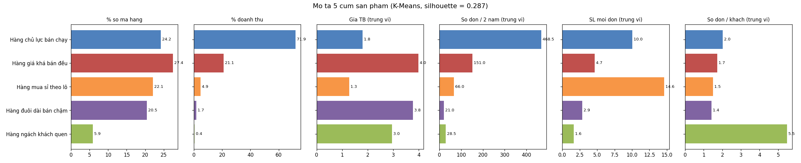
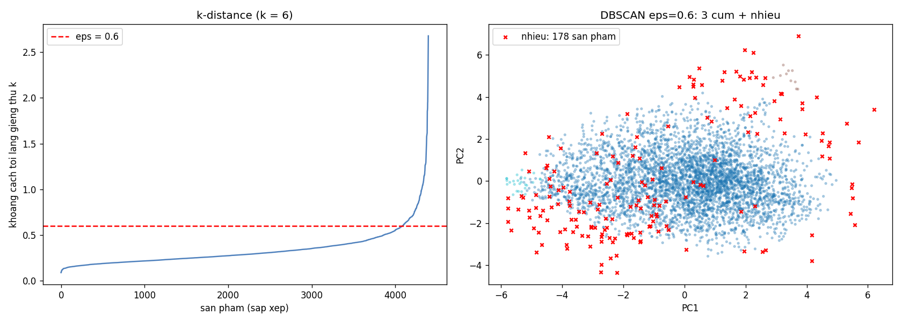
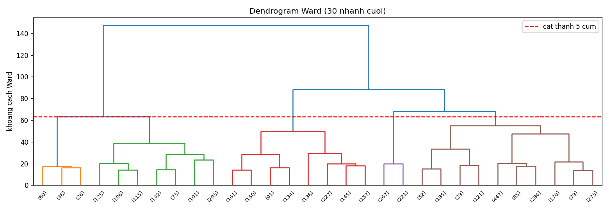

# TT-23 — K-MEANS CLUSTERING
## Báo cáo: Gom nhóm sản phẩm theo hành vi mua để sắp xếp lại kệ hàng

| | |
|---|---|
| 🎓 **Khoá** | HỌC MÁY · [Buổi 5](https://github.com/TruongTanNghia/Training-Machine-learning/tree/main/Buoi-05-Unsupervised-PCA) |
| 🧠 **Nhóm** | Học KHÔNG giám sát — Gom cụm |
| 🔧 **Thuật toán** | K-Means (so sánh: DBSCAN, MiniBatchKMeans, Hierarchical Ward) |
| 📊 **Dữ liệu** | Online Retail II (UCI) — 1.067.371 dòng giao dịch → 4.395 sản phẩm |
| 📓 **Notebook** | [notebooks/kmeans_san_pham.ipynb](notebooks/kmeans_san_pham.ipynb) — toàn bộ luồng logic, có giải thích từng bước |
| 📦 **Bàn giao** | [outputs/san_pham_theo_cum.csv](outputs/san_pham_theo_cum.csv) |

---

## TÓM TẮT KẾT QUẢ

```
   4.395 mã hàng  →  5 NHÓM TRƯNG BÀY   (K = 5, silhouette = 0,287 > 0,25 ✅)

   Hàng chủ lực bán chạy    1.062 mã  (24%)  →  71,9% doanh thu   → kệ đầu dãy, lối đi chính
   Hàng giá khá bán đều     1.206 mã  (27%)  →  21,1% doanh thu   → kệ giữa dãy theo chủ đề
   Hàng mua sỉ theo lô        970 mã  (22%)  →   4,9% doanh thu   → kệ dưới / pallet, bán theo thùng
   Hàng đuôi dài bán chậm     899 mã  (20%)  →   1,7% doanh thu   → khu mẫu / chỉ bán online, rà soát loại bớt
   Hàng ngách khách quen      258 mã   (6%)  →   0,4% doanh thu   → khu chuyên biệt, gợi ý cho khách cũ
```

Ba phát hiện quan trọng nhất:
1. **Một nửa số mã (2.268 mã) mang về 93% doanh thu**. Hai nhóm cuối (1.157 mã, 26% số mã) chỉ tạo 2,1% doanh thu, là ứng viên giải phóng mặt kệ.
2. **Không có "nhóm mua đột biến cuối tuần".** Tỷ lệ doanh thu thứ 6–CN gần như bằng nhau ở mọi cụm (20–25%), vì đây là nhà bán sỉ online gần như **không có giao dịch thứ 7**.
3. **Cụm hành vi ≠ quan hệ mua chung.** Sau khi trừ hiệu ứng độ phổ biến, sản phẩm hay được mua chung không có xu hướng cùng cụm hơn ngẫu nhiên. Cụm dùng để chọn **khu** trưng bày; việc chọn **đặt cạnh nhau** cần phân tích luật kết hợp riêng.

---

## 1. BÀI TOÁN

Một nhà bán lẻ có khoảng 4.000 mã hàng và muốn sắp kệ theo **hành vi mua** (bán nhanh/chậm, mua lẻ/mua sỉ, khách có quay lại không) thay vì theo danh mục nhà cung cấp. Bài toán không có nhãn đúng/sai nên dùng **học không giám sát**: K-Means tự gom các sản phẩm có hành vi giống nhau. Kết quả bàn giao cho bộ phận trưng bày là một file CSV: mỗi mã hàng có nhóm, tên nhóm tiếng Việt và đề xuất vị trí.

> Đơn vị phân tích là **SẢN PHẨM** (`StockCode`), không phải khách hàng. Bài RFM gom cụm khách hàng trên cùng dữ liệu; bài này nhìn từ góc sản phẩm.

**Cách K-Means hoạt động.** Thuật toán chọn K tâm, gán mỗi điểm về tâm gần nhất, dời tâm về trung bình các điểm vừa gán, rồi lặp lại tới khi tâm không đổi. Mục tiêu là tối thiểu hoá **inertia** = tổng bình phương khoảng cách tới tâm. Mục 0 của notebook chạy tay một ví dụ 6 điểm bằng numpy: inertia giảm 67,4 → 6,4 → 1,8 rồi hội tụ, cho cùng kết quả với sklearn.

---

## 2. DỮ LIỆU VÀ LÀM SẠCH

**Nguồn:** [Online Retail II (UCI)](https://archive.ics.uci.edu/dataset/502/online+retail+ii). Đây là giao dịch của một công ty bán quà tặng/đồ trang trí online ở Anh, từ 12/2009 đến 12/2011, gồm 2 sheet và 1.067.371 dòng.

| Bước | Số dòng bị loại | Còn lại |
|---|---:|---:|
| Ban đầu | — | 1.067.371 |
| 1. Hoá đơn huỷ (`Invoice` bắt đầu bằng `C`) | 19.494 | 1.047.877 |
| 2. `Quantity ≤ 0` hoặc `Price ≤ 0` | 6.207 | 1.041.670 |
| 3. Mã không phải sản phẩm (`POST`, `DOT`, `M`, `C2`, `ADJUST`, `BANK CHARGES`, `AMAZONFEE`, `TEST…`) | 4.633 | 1.037.037 |
| (thêm) Dòng trùng lặp hoàn toàn (lỗi ghi kép) | 33.664 | **1.003.373** |
| 4. Sản phẩm bán < 5 đơn (lọc ở cấp sản phẩm) | 334 sản phẩm (0,98% doanh thu) | **4.395 sản phẩm** |

Ở bước 3, ngoài danh sách cố định, mọi mã **không chứa chữ số** đều được coi là mã phí, vì sản phẩm thật luôn có phần số (vd `85123A`). Cách này bắt thêm các mã như `DCGSSGIRL` và `PADS`.

### 8 đặc trưng cấp sản phẩm

| Đặc trưng | Ý nghĩa |
|---|---|
| `tong_so_luong`, `tong_doanh_thu` | quy mô bán |
| `gia_trung_binh` | phân khúc giá |
| `so_don_hang`, `so_khach_mua` | độ phổ biến |
| `do_lech_sl` | lượng mua mỗi lần dao động mạnh hay đều |
| `sl_moi_don` = số lượng / số đơn | mua lẻ hay mua sỉ |
| `ty_le_mua_lai` = số đơn / số khách | khách có quay lại không |

Riêng `ty_le_dt_cuoi_tuan` (% doanh thu từ thứ 6 đến CN) **không** đưa vào mô hình mà chỉ dùng để mô tả cụm.

---

## 3. TIỀN XỬ LÝ — BƯỚC QUYẾT ĐỊNH

### 3.1. Phân phối lệch phải → `log1p` trước, `StandardScaler` sau



| Đặc trưng | Skew gốc | Skew sau `log1p` |
|---|---:|---:|
| `sl_moi_don` | 33,99 | 1,07 |
| `do_lech_sl` | 18,27 | 0,57 |
| `gia_trung_binh` | 14,23 | 0,94 |
| `tong_doanh_thu` | 11,83 | −0,17 |
| `ty_le_mua_lai` | 9,35 | 2,50 |
| `tong_so_luong` | 7,91 | −0,25 |
| `so_don_hang` | 4,08 | −0,06 |
| `so_khach_mua` | 2,59 | −0,34 |

**Chứng minh cần log:** cùng K = 5, nếu **bỏ** `log1p` thì kích thước cụm là `[3537, 726, 109, 15, 8]`, tức một cụm khổng lồ cộng vài cụm chỉ chứa "cá voi". **Có** `log1p` thì kích thước là `[1192, 1163, 923, 870, 247]`.

### 3.2. Đặc trưng trùng lặp → thêm PCA giữ 90% phương sai



Bốn đặc trưng `tong_so_luong`, `tong_doanh_thu`, `so_don_hang`, `so_khach_mua` tương quan 0,83–0,90 với nhau, tức chiều "quy mô" bị tính **4 lần** trong khoảng cách Euclid. Hai đặc trưng `do_lech_sl` và `sl_moi_don` cũng tương quan 0,92. Vì vậy pipeline có thêm bước **PCA(90%)**. PCA vẫn dùng đủ 8 đặc trưng, không tự tay bỏ cột nào, và giữ lại 3 thành phần (90,6% phương sai), mỗi thành phần có ý nghĩa kinh doanh rõ:

| PC | % phương sai | Ý nghĩa (từ ma trận tải) |
|---|---:|---|
| PC1 | 54,4% | **Quy mô bán**: số lượng, doanh thu, số đơn, số khách |
| PC2 | 23,4% | **Mua sỉ giá rẻ ↔ mua lẻ giá cao**: `sl_moi_don` +0,51, `gia_trung_binh` −0,48 |
| PC3 | 12,9% | **Khách quay lại**: `ty_le_mua_lai` +0,90 |

**Pipeline cuối cùng** ([src/cluster.py](src/cluster.py)):

```python
Pipeline([
    ('log',   FunctionTransformer(np.log1p)),
    ('scale', StandardScaler()),
    ('pca',   PCA(n_components=0.90)),                         # → 3 thành phần
    ('km',    KMeans(n_clusters=5, n_init=10, random_state=42)),
])
```

---

## 4. CHỌN K — CĂN CỨ KÉP



| K | Silhouette (PCA) | Silhouette (8 chiều) | Cụm nhỏ nhất |
|---:|---:|---:|---:|
| 2 | 0,367 | 0,337 | 1.758 |
| 3 | 0,282 | 0,258 | 1.302 |
| 4 | 0,278 | 0,241 | 944 |
| **5** | **0,287** | 0,248 | 258 |
| 6 | 0,276 | 0,247 | 246 |
| 7–12 | 0,262–0,276 | 0,212–0,236 | 234 → 114 |

- **Về kỹ thuật:** đường elbow cong đều, "khuỷu tay" mơ hồ trong khoảng K = 3–5. Silhouette cao nhất ở K = 2, nhưng 2 nhóm quá thô để sắp kệ. Trong vùng K = 4–6, **K = 5 có silhouette cao nhất (0,287)**. Biểu diễn có PCA tốt hơn biểu diễn 8 chiều ở **mọi** K. Riêng biểu diễn 8 chiều ở K = 4–6 chỉ đạt ~0,24–0,25, dưới ngưỡng.
- **Về kinh doanh:** 5 nhóm ứng với 5 khu trưng bày, bộ phận trưng bày quản lý được. Từ K = 6 trở đi silhouette không tăng nữa; thêm cụm chỉ chẻ nhỏ cụm cũ.

→ **Chọn K = 5, silhouette = 0,287**, ở mức "chấp nhận được" (0,25–0,5).

---

## 5. THÍ NGHIỆM `n_init` — K-MEANS PHỤ THUỘC KHỞI TẠO

Thí nghiệm chạy K = 5 với 10 seed khác nhau rồi so với nghiệm tốt nhất (`n_init=50`). Độ giống nhau đo bằng **ARI** (1 = cách chia giống hệt).



| init | n_init | Inertia min – max | ARI thấp nhất | ARI TB | Số seed lệch (ARI < 0,95) |
|---|---:|---|---:|---:|---:|
| random | 1 | 10.510 – 11.388 | 0,49 | 0,72 | **7/10** |
| k-means++ | 1 | 10.510 – 11.172 | 0,37 | 0,81 | **5/10** |
| random | 10 | 10.510 – 10.510 | 0,995 | 0,996 | 0/10 |
| k-means++ | 10 | 10.510 – 10.510 | 0,995 | 0,997 | 0/10 |

Với `n_init=1`, nhiều seed bị kẹt ở **cực tiểu địa phương**: inertia cao hơn tới 8% và kích thước cụm đổi hẳn (vd `[257, 899, 974, 1064, 1201]` thành `[498, 705, 919, 1053, 1220]`). Nghĩa là chạy lại trên cùng dữ liệu sẽ ra **danh sách sản phẩm khác**. `k-means++` đỡ hơn một chút nhưng vẫn không miễn nhiễm. Với `n_init=10`, thuật toán chạy 10 lần và giữ lần tốt nhất, nên mọi seed đều hội tụ về cùng nghiệm (ARI ≈ 1), đổi lại tốn gấp 10 lần thời gian (vẫn dưới 1 giây).

---

## 6. KẾT QUẢ GOM CỤM



Trên mặt PC1–PC2: PC1 tách *chủ lực* (phải) khỏi *đuôi dài* (trái), còn PC2 tách *mua sỉ* (trên) khỏi *giá khá bán đều* (dưới). Cụm *khách quen* chỉ tách rõ trên **PC3** (hình phải), đó là lý do giữ 3 PC thay vì 2.

### 6.1. Bảng mô tả cụm (giá trị trung vị để không bị "cá voi" kéo lệch)



| Cụm | Số mã | % mã | % doanh thu | Giá TB | Số đơn / 2 năm | Số khách | SL / đơn | Đơn / khách | % DT thứ 6–CN |
|---|---:|---:|---:|---:|---:|---:|---:|---:|---:|
| Hàng chủ lực bán chạy | 1.062 | 24,2 | **71,9** | 1,80 | **468** | **242** | 10,0 | 2,0 | 24,5 |
| Hàng giá khá bán đều | 1.206 | 27,4 | 21,1 | **3,99** | 151 | 83 | 4,7 | 1,7 | 24,3 |
| Hàng mua sỉ theo lô | 970 | 22,1 | 4,9 | 1,28 | 66 | 40 | **14,6** | 1,5 | 22,3 |
| Hàng đuôi dài bán chậm | 899 | 20,5 | 1,7 | 3,77 | **21** | 13 | 2,9 | 1,4 | 24,5 |
| Hàng ngách khách quen | 258 | 5,9 | 0,4 | 2,95 | 28,5 | **5** | 1,6 | **5,5** | 20,5 |

### 6.2. ⭐ Tên cụm, mô tả và đề xuất trưng bày

| Cụm | Mô tả | Ví dụ sản phẩm | Đề xuất trưng bày |
|---|---|---|---|
| 🔵 **Hàng chủ lực bán chạy** | Giá rẻ, rất nhiều đơn và nhiều khách; ~1/4 số mã nhưng ~72% doanh thu | Regency cakestand 3 tầng, White hanging heart T-light holder, Jumbo bag red retrospot, Party bunting | **Kệ đầu dãy / lối đi chính, ngang tầm mắt**; luôn đủ tồn kho, không để trống kệ |
| 🔴 **Hàng giá khá bán đều** | Giá cao hơn hàng chủ lực (trung vị ~4), lượng đơn ổn định, mua lẻ 4–5 cái/đơn; ~1/5 doanh thu | Set/4 white retro storage cubes, Picnic basket wicker, Ivory kitchen scales | **Kệ giữa dãy theo chủ đề** (bếp, quà tặng, trang trí nhà), tầm tay; xoay vòng theo mùa |
| 🟠 **Hàng mua sỉ theo lô** | Đơn giá thấp nhất nhưng ~15 cái/đơn, lượng mua dao động mạnh giữa các đơn | Small chinese style scissor, Fairy cake fridge magnets, Pantry chopping board | **Kệ dưới / pallet cuối dãy**, đóng gói theo thùng-lốc; gắn biển giá theo số lượng |
| 🟣 **Hàng đuôi dài bán chậm** | Ít đơn nhất (~21 đơn/2 năm), 2–3 cái/đơn; giá trải rộng, có cả nội thất giá cao | Vintage kitchen cabinet, Rustic 17-drawer sideboard, Love seat antique white | **Không chiếm kệ chính**: đưa vào khu "mẫu trưng bày" hoặc chỉ bán online/đặt trước; rà soát loại bớt mã |
| 🟢 **Hàng ngách khách quen** | Rất ít khách (~5) nhưng mỗi khách quay lại mua ~5,5 lần | Retro bar stool, Picnic hamper for 2, Floor cushion elephant carnival | **Khu chuyên biệt cuối cửa hàng**; ưu tiên gợi ý cá nhân hoá cho đúng nhóm khách cũ |

Tên cụm **không** gắn cứng theo số hiệu 0..4, vì số hiệu do K-Means đặt ngẫu nhiên. Tên được gán theo luật trên hồ sơ trung vị trong `assign_names()`: cụm nhiều đơn nhất là *chủ lực*; mua lại cao nhất là *khách quen*; số lượng/đơn cao nhất là *mua sỉ*; ít đơn nhất trong số còn lại là *đuôi dài*; cụm còn lại là *giá khá bán đều*. Nhờ vậy chạy lại với seed khác hay trên dữ liệu mới thì tên vẫn gán đúng cụm.

**Độ tách của từng cụm (silhouette TB):** chủ lực 0,32 (không có giá trị âm) · đuôi dài 0,29 · khách quen 0,28 (6,6% âm) · giá khá 0,28 · mua sỉ 0,25. Sản phẩm có silhouette âm nằm ở vùng biên; khi trưng bày nên để linh hoạt giữa hai khu.

**Giả thuyết "mua đột biến cuối tuần":** **không được xác nhận.** Tỷ lệ doanh thu thứ 6–CN ở mọi cụm chỉ 20–25%. Nguyên nhân nằm ở dữ liệu: thứ 7 chỉ có 400 dòng giao dịch / 1 triệu dòng (0,04%), vì đây là nhà bán sỉ online, hoạt động theo ngày làm việc.

---

## 7. SO SÁNH VỚI DBSCAN



DBSCAN chạy trên cùng không gian PCA 3 chiều, với `min_samples = 2 × số chiều = 6` và `eps = 0,6` (đọc từ khuỷu đồ thị k-distance).

| eps | Số cụm | Số nhiễu | Cụm lớn nhất |
|---:|---:|---:|---:|
| 0,3 | 28 | 1.394 (31,7%) | 62,8% |
| 0,5 | 7 | 281 (6,4%) | 91,9% |
| **0,6** | **3** | **178 (4,1%)** | **95,1%** |
| 0,8 | 1 | 80 (1,8%) | 98,2% |

- DBSCAN **không tách được nhóm hành vi**: ở eps hợp lý, 95% sản phẩm dồn vào 1 cụm. Dữ liệu hành vi là một đám mây liên tục, mật độ đều, không có vùng trống ngăn cách. Thuật toán dựa vào mật độ không có chỗ để cắt, trong khi K-Means vẫn chia được đám mây thành các vùng có ý nghĩa kinh doanh.
- DBSCAN hữu ích để tìm **178 sản phẩm cá biệt**: 76 mã thuộc *khách quen* (chiếm ~30% cụm này, tỷ lệ mua lại đột biến); 25 mã *chủ lực* là "cá voi" doanh thu (Regency cakestand, White hanging heart…) hoặc mua sỉ cực lớn (Medium ceramic top storage jar: 316 cái/đơn); số còn lại là mã mua sỉ đột biến hoặc có giá bất thường. → Danh sách này nên chuyển cho bộ phận mua hàng xem riêng (tồn kho, giá).

---

## 8. KIỂM TRA 3 GIẢ ĐỊNH CỦA K-MEANS

| Giả định | Bài này có thoả? |
|---|---|
| ① Cụm **hình cầu**, kích thước tương đương | **Thoả một phần.** Trong mỗi cụm, tỷ lệ độ lệch chuẩn giữa các trục là 1,2–1,8: hơi dẹt nhưng không cong hay dài rõ. Bốn cụm có ~900–1.200 mã, riêng *khách quen* chỉ 258 mã và có bán kính TB lớn nhất (1,9 so với 1,3–1,5), tức thưa và rộng hơn. Ranh giới giữa các cụm là đường "cắt" trong một đám mây liên tục chứ không phải khoảng trống tự nhiên, nên silhouette chỉ ở mức chấp nhận (0,29). |
| ② Mọi đặc trưng quan trọng **ngang nhau** | **Thoả sau xử lý.** Dữ liệu gốc vi phạm nặng (đơn vị khác nhau và lệch phải), nên phải dùng `log1p` + `StandardScaler`. Bốn đặc trưng quy mô trùng lặp, nên thêm PCA để một thông tin không bị tính 4 lần. |
| ③ Phải biết **K trước** | **Không thoả.** K được chọn bằng Elbow + Silhouette + ràng buộc kinh doanh (K = 4–6) → K = 5. |

DBSCAN (mục 7) không tìm ra cụm cong/dài nào mà K-Means bỏ lỡ, nên chưa cần thay K-Means bằng DBSCAN.

---

## 9. MỞ RỘNG

### 9.1. MiniBatchKMeans

| Dữ liệu | Thuật toán | Thời gian | Inertia tăng | ARI vs KMeans |
|---|---|---:|---:|---:|
| 4.395 sản phẩm | KMeans | ~0,1–0,3 s | — | 1 |
| 4.395 sản phẩm | MiniBatchKMeans | ~0,05 s | +6,5% | 0,60 |
| 2,2 triệu điểm (nhân bản ×500) | KMeans | 5,0 s | — | 1 |
| 2,2 triệu điểm (nhân bản ×500) | MiniBatchKMeans | 0,7 s | +5,4% | 0,57 |

MiniBatch nhanh hơn **~7 lần** ở quy mô triệu dòng, đổi lại kém chính xác ~5–6% inertia và cho cách chia khác khá nhiều. Với vài nghìn sản phẩm, thời gian tiết kiệm được không đáng kể, nên **dùng KMeans thường**.

### 9.2. Hierarchical Clustering (Ward)



- **Có cấu trúc phân tầng.** Bước gộp cuối cùng cách xa vượt trội (khoảng cách ~147 so với ~88 của bước trước). Cắt ở 2 cụm, Ward tách {*đuôi dài* + phần lớn *khách quen*} khỏi {*chủ lực*, *mua sỉ*, *giá khá*}. Tầng trên cùng là **bán chậm ↔ bán chạy**, các tầng sau mới tách theo **kiểu mua** (sỉ/lẻ, giá).
- Cắt ở 5 cụm, Ward chỉ **khớp một phần** với K-Means (ARI 0,40; silhouette 0,21 so với 0,29 của K-Means). *Chủ lực* và *đuôi dài* trùng khớp tốt, còn *giá khá bán đều* bị Ward chia thành 3 nhóm. Ward không sửa được các lần gộp sai từ sớm, nên trên dữ liệu này nó cho cách chia kém gọn hơn K-Means.

### 9.3. Kiểm chéo với Market Basket

Phần này tính **lift** cho mọi cặp sản phẩm có ≥ 30 hoá đơn chung (39.498 hoá đơn, 332.820 cặp) trực tiếp từ ma trận hoá đơn × sản phẩm, không cần `mlxtend`.

| Nhóm cặp | Số cặp | Tỷ lệ cùng cụm | Đối chứng cùng độ phổ biến |
|---|---:|---:|---:|
| Ngẫu nhiên hoàn toàn | — | 0,228 | — |
| lift < 1 | 236 | 0,949 | 0,883 |
| 1 ≤ lift < 3 | 81.301 | 0,807 | 0,797 |
| 3 ≤ lift < 10 | 194.878 | 0,666 | 0,623 |
| lift ≥ 10 | 56.405 | 0,418 | 0,388 |
| Top 100 cặp lift cao nhất | 100 | 0,790 | — |

**Kết quả ngược với kỳ vọng ban đầu:**
- Nhìn thô, các cặp mua chung đều cùng cụm nhiều hơn mức ngẫu nhiên (0,23). Nhưng tỷ lệ này **giảm** khi lift tăng.
- Nguyên nhân là **độ phổ biến**. Lọc cặp có ≥ 30 hoá đơn chung sẽ giữ lại chủ yếu sản phẩm bán chạy; mà bán chạy chính là trục PC1 quyết định cụm *chủ lực*. Đối chứng xáo trộn nhãn cụm giữa các sản phẩm có cùng mức phổ biến cho tỷ lệ chỉ thấp hơn thực tế 0,01–0,07. → Sau khi trừ hiệu ứng phổ biến, **cụm hành vi gần như không mang thêm thông tin "mua chung"**.
- Ngoại lệ: các cặp lift cao nhất phần lớn cùng cụm (79%), vì đó là **biến thể cùng một mẫu** (Landmark frame Oxford Street / Covent Garden, Egg cup milkmaid Ingrid / Heidi), có cùng giá và cùng tần suất.

→ Cụm K-Means trả lời câu hỏi *"sản phẩm bán thế nào"*, dùng để chọn **khu** trưng bày. Câu hỏi *"đặt sản phẩm nào cạnh nhau"* cần luật kết hợp (Apriori). Hai phân tích **bổ sung** cho nhau.

---

## 10. CẠM BẪY ĐÃ TRÁNH

| Cạm bẫy | Cách xử lý trong bài | Bằng chứng |
|---|---|---|
| Không log-transform | `log1p` trước khi scale | Bỏ log → 1 cụm 3.537 mã + cụm chỉ 8 mã |
| Không chuẩn hoá / đặc trưng trùng lặp | `StandardScaler` + PCA(90%) | Silhouette tăng từ 0,248 lên 0,287 |
| `n_init=1` | `n_init=10` | `n_init=1`: 5–7/10 seed cho cách chia khác |
| Chọn K quá lớn | K trong 4–6, chọn 5 | — |
| Dừng ở nhãn "Cluster 0,1,2" | Tên tiếng Việt + mô tả + đề xuất trưng bày, gán theo luật | — |
| Sản phẩm bán quá ít làm nhiễu cụm | Loại 334 mã có < 5 đơn | Chỉ mất 0,98% doanh thu |
| Kết luận vội ở phần kiểm chéo | Thêm đối chứng cùng độ phổ biến | Mục 9.3 |

---

## 11. HẠN CHẾ

- Silhouette 0,29 nghĩa là các cụm **tiếp giáp nhau**. Sản phẩm ở vùng biên (silhouette < 0, khoảng 2% số mã) nên được xếp linh hoạt.
- Dữ liệu đến từ **nhà bán sỉ online**, không phải siêu thị bán lẻ: khách chủ yếu là cửa hàng nhỏ, và không có hành vi theo ngày cuối tuần. Đề xuất "kệ" ở đây là phép ánh xạ sang bối cảnh cửa hàng.
- Đặc trưng là **tổng hợp 2 năm**, nên chưa phản ánh tính mùa vụ (vd hàng Giáng sinh). Hướng tiếp theo là thêm đặc trưng tỷ lệ doanh thu theo quý.
- Khách không có `Customer ID` (khách vãng lai) không được đếm vào `so_khach_mua`, nên `ty_le_mua_lai` có thể bị phóng đại ở một số mã.

---

## 12. CẤU TRÚC THƯ MỤC

```
TT-23-KMeans/
├── README.md                        ← báo cáo này
├── requirements.txt
├── data/
│   ├── online_retail_II.xlsx        ← tải từ UCI (45 MB)
│   └── online_retail_ii.parquet     ← cache tự sinh ở lần đọc đầu
├── notebooks/kmeans_san_pham.ipynb  ← ⭐ toàn bộ luồng phân tích, có giải thích
├── src/
│   ├── features.py                  ← đọc, làm sạch, tổng hợp 8 đặc trưng
│   └── cluster.py                   ← pipeline, mô tả + đặt tên cụm, xuất file
├── models/kmeans_pipeline.joblib    ← pipeline đã fit (gán cụm cho sản phẩm mới)
├── outputs/
│   ├── san_pham_theo_cum.csv        ← ⭐ BÀN GIAO: StockCode | Description | cum | ten_cum | de_xuat_trung_bay | …
│   └── mo_ta_cum.csv                ← bảng mô tả + đề xuất trưng bày
└── reports/
    ├── truoc_sau_log.png · tuong_quan.png · elbow_silhouette.png · n_init_experiment.png
    ├── pca_scatter.png · mo_ta_cum.png · dbscan.png · dendrogram.png
    ├── chon_K.csv · n_init_experiment.csv · minibatch.csv · mua_chung_vs_cum.csv
    └── cluster_metrics.json · tom_tat.json
```

## 13. HƯỚNG DẪN CHẠY

```bash
# 1. Cài môi trường
pip install -r requirements.txt

# 2. Tải dữ liệu: giải nén online_retail_II.xlsx từ
#    https://archive.ics.uci.edu/dataset/502/online+retail+ii  vào thư mục data/

# 3. Chạy pipeline chính → sinh file bàn giao (lần đầu đọc xlsx mất ~4 phút, sau đó dùng cache parquet)
python src/cluster.py

# 4. Xem toàn bộ phân tích + sinh lại mọi biểu đồ
jupyter notebook notebooks/kmeans_san_pham.ipynb
```

**Tham khảo:** [Buổi 5 — Unsupervised & PCA](https://github.com/TruongTanNghia/Training-Machine-learning/tree/main/Buoi-05-Unsupervised-PCA/Tai-Lieu)
