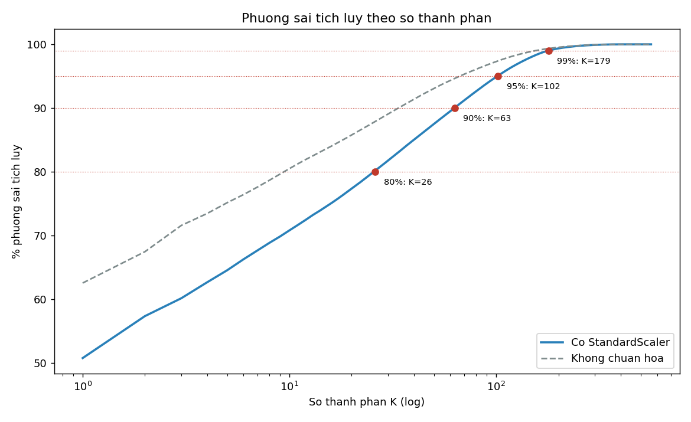
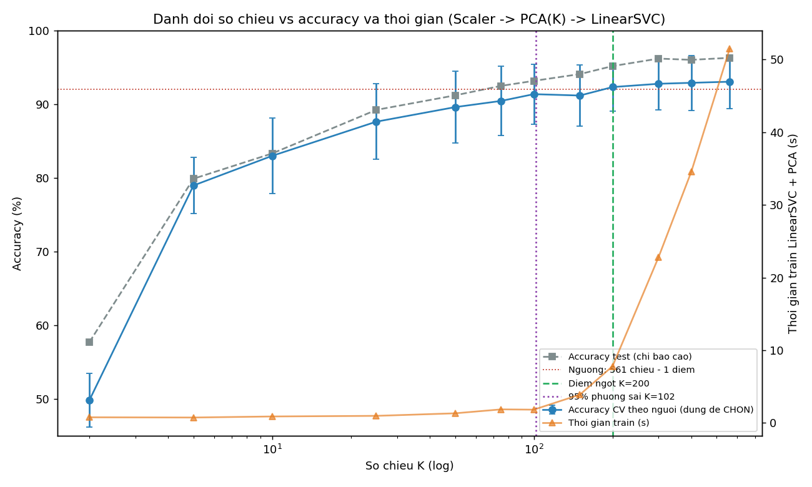
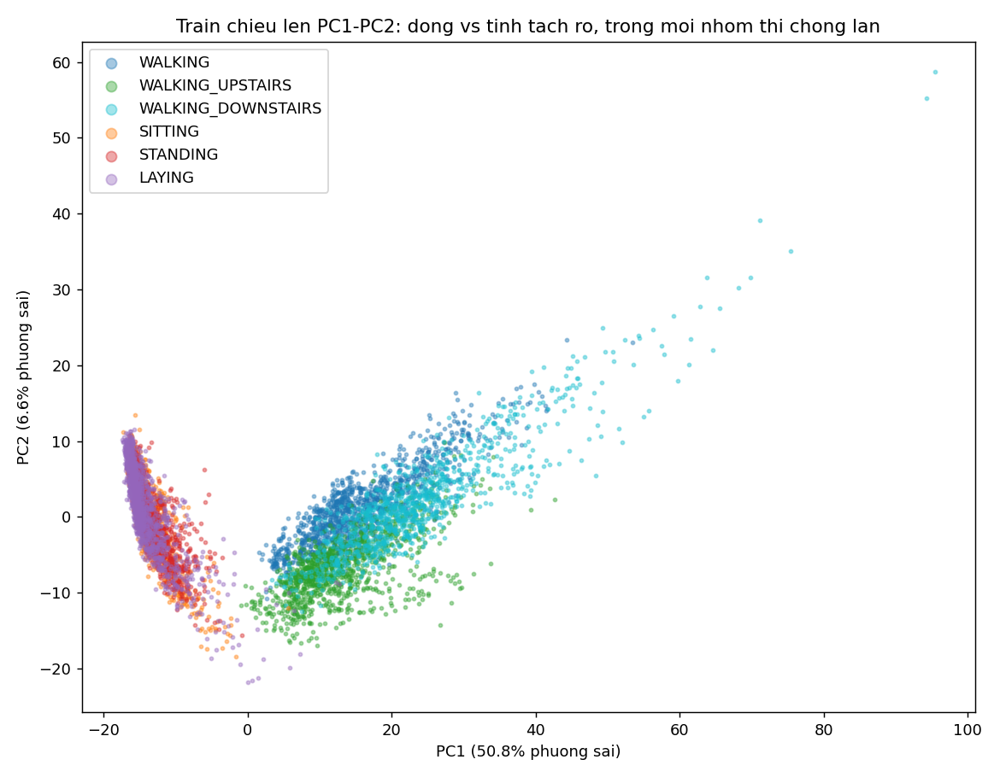

# TT-24 — PCA (PHÂN TÍCH THÀNH PHẦN CHÍNH)
## Nén 561 tín hiệu cảm biến cho thiết bị đeo — kết quả thực nghiệm

| | |
|---|---|
| 🎓 **Khoá** | HỌC MÁY · [Buổi 5](https://github.com/TruongTanNghia/Training-Machine-learning/tree/main/Buoi-05-Unsupervised-PCA) |
| 🧠 **Nhóm** | Học KHÔNG giám sát — Giảm chiều |
| 🔧 **Thuật toán** | PCA (+ so sánh SelectKBest, LDA, t-SNE, UMAP, Kernel PCA, IncrementalPCA) |
| 🏭 **Lĩnh vực** | IoT · Thiết bị đeo |
| 📊 **Dữ liệu** | UCI Human Activity Recognition: 10.299 cửa sổ × 561 đặc trưng, 6 hoạt động, 30 người |

> **Kết quả chính:**
> * **102 thành phần** giữ 95% phương sai (giảm 81,8% số chiều). PC1 một mình giữ 50,8%.
> * **Điểm ngọt chọn bằng CV theo người: K = 200** (−64% số chiều), accuracy CV 0,923 so với 0,930 khi dùng đủ 561
>   chiều; trên test 0,952 so với 0,963.
> * Kỳ vọng của đề ("~60–70 chiều, mất < 1%") **không đúng** ở đây: K = 50 mất 3,5 điểm.
> * **PCA không giảm tính toán trên chip** với bộ phân loại tuyến tính: ma trận chiếu 450 KB, vượt 64 KB RAM. PCA chỉ
>   tiết kiệm ở khâu truyền và lưu dữ liệu (−64%).
> * **Khuyến nghị cho vòng đeo tay: LDA 5 chiều.** Giảm 99% số chiều, accuracy test **0,963 (bằng model 561 chiều)**,
>   model 17,7 KB vừa 64 KB, truyền 1,4 MB/ngày thay vì 151,5 MB/ngày.

---

## 1. Bài toán & cách đánh giá

Vòng đeo tay nhận biết 6 hoạt động (WALKING, WALKING_UPSTAIRS, WALKING_DOWNSTAIRS, SITTING, STANDING, LAYING) từ 561
đặc trưng dẫn xuất từ gia tốc kế và con quay. Ràng buộc: **chip 64 KB RAM**, pin 7 ngày.

| | |
|---|---|
| Chia dữ liệu | **Giữ nguyên theo người** của bộ gốc: 7.352 cửa sổ / 21 người train, 2.947 cửa sổ / 9 người test. Có `assert` kiểm tra không ai ở cả hai tập |
| Pipeline | `StandardScaler → PCA(K) → LinearSVC`. Scaler và PCA nằm **trong** Pipeline nên chỉ fit trên train |
| Chọn K | `GroupKFold(5)` theo người trên train. Mỗi fold kiểm tra trên người chưa gặp. **Tập test chỉ để báo cáo** |
| Chuẩn hoá | Bắt buộc: dữ liệu nằm trong [−1, 1] nhưng phương sai cột chênh **339 lần** (0,0017–0,565) |

---

## 2. Phương sai: cần bao nhiêu chiều?



| Ngưỡng phương sai | 80% | 90% | **95%** | 99% |
|---|---:|---:|---:|---:|
| Số chiều (có chuẩn hoá) | 26 | 63 | **102** | 179 |
| Giảm chiều | 95,4% | 88,8% | **81,8%** | 68,1% |
| Số chiều nếu **không** chuẩn hoá | 10 | 34 | 67 | 155 |

* PC1 = **50,8%**, PC2 = 6,6%, PC3 = 2,8% phương sai (`reports/scree_plot.png`).
* Con số "60–70 thành phần cho 95%" của đề chỉ đúng khi **không chuẩn hoá** (67). Đó là ảo giác: không chuẩn hoá thì vài
  cột `entropy()` có phương sai lớn chiếm trọn PC1 (62,6%).

## 3. ⭐ Đánh đổi số chiều vs accuracy — điểm ngọt



| K | 2 | 10 | 25 | 50 | 100 | 150 | **200** | 300 | 561 |
|---|---:|---:|---:|---:|---:|---:|---:|---:|---:|
| Phương sai giữ | 57,4% | 70,8% | 79,8% | 87,5% | 94,9% | 98,1% | **99,4%** | 99,9% | 100% |
| **Acc CV theo người** | 0,499 | 0,830 | 0,876 | 0,896 | 0,913 | 0,912 | **0,923** | 0,928 | 0,930 |
| Mất so với 561 (điểm) | 43,2 | 10,1 | 5,4 | 3,5 | 1,7 | 1,9 | **0,7** | 0,3 | 0 |
| Acc test (chỉ báo cáo) | 0,577 | 0,833 | 0,892 | 0,912 | 0,932 | 0,941 | 0,952 | 0,962 | 0,963 |

* **Quy tắc:** K nhỏ nhất có CV ≥ CV(561) − 1 điểm, nên **K = 200**. Quy tắc chỉ dùng CV, không nhìn test.
* **Phương sai lớn ≠ thông tin phân loại.** K = 102 giữ 95% phương sai nhưng vẫn mất 1,7 điểm. Các hướng phương sai nhỏ ở
  đuôi chứa một phần tín hiệu phân biệt *ngồi* với *đứng* (mục 7).
* Độ lệch giữa các fold là ±3,3–5,1 điểm, lớn hơn nhiều so với ngưỡng 1 điểm. K = 150 thấp hơn K = 100 chỉ là nhiễu. Nên
  đọc điểm ngọt là "khoảng 150–300".
* **Thời gian train** chỉ ~1–4 s tới K = 150, rồi tăng mạnh (~8 s ở K = 200, ~51 s ở 561 trong lần chạy notebook;
  `reports/danh_doi_chieu_accuracy.csv`). Thời gian đo trên laptop nên dao động giữa các lần chạy, nhưng hình dạng như nhau.

## 4. PC1–PC2 và ý nghĩa của PC1



* **6 lớp với 2 chiều: chỉ 0,50** (CV). Ngồi, đứng, nằm chồng lên nhau (PC1 ≈ −14 cho cả ba).
* Nhưng **PC1 một mình tách "động vs tĩnh" 99,9%** (test 0,9990, CV 0,9965). Ba hoạt động di chuyển có PC1 trung bình
  +12,9 đến +23,8, ba hoạt động tĩnh khoảng −14.
* **PC1 = "cường độ chuyển động".** 10 hệ số lớn nhất gần bằng nhau (+0,058 đến +0,059) và cùng dấu: `sma()`, `mean/std/mad`
  của **độ giật (Jerk)** gia tốc, năng lượng con quay. Cần **159/561** đặc trưng để gom 50% tỉ trọng, nghĩa là PC1 là
  trung bình đều của rất nhiều cột cùng đo một hiện tượng. Theo nhóm: `fBodyAccJerk` 16,9%, `fBodyAcc` 15,7%,
  `fBodyGyro` 13,1% (`reports/pc1_phan_tich.png`). Từ PC2 trở đi không còn diễn giải vật lý rõ như vậy.

## 5. ⭐ Tiết kiệm được gì THẬT SỰ?

Giả định: 1 cửa sổ 2,56 s chồng lấn 50%, tức **67.500 cửa sổ/ngày**; số thực float32 trên chip. Model tuyến tính:
scaler `2×561` + ma trận chiếu PCA `K×561` + mean `561` + LinearSVC `6×K + 6`.

| Cấu hình | Dữ liệu (10.299 mẫu) | Truyền/ngày | Model | Vừa 64 KB? | Phép nhân–cộng/lần | Nếu gộp W·P |
|---|---:|---:|---:|---|---:|---:|
| Gốc 561 chiều | 46,2 MB | 151,5 MB | **17,6 KB** | ✅ | 3.927 | 3.927 |
| PCA K = 102 (95%) | 8,4 MB | 27,5 MB | 232,5 KB | ❌ | 58.395 | 3.927 |
| **PCA K = 200 (điểm ngọt)** | 16,5 MB (**−64%**) | 54,0 MB (**−64%**) | 449,6 KB | ❌ | 113.961 (×29) | 3.927 |
| PCA K = 50 | 4,1 MB | 13,5 MB | 117,3 KB | ❌ | 28.911 | 3.927 |
| **LDA 5 chiều** | **0,4 MB (−99%)** | **1,4 MB (−99%)** | **17,7 KB** | ✅ | **3.396** | — |

| RBF-SVM (phi tuyến) | Vector hỗ trợ | Phép nhân–cộng/lần | Model | Dự đoán |
|---|---:|---:|---:|---:|
| 561 chiều | 2.332 | 1.308.252 | 5.110 KB | 2,75 ms/mẫu |
| PCA K = 200 | 2.324 | 577.000 (−56%) | 2.254 KB | 1,02 ms/mẫu |
| PCA K = 50 | 2.313 | 143.700 (−89%) | 561 KB | 0,56 ms/mẫu |

1. **Với bộ phân loại tuyến tính trên chip, PCA không tiết kiệm mà còn tốn hơn.** `LinearSVC(PCA(x)) = W·(P·x)` là hai phép
   tuyến tính, gộp được thành một ma trận 6×561. Chạy riêng thì ma trận chiếu P (450 KB ở K = 200) không vừa 64 KB và tốn
   gấp 29 lần phép tính; gộp lại thì chi phí bằng đúng model gốc. Con số "tiết kiệm ~90% tính toán" của đề không đúng
   trong trường hợp này.
2. **PCA tiết kiệm thật ở khâu truyền và lưu trữ:** nếu vòng tay gửi đặc trưng về điện thoại hoặc máy chủ, K = 200 giảm
   151,5 → 54,0 MB/ngày.
3. **PCA giảm chi phí suy luận thật cho model phi tuyến** (RBF-SVM: −56% đến −89%, vì chi phí ∝ vector hỗ trợ × số chiều).
   Nhưng RBF-SVM vẫn quá nặng cho 64 KB.
4. **LDA 5 chiều tốt nhất ở mọi cột chi phí** và không mất accuracy (mục 6).

## 6. So sánh các cách giảm chiều

**Cho model** (cùng `Scaler → [giảm chiều] → LinearSVC`, accuracy CV theo người) — `reports/so_sanh_giam_chieu.png`:

| K | 10 | 25 | 50 | 100 | 200 |
|---|---:|---:|---:|---:|---:|
| PCA | **0,830** | **0,876** | **0,896** | 0,913 | 0,923 |
| SelectKBest (f_classif) | 0,752 | 0,868 | 0,879 | **0,918** | **0,926** |
| **LDA (có giám sát)** | 2 chiều: 0,661 · **5 chiều: 0,947** (test **0,963**) | | | | |

* Ở số chiều nhỏ, **PCA hơn chọn đặc trưng** (+7,8 điểm ở K = 10): mỗi PC gom thông tin hàng trăm cột, còn SelectKBest giữ
  các cột lẻ, lại trùng thông tin nhau. Từ 100 chiều trở lên hai cách ngang nhau.
* **LDA 5 chiều vượt cả model 561 chiều trên CV** (0,947 so với 0,930) và bằng trên test. LDA biết nhãn nên dồn đúng thông
  tin phân biệt hoạt động vào `số lớp − 1 = 5` chiều. PCA không biết nhãn, nên tốn hàng trăm chiều để giữ cả những biến
  động không liên quan (ví dụ khác biệt giữa người với người).

**Trực quan hoá 2D** (3.000 mẫu train) — `reports/pca_tsne_umap.png`:

| | PCA | t-SNE | UMAP |
|---|---:|---:|---:|
| Độ tách lớp trong 2D (5-NN CV trên toạ độ) | 0,565 | **0,937** | 0,907 |
| Thời gian | 0,1 s | ~20 s | ~60 s |
| `transform` cho người mới | ✅ | ❌ | ❌ (không ổn định) |

t-SNE và UMAP giữ cấu trúc lân cận nên vẽ đẹp hơn hẳn, nhưng chỉ dùng để **nhìn**, không dùng làm tiền xử lý cho model.

## 7. Model cuối (test, 9 người chưa gặp)

| Model | Acc test | F1 SITTING | F1 STANDING | F1 LAYING | F1 3 kiểu đi | File |
|---|---:|---:|---:|---:|---|---|
| PCA K = 200 + LinearSVC | 0,9515 | 0,894 | 0,922 | 0,994 | 0,957–0,982 | `models/pca_pipeline.joblib` |
| Gốc 561 + LinearSVC | 0,9627 | 0,910 | 0,933 | 0,996 | 0,970–0,984 | — |
| **LDA 5 + LinearSVC** | **0,9627** | 0,907 | 0,925 | **1,000** | 0,972–0,993 | `models/lda_pipeline.joblib` |

Lỗi tập trung ở **ngồi ↔ đứng**: model PCA K = 200 đoán 61 cửa sổ *ngồi* thành *đứng* và 19 cửa sổ ngược lại; kế đến là 27
cửa sổ *lên cầu thang* bị đoán thành *đi bộ* (`reports/confusion_matrix_pca.png`). PCA mất 1,1 điểm so với model gốc chủ
yếu ở cặp ngồi/đứng.

## 8. Mở rộng

| Thí nghiệm | Kết quả | Kết luận |
|---|---|---|
| **Sai số tái tạo** theo K (`reports/sai_so_tai_tao.png`) | Mất phương sai (test): K = 50 → 15,4%; K = 100 → 6,7%; K = 200 → 0,9%; K ≥ 400 → ~0 | Test luôn cao hơn train một chút: các trục học từ 21 người nén người mới kém hơn |
| **Kernel PCA** (RBF, K = 50) | CV 0,883 so với PCA 0,896; test 0,918 so với 0,912 | Không hơn PCA, mà fit lâu gấp ~3 lần, dự đoán chậm gấp hàng chục lần (phải giữ cả tập train) |
| **IncrementalPCA** (K = 200, 15 lô × 500) | Phương sai 99,32% (PCA 99,36%); acc test 0,954 so với 0,952; RAM mỗi lô 2,2 MB so với 16,5 MB | Dùng được cho luồng dữ liệu. Vài hướng đuôi bị xoay (cos góc chính nhỏ nhất 0,02, trung bình 0,99) nhưng không ảnh hưởng accuracy |
| **Phát hiện bất thường** (bỏ 1 hoạt động khỏi train, PCA 102 chiều) | AUC: nằm 0,998 · xuống cầu thang 0,904 · đi bộ 0,819 · lên cầu thang 0,756 · đứng 0,447 · ngồi 0,393 | Chỉ bắt được hoạt động có cấu trúc tín hiệu **khác hẳn** (nằm). Ngồi/đứng giống nhau nên không phát hiện được |

## 9. Tiêu chí hoàn thành

```
   ☑ Giữ đúng cách chia theo người (không trộn ngẫu nhiên)     → assert trong src/data.py
   ☑ Scree plot + đường phương sai tích luỹ                   → reports/scree_plot.png, variance_tich_luy.png
   ☑ Bảng ngưỡng phương sai → số chiều                         → mục 2
   ☑ ⭐ Biểu đồ đánh đổi accuracy vs số chiều + ĐIỂM NGỌT        → mục 3: K = 200 (chọn bằng CV theo người)
   ☑ Scatter PC1–PC2 tô màu 6 lớp                              → mục 4
   ☑ Phân tích ý nghĩa PC1                                     → mục 4: "cường độ chuyển động"
   ☑ ⭐ Số liệu tiết kiệm dung lượng / thời gian cụ thể          → mục 5
   ☑ Hạn chế: mất tính giải thích, PCA chỉ bắt quan hệ tuyến tính → mục 10
```

**11 bước của đề:** ☑ 1 nạp + chia theo người · ☑ 2 chuẩn hoá · ☑ 3 scree plot · ☑ 4 tích luỹ · ☑ 5 bảng ngưỡng ·
☑ 6 đánh đổi K (12 giá trị, CV + thời gian) · ☑ 7 scatter PC1–PC2 · ☑ 8 PC1 · ☑ 9 dung lượng · ☑ 10 tái tạo ·
☑ 11 SelectKBest / t-SNE / UMAP (+ LDA). **Mở rộng:** ☑ Kernel PCA · ☑ IncrementalPCA · ☑ phát hiện bất thường.

## 10. Hạn chế

1. **Mất tính giải thích:** chỉ PC1 có nghĩa vật lý rõ ("cường độ chuyển động"). Các PC sau là tổ hợp của hàng trăm cột.
2. **PCA chỉ bắt quan hệ tuyến tính và không biết nhãn**, nên giữ phương sai ≠ giữ thông tin phân loại (K = 102 giữ 95% phương
   sai nhưng mất 1,7 điểm). LDA có giám sát làm tốt hơn nhiều.
3. **Điểm ngọt nhạy với nhiễu CV** (±3–5 điểm giữa các fold, chỉ 21 người train).
4. **Phân tích chi phí chưa tính khâu đắt nhất trên thiết bị thật**: tính 561 đặc trưng từ tín hiệu thô (lọc, FFT, jerk). Con
   số 64 KB chỉ so với bộ nhớ model.
5. LinearSVC dùng `C = 1` mặc định, không tinh chỉnh. Thời gian đo trên laptop, dao động giữa các lần chạy.

## 11. Cách chạy & sản phẩm

```bash
pip install -r requirements.txt
python src/pca_pipeline.py      # lần đầu tự tải ~61 MB từ UCI; toàn bộ ~5–10 phút
```

```
TT-24-PCA/
├── README.md                       ← báo cáo này
├── data/DATA_SOURCE.md             ← nguồn & cách tải (dữ liệu KHÔNG commit, ~270 MB)
├── notebooks/pca_har_sensors.ipynb ← giải thích logic code từng bước + output thật
├── src/data.py                     ← tải, đổi tên cột trùng, cache parquet, chia theo người
├── src/pca_pipeline.py             ← toàn bộ thí nghiệm (mỗi bước một hàm run_*)
├── models/pca_pipeline.joblib      ← Scaler → PCA(200) → LinearSVC
├── models/lda_pipeline.joblib      ← Scaler → LDA(5) → LinearSVC (khuyến nghị cho thiết bị)
├── reports/                        ← 23 file CSV/PNG + tom_tat.json
└── requirements.txt
```

```python
import joblib
model = joblib.load("models/lda_pipeline.joblib")   # nhận thẳng 561 đặc trưng gốc
model.predict(X_561)                                # -> 'WALKING', 'SITTING', ...
```

**Tham khảo:** [Buổi 5 — PCA](https://github.com/TruongTanNghia/Training-Machine-learning/tree/main/Buoi-05-Unsupervised-PCA/Tai-Lieu)
