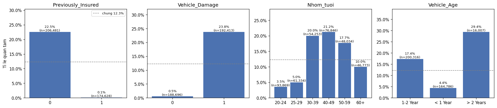
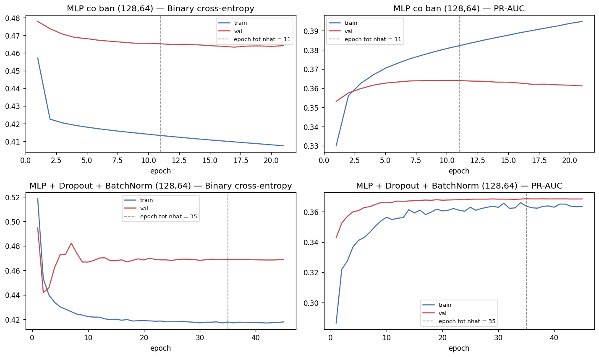
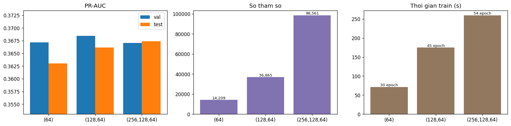
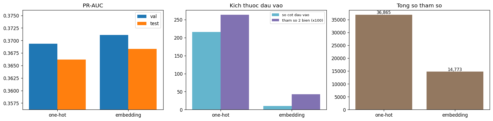
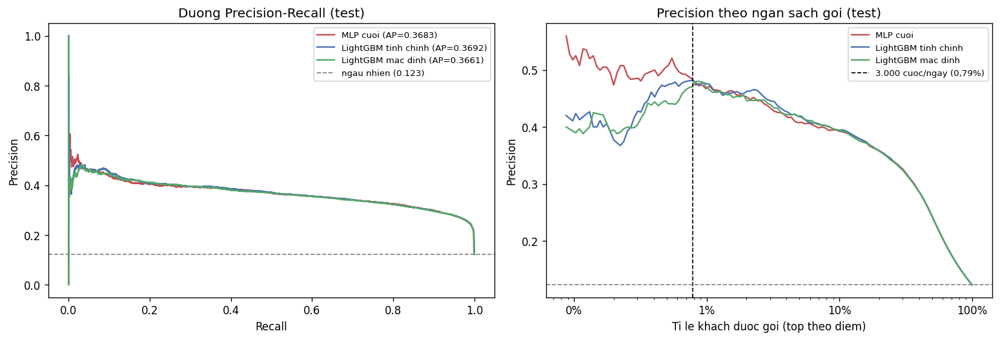

# TT-25 — MLP VỚI KERAS
## Chấm điểm khách hàng tiềm năng mua bảo hiểm ô tô — kết quả thực nghiệm

| | |
|---|---|
| 🎓 **Khoá** | HỌC MÁY · [Buổi 7](https://github.com/TruongTanNghia/Training-Machine-learning/tree/main/Buoi-07-Neural-Network) |
| 🧠 **Nhóm** | Deep Learning · Phân loại dữ liệu bảng |
| 🔧 **Thuật toán** | MLP Keras/TensorFlow (Dropout, BatchNorm, Embedding) · baseline LightGBM |
| 🏭 **Lĩnh vực** | Bảo hiểm · Bán chéo sản phẩm |
| 📊 **Dữ liệu** | [Health Insurance Cross Sell](https://www.kaggle.com/datasets/anmolkumar/health-insurance-cross-sell-prediction): 381.109 khách × 10 đặc trưng, 12,26% quan tâm |

> **Kết quả chính:**
> * **MLP không thắng được cây.** MLP tốt nhất (128, 64) + Dropout + BatchNorm + **Embedding** đạt PR-AUC test
>   **0,3683** (3 seed: 0,3674 ± 0,0013). LightGBM tinh chỉnh đạt **0,3692** (0,3691 ± 0,0008). LightGBM **mặc định,
>   không chỉnh gì** đạt 0,3661 trong **4 giây**.
> * **Chi phí nghiêng hẳn về LightGBM:** train nhanh hơn 10–25 lần, không cần tiền xử lý, 1 lần chạy so với 7 cấu hình MLP.
> * **Gọi 3.000 khách/ngày theo model:** precision **~48%** (≈ 1.440 khách quan tâm/ngày so với 368 nếu gọi ngẫu
>   nhiên, **lift ~3,9×**), như nhau cho cả MLP và LightGBM.
> * Trong các kỹ thuật MLP: **Embedding** (+0,002, ít hơn 2,5 lần tham số) và **Dropout + BatchNorm** (chặn overfit,
>   +0,004 val) có ích. **Độ sâu** và **class_weight** không giúp gì. class_weight còn làm xác suất lệch (TB 33% so với 12,3%).
> * Dao động do **seed** (±0,0013) lớn ngang hầu hết các chênh lệch giữa cấu hình. Đây là bằng chứng chính cho kết
>   luận "hoà, không thắng".

---

## 1. Bài toán & cách đánh giá

Công ty bảo hiểm muốn bán chéo bảo hiểm ô tô cho 381.109 khách bảo hiểm sức khoẻ. Telesales gọi được **3.000
cuộc/ngày** (top **0,79%**), nên bài toán là **xếp hạng**, không phải phân loại ở ngưỡng 0,5.

| | |
|---|---|
| Dữ liệu | Chỉ `train.csv` có nhãn (Kaggle `test.csv` không có) → tự chia **70/15/15 có stratify**: 266.775 / 57.167 / 57.167 |
| Tiền xử lý (MLP) | `log1p(Annual_Premium)` → `StandardScaler` cho số + nhị phân; one-hot `Vehicle_Age`; `Region_Code` (53) và `Policy_Sales_Channel` (155) dạng **one-hot (216 cột)** hoặc **Embedding**. Mọi thứ chỉ fit trên train |
| Tiền xử lý (cây) | Không. Giữ mã số, khai báo 2 cột `categorical_feature` |
| Lựa chọn | EarlyStopping, kiến trúc, class_weight, cách mã hoá, ngưỡng gọi: **chỉ dùng val**. Test chỉ để báo cáo |
| Metric | PR-AUC (`average_precision_score`) + precision của danh sách gọi 1 ngày. **Không** dùng accuracy (đoán "không" cho tất cả đã được 87,7%) |
| Callback | `EarlyStopping(val_pr_auc, patience=10, restore_best_weights)`, `ReduceLROnPlateau(val_loss, 0.5, patience=5)`, `ModelCheckpoint` |
| Đầu ra | `Dense(1, sigmoid)` + `binary_crossentropy`, Adam 1e-3, batch 2048 |

## 2. EDA



| Nhóm | Tỉ lệ quan tâm |
|---|---:|
| Đã có bảo hiểm xe (`Previously_Insured=1`, 45,8% khách) | **0,09%** |
| Chưa có bảo hiểm xe | 22,5% |
| Xe từng hư hỏng / chưa từng | **23,8%** / 0,5% |
| Chưa có BH **và** xe từng hỏng (47,9% khách) | **25,0%** (3 nhóm còn lại: 0,04–3,8%) |
| Tuổi 20–29 / 30–59 / 60+ | 3,5–5,0% / 17,7–21,2% / 10,0% |

* `Previously_Insured` **không phải rò rỉ**: đây là thông tin biết **trước** cuộc gọi (và tỉ lệ là 0,09%, không phải 0%).
* `Annual_Premium` lệch phải (skew 1,77, max 540k). Sau `log1p` skew còn −1,47, đuôi trái do ~17% khách có phí tối thiểu 2.630.
* Độ quan trọng LightGBM: `Vehicle_Damage` 45%, `Previously_Insured` 33%, **`Policy_Sales_Channel` 9%**, `Age` 6%.

## 3. ⭐ Baseline cây: LightGBM

| | Số cây | Thời gian | PR-AUC val | PR-AUC test |
|---|---:|---:|---:|---:|
| LightGBM mặc định | 100 | **4,2 s** | 0,3707 | 0,3661 |
| LightGBM tinh chỉnh + early stopping | 193 | 9,7 s | **0,3735** | **0,3692** |

## 4. Dropout + BatchNorm và đường học



| (128, 64), class_weight | Tham số | Epoch (tốt nhất) | Thời gian | PR-AUC val | PR-AUC test |
|---|---:|---:|---:|---:|---:|
| MLP cơ bản | 36.097 | 21 (11) | 54 s | 0,3642 | 0,3644 |
| + Dropout + BatchNorm | 36.865 | 45 (35) | 196 s | **0,3685** | **0,3662** |

* **MLP cơ bản overfit sớm:** PR-AUC train tăng đều lên 0,395, còn val đạt đỉnh 0,364 ở epoch 11 rồi giảm.
  EarlyStopping khôi phục epoch 11.
* **Dropout + BatchNorm chặn được overfit:** val đi lên rồi đi ngang ở 0,368, không giảm. Train *thấp hơn* val vì
  metric train đo khi Dropout đang bật. ReduceLROnPlateau hạ learning rate từ 1e-3 xuống 1e-5.

## 5. Kiến trúc, class_weight, Embedding



| Kiến trúc (Dropout + BN, class_weight) | Tham số | Thời gian | PR-AUC val | PR-AUC test |
|---|---:|---:|---:|---:|
| (64) | 14.209 | 72 s | 0,3672 | 0,3630 |
| **(128, 64)** ← chọn theo val | 36.865 | 175 s | **0,3685** | 0,3662 |
| (256, 128, 64) | 98.561 | 260 s | 0,3670 | 0,3674 |

Ba kiến trúc chênh nhau ≤ 0,0015 dù số tham số chênh 7 lần, và thứ hạng val/test ngược nhau, nên đây là nhiễu.

| (128, 64) | PR-AUC val | PR-AUC test | Xác suất TB (thật 12,3%) | % dự đoán "1" @0,5 |
|---|---:|---:|---:|---:|
| class_weight `balanced` {0: 0,57, 1: 4,08} | 0,3685 | 0,3662 | 0,334 | 40,4% |
| **Không** class_weight ← chọn | **0,3694** | 0,3662 | **0,118** | 0,05% |

class_weight **không đổi thứ hạng** (PR-AUC test bằng nhau), chỉ đẩy xác suất lên cao và làm hỏng hiệu chỉnh. Với bài
xếp hạng thì không dùng.



| (128, 64), không class_weight | Cột đầu vào | Tham số cho 2 biến | Tổng tham số | PR-AUC val | PR-AUC test |
|---|---:|---:|---:|---:|---:|
| One-hot | 216 | 26.368 | 36.865 | 0,3694 | 0,3662 |
| **Embedding** (vùng 54×8, kênh 107×12) | 10 + 2 chỉ số | **4.276** | **14.773** | **0,3711** | **0,3683** |

Embedding tốt hơn ở cả val lẫn test với ít hơn 2,5 lần tham số. Kênh hiếm (< 10 khách ở train, 47 kênh) gộp vào "khác".
Embedding học được một phần cấu trúc có ý nghĩa: các kênh có tỉ lệ quan tâm thấp (152, 160, 151, 73) nằm gần nhau
(`reports/embedding_kenh_gan_nhau.csv`). Model này được lưu thành **`models/best.keras`**.

**Độ dao động theo seed** (train lại với seed 1, 2, 3):

| | PR-AUC val | PR-AUC test | Thời gian TB |
|---|---:|---:|---:|
| MLP cuối | 0,3723 ± 0,0003 | 0,3674 ± 0,0013 | ~137 s |
| LightGBM tinh chỉnh | 0,3726 ± 0,0002 | 0,3691 ± 0,0008 | ~11 s |

## 6. Precision@3000

3.000 cuộc / 381.109 khách = top 0,79%. Test là mẫu ngẫu nhiên 15%, nên **top 451 khách của test** mô phỏng danh sách
gọi một ngày. Ngưỡng được chọn trên **val** (điểm của khách thứ 0,79%) rồi áp sang test.

| | Ngưỡng (val) | Số khách chọn ở test | Precision tại ngưỡng | **Precision 1 ngày** | P@3000 nghĩa đen (top 5,2% test) | Lift |
|---|---:|---:|---:|---:|---:|---:|
| MLP cuối | 0,437 | 471 | 47,6% | **48,3%** | 40,7% | 3,94× |
| LightGBM tinh chỉnh | 0,462 | 492 | 47,0% | 47,9% | 41,7% | 3,91× |
| LightGBM mặc định | 0,458 | 483 | 47,8% | 47,2% | 41,7% | 3,85× |

→ Khoảng **1.440 khách quan tâm/ngày** thay vì 368 nếu gọi ngẫu nhiên. Chênh lệch MLP–LightGBM ở top 451 chỉ là
2 khách (sai số chuẩn ±2,4 điểm %), không có ý nghĩa.



## 7. ⭐ Kết luận: MLP Keras vs LightGBM

| | PR-AUC test | 3 seed | Precision 1 ngày | Thời gian train | Số cấu hình đã thử | Tiền xử lý |
|---|---:|---:|---:|---:|---:|---|
| LightGBM mặc định | 0,3661 | — | 47,2% | **4 s** | **1** | không |
| **LightGBM tinh chỉnh** | **0,3692** | **0,3691 ± 0,0008** | 47,9% | 10 s | 1 | không |
| MLP (128,64) + Embedding | 0,3683 | 0,3674 ± 0,0013 | 48,3% | 109 s | 7 | log1p, scale, one-hot/bảng mã, 3 callback |

1. **Hiệu quả: hoà, LightGBM nhỉnh hơn một chút.** Ba đường PR gần như trùng nhau. LightGBM cao hơn MLP trung bình
   0,0017 PR-AUC và ổn định hơn qua seed.
2. **Công sức: LightGBM thắng tuyệt đối.** Không cần chuẩn hoá hay mã hoá, cấu hình mặc định đã đạt 99% hiệu quả, train
   trong vài giây. MLP phải qua 7 thí nghiệm (Dropout/BN, 3 kiến trúc, class_weight, Embedding) mới bắt kịp, mỗi bước
   chỉ thêm vài phần nghìn.
3. **Khuyến nghị:** với dữ liệu bảng 10 cột như bài này, **triển khai LightGBM**. MLP đáng dùng khi có biến phân loại
   cực nhiều mức (Embedding phát huy), dữ liệu đa dạng (văn bản, ảnh), hoặc làm thành phần trong stacking. Kết quả này
   khớp với nhận định của đề: *"với dữ liệu bảng, cây thường thắng mạng nơ-ron"*.

## 8. Cạm bẫy đã gặp

| Cạm bẫy | Thực tế trong bài |
|---|---|
| Không EarlyStopping | MLP cơ bản tụt từ 0,364 (epoch 11) xuống 0,361 (epoch 21) và tiếp tục giảm |
| Dùng class_weight cho bài xếp hạng | Không tăng PR-AUC, xác suất bị thổi lên 2,7 lần |
| Cắt ngưỡng 0,5 | Có class_weight: gắn nhãn "quan tâm" cho 40% khách. Không có: 0,05%. Ngưỡng phải theo ngân sách gọi |
| So sánh cấu hình mà không đo nhiễu | Chênh lệch giữa 3 kiến trúc (≤ 0,0015) nhỏ hơn dao động do seed (0,0023) |
| `AUC(curve='PR')` của Keras | Xấp xỉ bằng ngưỡng rời rạc. Số báo cáo dùng `sklearn.average_precision_score` |
| `.keras` không chứa tiền xử lý | Triển khai phải lưu kèm `Preprocessor` (scaler + bảng mã kênh/vùng) |

---

## Cấu trúc & cách chạy

```
TT-25-MLP-Keras/
├── README.md                              ← báo cáo này
├── requirements.txt
├── data/DATA_SOURCE.md                    ← train.csv tự tải bằng kagglehub (không commit)
├── notebooks/mlp_keras_insurance.ipynb    ← giải thích logic code từng bước + đọc kết quả
├── src/
│   ├── data.py      ← tải, chia 70/15/15, Preprocessor (one-hot / embedding), ma trận cho cây
│   ├── model.py     ← build_mlp, build_embedding_mlp, compile_model, make_callbacks
│   └── train.py     ← mỗi bước của đề là một hàm run_*(); main() chạy toàn bộ
├── models/best.keras                      ← MLP (128,64) + Embedding (models/runs/ không commit)
└── reports/   learning_curves.png · kien_truc_comparison.png · embedding_vs_onehot.png · pr_curve.png
               eda_*.png · *.csv · tom_tat.json
```

```bash
pip install -r requirements.txt
python src/train.py                      # hoặc chạy notebook; ~25 phút trên CPU
```

Kết quả tái lập được: `tf.keras.utils.set_random_seed` + `enable_op_determinism()`. Môi trường đã chạy: Python 3.13,
TensorFlow 2.21 (CPU), LightGBM 4.7.

**Mở rộng chưa làm:** TabNet / FT-Transformer; stacking MLP + LightGBM; chuyển sang PyTorch (KT-01).
